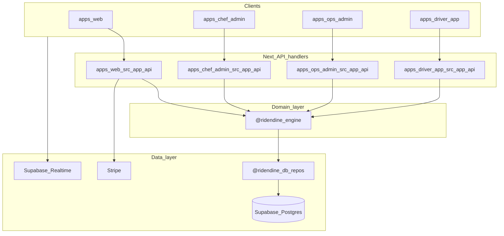
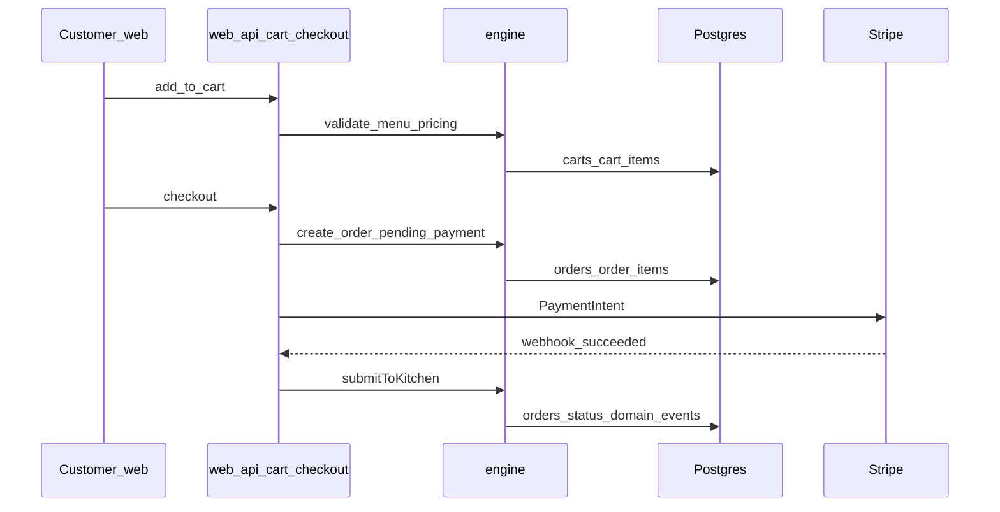
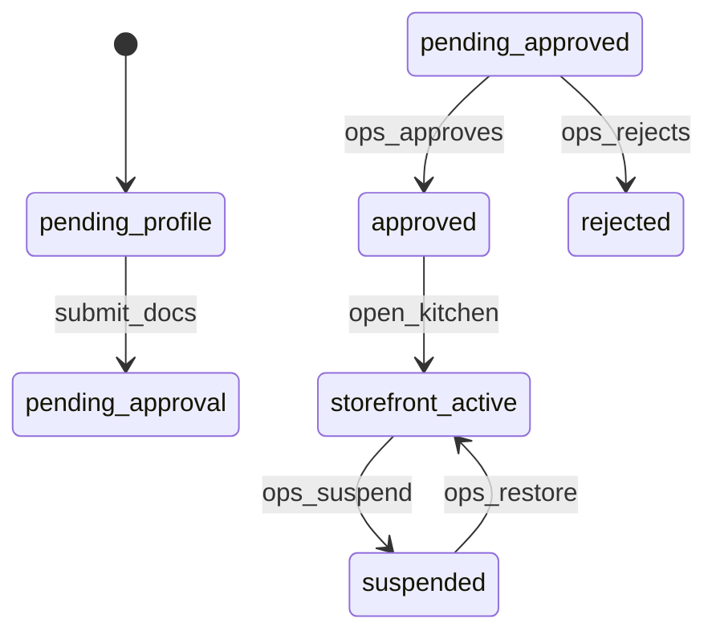
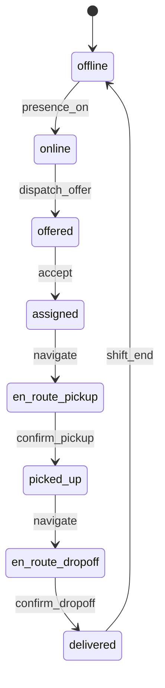
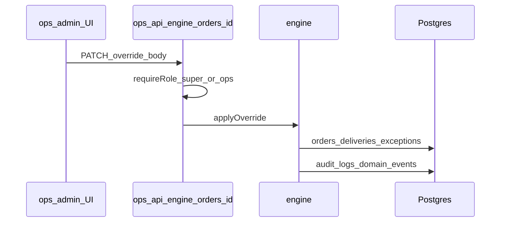
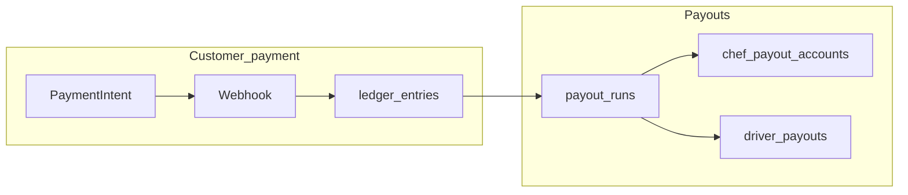
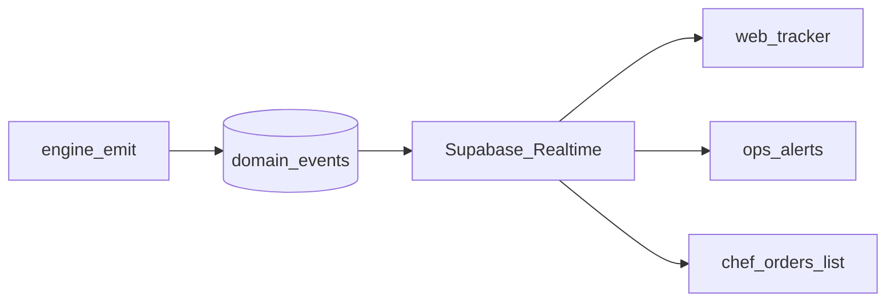
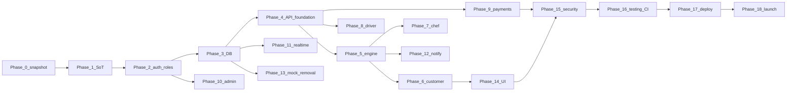

# Ridendine — Full correction and upgrade execution plan

**Document:** `AUDIT_AND_PLANNING/21_FULL_CORRECTION_AND_UPGRADE_EXECUTION_PLAN.md`  
**Audience:** Future Cursor / engineering sessions executing production readiness  
**Rules for this document:** Planning only; cites prior audit sources; does not modify application code by itself.

**Audit sources read (all files under `AUDIT_AND_PLANNING/`):**

- `AUDIT_AND_PLANNING/RIDENDINE_FULL_HEADLESS_AUDIT_AND_UPGRADE_PLAN.md` (master audit, Parts 1–20 + Appendix A)
- `AUDIT_AND_PLANNING/diagrams/monorepo_topology.md`
- `AUDIT_AND_PLANNING/diagrams/order_status_flow.md`
- `AUDIT_AND_PLANNING/diagrams/checkout_payment_webhook.md`
- `AUDIT_AND_PLANNING/diagrams/auth_middleware_matrix.md`

---

## Part 1 — Audit digest

| Topic | Summary | Audit reference | App / repo path (where cited in audit) |
|------|---------|-------------------|----------------------------------------|
| **App structure** | Four Next.js 14 apps (web, chef-admin, ops-admin, driver-app) + shared packages (`@ridendine/db`, `@ridendine/engine`, `@ridendine/auth`, `@ridendine/ui`, etc.); Turborepo + pnpm | Master Part 1.1–1.2 | `apps/web/`, `apps/chef-admin/`, `apps/ops-admin/`, `apps/driver-app/`, `packages/*`, `package.json` |
| **What works** | Migrations present; engine orchestrators + Vitest; Stripe checkout + signed webhook; ops engine HTTP surface; shared auth middleware; driver PWA public assets; notifications package + engine sender | Master Part 1, Part 4, Part 11, Part 20 | `supabase/migrations/`, `packages/engine/`, `apps/web/src/app/api/checkout/route.ts`, `apps/web/src/app/api/webhooks/stripe/route.ts`, `apps/ops-admin/src/app/api/engine/`, `packages/auth/src/middleware.ts` |
| **What is partial** | E2E status UNKNOWN; CI lint non-gating; Stripe `apiVersion` inconsistency; web middleware only `/account`; ops RBAC coarse; ledger/finance UI depth; realtime typing; many routes PARTIAL/UNKNOWN | Master Part 2, 5, 7, 11, 12, 17 | `apps/web/src/middleware.ts`, `.github/workflows/ci.yml`, grep `apiVersion` under `apps/` |
| **What is broken** | No runtime-verified BROKEN in audit (explicit **UNKNOWN** until tests run) | Master legend + Part 20 | — |
| **What is missing** | Dedicated WebSocket server; graphify report in repo; first-class support/finance roles; RiskEngine module; typed global event bus contract; webhook idempotency evidence | Master Part 1.21, 7, 8, 10, 11 | `graphify-out/GRAPH_REPORT.md` MISSING; `packages/engine` RiskEngine MISSING |
| **Mock / demo / static** | `supabase/seeds/seed.sql`; test mocks; CI placeholder env | Master Part 13 | `supabase/seeds/seed.sql`, `.github/workflows/ci.yml`, `**/__tests__/**` |
| **Highest-risk areas** | `createAdminClient` on customer web APIs; ops god-mode APIs with login-only middleware; processor token misconfig; processor routes public to middleware | Master Part 12, 5, 20 | `apps/web/src/app/api/cart/route.ts` (example), `apps/ops-admin/src/middleware.ts`, `apps/ops-admin/src/app/api/engine/processors/sla/route.ts` |
| **Highest-value upgrades** | Unify Stripe client; per-route ops RBAC; CI lint gating; merge duplicate confirmation + password-strength; ledger alignment; expand CI tests beyond engine+utils | Master Part 16–18 | `apps/web/src/lib/stripe-adapter.ts`, `packages/ui/src/components/password-strength.tsx` |

---

## Part 2 — Source-of-truth decision

**Principle:** One canonical lifecycle and money trail in **`@ridendine/engine` + Postgres**; four Next apps are **presentation + thin route handlers**; **Supabase Auth** is the identity provider; **RLS** is defense-in-depth but **server routes must not rely on RLS alone** when using service role.

| Area | Current drift | Final source of truth | Action | Risk |
|------|----------------|-------------------------|--------|------|
| Frontends | Four apps, overlapping concerns (e.g. two confirmation URLs) | **Four apps remain** but each domain owns one UX: web=customer, chef-admin=chef, ops-admin=control plane, driver-app=field | **Merge** duplicate customer flows; **document** boundaries | MEDIUM |
| Backend/API | 73 route handlers across apps; mixed `createAdminClient` + session | **Next Route Handlers** remain transport; **engine** is authority for mutations | **Refactor later** handlers to thin delegators to engine | HIGH |
| Auth | Same factory, different middleware modes (web selective vs admin default) | **Supabase session** + **`platform_users` / profile tables** for ops; customer/chef/driver profile tables | **Document** expected middleware matrix; **enforce** API-side actor checks | HIGH |
| Database | Docs + migrations + generated types can drift | **`supabase/migrations/`** + regenerated **`packages/db/src/generated/database.types.ts`** + **`docs/DATABASE_SCHEMA.md`** kept in lockstep | **Process:** migrate → generate → doc update | MEDIUM |
| Order lifecycle | `docs/ORDER_FLOW.md` vs engine state machine naming | **`packages/engine/src/orchestrators/order-state-machine.ts`** + **`orders.status`** as canonical; doc updated to match | **Replace** doc drift; **quarantine** stale narrative | MEDIUM |
| Payment/ledger | Stripe client strings differ; ledger in DB | **`ledger_entries`** + Stripe objects; single Stripe wrapper module | **Replace** ad-hoc Stripe `new Stripe(...)` | HIGH |
| Roles | `UserRole` union missing support/finance | **`platform_users.role`** enum + engine permission checks expanded | **Extend** schema + code | HIGH |
| Admin center | Many dashboards; RBAC UI weak | **`apps/ops-admin`** as sole ops UI; permissions gate tabs/routes | **Implement** server checks per API + nav visibility | HIGH |
| Realtime | Hook + tests; no global contract | **`domain_events`** table + **Supabase Realtime** channel naming convention + typed payloads | **Define** contract doc + code | MEDIUM |
| Notifications | Templates package + engine Resend | **Engine `NotificationEngine`** emits; **DB `notifications`** durable; **Resend** delivery | **Consolidate** triggers in engine | MEDIUM |
| Deployment | Vercel json per app; turbo env list | **Vercel projects per app** + env parity to `.env.example` | **Automate** env validation in CI | MEDIUM |

**Leave untouched (initially):** Monorepo layout, choice of Supabase+Stripe, existing migration history (append-only new migrations).

**Quarantine later (via knip/depcheck — UNKNOWN until run):** Dead exports; not evidenced in audit.

---

## Part 3 — Master issue register

**Convention:** `IRR-XXX` = Issue Register Ridendine. **Severity:** CRITICAL / HIGH / MEDIUM / LOW.

| ID | Cat | Sev | Current problem | File / path | Root cause | Business impact | Technical impact | Required correction | Deps | Acceptance criteria | Phase |
|----|-----|-----|-------------------|-------------|------------|-----------------|-------------------|----------------------|------|----------------------|-------|
| IRR-001 | Architecture | HIGH | Four apps without written cross-app contracts | Master Part 1 | Implicit boundaries | Onboarding confusion | Duplicated endpoints/UX | Add `docs/CROSS_APP_CONTRACTS.md` + link from CLAUDE | None | Doc merged; links from audit | 1 |
| IRR-002 | Auth | HIGH | Web `/checkout` not in middleware protected list | `apps/web/src/middleware.ts` | Selective protect design | Guest checkout vs forced login unclear | Session edge cases | Product decision + implement guard or explicit guest path | IRR-030 | Policy documented + tests | 2 |
| IRR-003 | Security | HIGH | Service role on web customer APIs | `apps/web/src/app/api/cart/route.ts` (audit example), similar | Server uses `createAdminClient` | Data leak if handler bug | Bypass RLS | Every query scoped by `customerId` from session; add automated tests | Engine, DB | No cross-customer reads in tests | 15 |
| IRR-004 | Roles/permissions | HIGH | No support/finance distinct roles | `packages/engine/src/services/permissions.service.ts` | Schema/code gap | Wrong person refunds/overrides | Over-permissioned users | Extend `platform_users` + `getUserRoles` + per-route checks | DB mig | Role tests pass | 2 |
| IRR-005 | API | HIGH | Ops APIs powerful; UI gate = login | `apps/ops-admin/src/middleware.ts` | Missing fine RBAC | Insider abuse | Unauthorized admin actions | `requireRole()` on each `apps/ops-admin/src/app/api/**/route.ts` | IRR-004 | 403 for wrong role | 2 |
| IRR-006 | Security | HIGH | Processor endpoints skip session | `apps/ops-admin/src/app/api/engine/processors/sla/route.ts` | Cron design | Automation abuse if token leaks | SLA manipulation | Secrets in vault; rotate; monitor 401 rate | Env | Token required; alerts | 15 |
| IRR-007 | Payments | HIGH | Stripe `apiVersion` inconsistent | `apps/web/src/app/api/checkout/route.ts` vs `apps/web/src/lib/stripe-adapter.ts` | Copy-paste | Subtle Stripe bugs | Runtime errors / wrong fields | Single `packages/db` or `packages/engine` stripe helper | None | One version string repo-wide | 9 |
| IRR-008 | Payments | MEDIUM | Webhook idempotency not evidenced | `apps/web/src/app/api/webhooks/stripe/route.ts` | UNKNOWN implementation | Double-submit money movement | Duplicate side effects | Store `stripe_event_id` processed UNIQUE | DB mig | Replay test passes | 9 |
| IRR-009 | Database | MEDIUM | `order_status_history` vs desired `order_status_events` naming | `docs/DATABASE_SCHEMA.md` vs product language | Naming drift | Reporting confusion | ORM confusion | Choose canonical name; view or migrate | DB | Single name in types/docs | 3 |
| IRR-010 | Real-time | MEDIUM | `postgres_changes as any` | `packages/db/src/hooks/use-realtime.ts` | TS workaround | Wrong payload shape at runtime | Crashes | Typed channels + zod parse | types | Fails closed on bad payload | 11 |
| IRR-011 | UI | MEDIUM | Duplicate order confirmation routes | `apps/web/src/app/order-confirmation/[orderId]/page.tsx`, `apps/web/src/app/orders/[id]/confirmation/page.tsx` | Product drift | SEO/bookmark confusion | Double maintenance | One canonical URL + redirect | Web | Single E2E path | 6 |
| IRR-012 | UI | LOW | Duplicate password strength | `apps/web/...`, `apps/chef-admin/...`, `packages/ui/...` | DRY violation | Inconsistent UX | Bundle size | Import from `@ridendine/ui` only | UI | One component | 14 |
| IRR-013 | Testing | HIGH | CI lint `continue-on-error: true` | `.github/workflows/ci.yml` | Pipeline config | Broken main | Debt accrual | Remove or scope allowlist | None | Lint fails job | 16 |
| IRR-014 | Testing | MEDIUM | Web/ops tests not in CI matrix | `.github/workflows/ci.yml` | Omission | Regressions undetected | Quality gap | Add `pnpm --filter @ridendine/web test` etc. | None | CI green | 16 |
| IRR-015 | Mock data | MEDIUM | Seed uses realistic emails/passwords | `supabase/seeds/seed.sql` | Dev convenience | Accidental prod seed | Credential leak | `seed.sql` only in dev; prod pipeline never runs seed | Deploy | Prod DB has no seed accounts | 13 |
| IRR-016 | Documentation | LOW | `graphify-out/GRAPH_REPORT.md` missing | Repo root | Not generated | Slower onboarding | N/A | Generate or remove rule | OPTIONAL | UNKNOWN owner | 1 |
| IRR-017 | Orders | MEDIUM | Order vs delivery status narrative drift | `docs/ORDER_FLOW.md` vs engine | Two vocabularies | Ops miscommunication | Bugs in UI labels | Single glossary in docs + i18n keys | engine | UI matches DB enums | 5 |
| IRR-018 | Payouts | MEDIUM | Chef Stripe Connect apiVersion drift | `apps/chef-admin/src/app/api/payouts/setup/route.ts` | Same as IRR-007 | Payout failure | Ops incidents | Unified Stripe module | IRR-007 | Connect onboarding works staging | 9 |
| IRR-019 | Driver flow | MEDIUM | Location API rate limit not evidenced | `apps/driver-app/src/app/api/location/route.ts` | Audit note | Cost / abuse | DB spam | Rate limit + batching | utils | Load test acceptable | 8 |
| IRR-020 | Customer flow | MEDIUM | Checkout orchestration in page | `apps/web/src/app/checkout/page.tsx` | UI owns sequence | Inconsistent totals | Hard to test | Move orchestration to API or engine | engine | UI only renders state | 6 |
| IRR-021 | Admin flow | MEDIUM | Finance dashboard depth UNKNOWN | `apps/ops-admin/src/app/dashboard/finance/page.tsx` | Audit | CFO cannot reconcile | Money disputes | Ledger UI + exports | ledger | Matches Stripe report | 10 |
| IRR-022 | Business engine | HIGH | RiskEngine MISSING | `packages/engine/src/index.ts` mapping | Not built | Fraud losses | Manual ops | Add module + hooks on checkout/dispatch | engine | Rules covered by tests | 5 |
| IRR-023 | Notifications | MEDIUM | End-to-end delivery UNKNOWN | Master Part 4 flow 21 | Partial wiring | Missed SLA | Chef/driver blind spots | Trace engine triggers → provider | Resend | Durable `notifications` rows | 12 |
| IRR-024 | Performance | LOW | Load handling score 0 | Master Part 17 | Not tested | Black Friday outage | UNKNOWN | k6/Artillery on checkout | infra | SLO defined | 17 |
| IRR-025 | Mobile UX | MEDIUM | Web responsive UNKNOWN | Master Part 14 | No QA | Conversion loss | UNKNOWN | Device matrix tests | QA | Checklist done | 14 |
| IRR-026 | Security | MEDIUM | File upload surface | `apps/web/src/app/api/upload/route.ts`, chef upload | Audit flag | Malware / PII | Storage abuse | MIME/size/AV scan; private bucket | storage | Blocked bad uploads | 15 |
| IRR-027 | Security | LOW | Sensitive logs in webhook | `apps/web/src/app/api/webhooks/stripe/route.ts` | console.error | PCI adjacent leak | Compliance | Structured redacted logging | obs | No PAN in logs | 15 |
| IRR-028 | API | MEDIUM | “Missing APIs” finance export | `apps/ops-admin/src/app/api/export/route.ts` | UNKNOWN depth | Ops cannot export | Manual SQL | Spec export + tests | finance | CSV matches ledger | 10 |
| IRR-029 | Database | HIGH | Promo dual columns (`starts_at` vs `valid_from`) | `apps/web/src/app/api/checkout/route.ts` (audit) | Migration drift | Wrong promo validity | Money loss | DB cleanup + single column set | mig | Checkout uses one | 3 |
| IRR-030 | Auth | MEDIUM | `BYPASS_AUTH` prod guard | `packages/auth/src/middleware.ts` | Dev flag | Accidental open site | Session bypass | CI asserts not set prod | deploy | Prod boot fails if true | 15 |
| IRR-031 | Customer flow | LOW | `/chef-signup` wiring UNKNOWN | `apps/web/src/app/chef-signup/page.tsx` | Audit | Drop-off | Dead link | Link to `apps/chef-admin` signup | web | E2E passes | 6 |
| IRR-032 | Chef flow | MEDIUM | Availability UI coverage UNKNOWN | Master Part 4 flow 20 | Gap | Kitchen closed orders | Chargebacks | Chef UI for availability | chef | Integration test | 7 |
| IRR-033 | Support | MEDIUM | Support role MISSING | Master Part 9 journey 5 | RBAC | Privacy breach | Ticket access too wide | Role + RLS on `support_tickets` | IRR-004 | Agent sees only assigned | 12 |
| IRR-034 | Analytics | LOW | Analytics truth vs `domain_events` | `apps/ops-admin/src/app/api/analytics/trends/route.ts` | UNKNOWN | Wrong KPIs | Bad decisions | Define metric sources | DB | Reconciles with ledger | 10 |
| IRR-035 | Deployment | MEDIUM | Backup/rollback not in repo | Master Part 17 | Platform | Data loss | Long downtime | Runbooks in docs (not code) | Supabase | RPO/RTO documented | 17 |
| IRR-036 | API | LOW | Health checks scattered | `apps/*/src/app/api/health/route.ts` | Pattern drift | Monitoring gaps | False negatives | Standard response schema | ops | Synthetic monitor green | 17 |

**Issue count (this register):** **36** rows (expandable; Appendix APIs warrant per-route rows in a spreadsheet).

---

## Part 4 — Drift elimination plan

| Drift | Danger | Canonical version | Files affected later | Migration | Verify |
|-------|--------|-------------------|----------------------|-----------|--------|
| Two customer confirmation URLs | Broken deep links, analytics split | Single `/orders/[id]/confirmation` or `/order-confirmation/[id]` (pick one) | `apps/web/src/app/order-confirmation/**`, `apps/web/src/app/orders/**` | HTTP 308 from loser → winner | E2E hits one URL only |
| Stripe client copies | Silent API mismatch | `packages/engine` or `packages/db` **single** `getStripe()` | All `apps/**/api/**` using Stripe | PR replaces imports | Grep shows one `apiVersion` |
| Order doc vs engine states | Ops/chef mis-click | `order-state-machine.ts` + `orders.status` CHECK | `docs/ORDER_FLOW.md`, UI badges | Doc PR | Snapshot tests on transitions |
| `createAdminClient` on web | Cross-tenant data risk | Service role only after `getCustomerActorContext` validation; prefer user-scoped client where possible | `apps/web/src/app/api/**/*.ts` | Incremental route refactor | Security tests per route |
| Password strength ×3 | Inconsistent rules | `@ridendine/ui` component only | web + chef components | Delete duplicates | Bundle import graph |
| Mock metrics in UI | False ops confidence | All metrics from `api/engine/dashboard` or DB aggregates | ops dashboard components | Remove any hardcoded arrays (if found by grep) | Storybook/MSW only in dev |
| CI placeholder keys | False green security | Secrets from GitHub env in CI; rotate test keys | `.github/workflows/ci.yml` | Add encrypted secrets | CI still passes |

---

## Part 5 — Final target architecture

### 5.1 Layers

1. **Clients:** `apps/web`, `apps/chef-admin`, `apps/driver-app`, `apps/ops-admin` (Next 14, React 18).  
2. **Edge / API:** Next Route Handlers under each app `src/app/api/**` — **thin**: auth, parse, call engine, map errors.  
3. **Domain:** `packages/engine` — state transitions, pricing, dispatch, notifications, audit.  
4. **Data:** `packages/db` repositories + Supabase (Postgres, Storage, Realtime, Auth).  
5. **Observability:** Sentry + structured logs (redacted).

### 5.2 Mermaid — system architecture

### 5.3 Mermaid — customer order lifecycle

### 5.4 Mermaid — chef/vendor lifecycle

### 5.5 Mermaid — driver delivery lifecycle

### 5.6 Mermaid — admin override lifecycle

### 5.7 Mermaid — payment and payout lifecycle

### 5.8 Mermaid — real-time event lifecycle

---

## Part 6 — Database correction plan

**Canonical physical schema today:** `supabase/migrations/00001_initial_schema.sql` + later migrations including `00007_central_engine_tables.sql` (engine tables). **Documentation:** `docs/DATABASE_SCHEMA.md`. **Types:** `packages/db/src/generated/database.types.ts`.

### 6.1 Table mapping (requested name → Ridendine reality)

| Logical table | Ridendine physical | Purpose | Migration priority |
|---------------|-------------------|---------|---------------------|
| users | `auth.users` | Identity | 0 — EXISTING |
| roles / user_roles | **PARTIAL:** `platform_users.role` + profile tables; no `user_roles` junction in audit | Fine-grained RBAC | **P1 NEW** migration if product requires junction |
| customers | `customers` | Customer profile | 0 |
| chefs | `chef_profiles` | Chef identity/status | 0 |
| vendors | **Alias** of chef storefront model (no separate `vendors` table in audit) | Marketplace seller | 0 — document alias |
| drivers | `drivers` | Driver profile | 0 |
| kitchens | `chef_kitchens` | Pickup location | 0 |
| menus / menu_items | `menu_categories`, `menu_items`, options child tables | Catalog | 0 |
| availability_windows | `chef_availability`, `menu_item_availability` | Hours / item schedule | 0 |
| addresses | `customer_addresses` | Delivery | 0 |
| delivery_zones | `chef_delivery_zones` | Geo pricing | 0 |
| carts / cart_items | `carts`, `cart_items` | Pre-checkout | 0 |
| orders / order_items | `orders`, `order_items`, `order_item_modifiers` | Purchase | 0 |
| order_status_events | `order_status_history` (rename **optional**) | Audit timeline | P2 view `order_status_events` → `order_status_history` |
| deliveries / delivery_assignments | `deliveries`, `delivery_assignments`, `delivery_events`, `delivery_tracking_events` | Logistics | 0 |
| payments | **PARTIAL:** Stripe + `orders` payment fields + `ledger_entries` | Money in | P1 align columns |
| payment_events | **MISSING as named table** — use `domain_events` + Stripe event id table per IRR-008 | Webhook audit | **P1 NEW** `stripe_events_processed` (suggested name) |
| refunds | Stripe + engine routes; DB linkage per migrations | Money out | P1 |
| payouts | `payout_runs`, chef/driver payout tables per docs | Seller pay | P1 |
| promo_codes | `promo_codes` | Discounts | P1 fix dual columns IRR-029 |
| reviews | `reviews` | Trust | 0 |
| support_tickets | `support_tickets` | CX | P2 RLS per role |
| notifications | `notifications` | Comms log | 0 |
| admin_audit_logs | `audit_logs` + `domain_events` | Compliance | P1 ensure write on all overrides |
| platform_settings | `platform_settings` | Feature flags/fees | 0 |

### 6.2 Enums (canonical strings — verify against `order-state-machine.ts` before coding)

| Enum | Canonical set | Source of truth file |
|------|----------------|----------------------|
| Order status | `pending`, `accepted`, `preparing`, `ready`, `picked_up`, `delivered`, `completed`, `cancelled`, `failed` (per `docs/DATABASE_SCHEMA.md`) | `docs/DATABASE_SCHEMA.md` + `packages/engine/src/orchestrators/order-state-machine.ts` |
| Payment status | Align `orders` columns + Stripe; define `pending`, `authorized`, `captured`, `failed`, `refunded` | **RECOMMENDED** doc + migration if gaps |
| Delivery status | Per `docs/DATABASE_SCHEMA.md` delivery section | `docs/DATABASE_SCHEMA.md` |
| Kitchen / storefront | `chef_storefronts.is_active` + chef `status` | `00001_initial_schema.sql` |
| User role | Extend beyond `permissions.service.ts` today | `packages/engine/src/services/permissions.service.ts` |
| Audit event types | Reuse `domain_events.event_type` vocabulary | `00007_central_engine_tables.sql` |

### 6.3 Per-table requirements (template — apply to each physical table)

For each: **Purpose** (above); **Required fields** = existing NOT NULL + audit timestamps; **Relationships** = FKs in `00001`; **Indexes** = already in migrations (grep `CREATE INDEX`); **Access** = RLS policies in `00002`, `00003`, `00011`; **Audit** = `order_status_history`, `audit_logs`, `domain_events`; **Migration priority** = column in mapping.

---

## Part 7 — API correction plan

**Module grouping** maps to **EXISTING** files in Master Appendix A (73 routes). Below: **required pattern** per module (future sessions implement).

### 7.1 Auth module

| Method | Route | Purpose | Auth | Role | Tables | Engine | Validation | Errors | Audit | Tests |
|--------|-------|---------|------|------|--------|--------|------------|--------|-------|-------|
| POST | `/api/auth/login` (per app) | Session create | public | — | auth | — | Zod email/password | 401 | login event | Each app route test |
| POST | `/api/auth/signup` | Register | public | — | profiles | optional engine | Zod | 400/409 | yes | integration |

**Files:** `apps/web/src/app/api/auth/login/route.ts`, `signup/route.ts`; chef + driver equivalents (Appendix A).

### 7.2 Customer module (web)

| Method | Route | Purpose | Auth | Role | Tables | Engine | Notes |
|--------|-------|---------|------|------|--------|--------|-------|
| GET/POST/PATCH/DELETE | `/api/cart` | Cart CRUD | session | customer | carts | pricing validation | Fix IRR-003 |
| POST | `/api/checkout` | Create PI + order | session | customer | orders | full pipeline | Rate limit EXISTING |
| GET/PATCH | `/api/orders`, `/api/orders/[id]` | List/detail | session | customer | orders | read | |
| CRUD | `/api/addresses` | Addresses | session | customer | customer_addresses | — | PII encryption RECOMMENDED |

### 7.3 Ops / Admin engine module

**All** under `apps/ops-admin/src/app/api/engine/**`: require **`platform_users`** role from IRR-004; log **`audit_logs`** on PATCH/POST affecting money or assignment.

*(Full per-endpoint spreadsheet = Appendix A rows × this column set; duplicate here would be unmaintainable — **execution rule:** create `docs/API_MATRIX.md` in a future doc PR.)*

### 7.4 Webhooks

| POST | `/api/webhooks/stripe` | Stripe events | Stripe sig | — | orders, ledger | engine | Stripe event schema | 400 bad sig | IRR-008 idempotency | Stripe CLI tests |

---

## Part 8 — Business engine build plan

**Layering rule (non-negotiable):** UI → API route → **engine** → DB + external providers; **no** pricing or state transitions in `page.tsx` except optimistic UI.

| Module | Responsibility | Inputs | Outputs | Rules | Files to create later | APIs calling | DB RW | Events | Failure | Tests |
|--------|---------------|--------|---------|-------|------------------------|--------------|-------|--------|---------|-------|
| OrderEngine | Lifecycle | orderId, actor | new status | state machine | extend `master-order-engine.ts` | web + chef PATCH | orders, history | `order.*` | rollback + exception | existing + new |
| PricingEngine | Fees, tax, promo | cart, zone | totals | platform_settings | `commerce.engine.ts` | checkout | read menu/zones | `pricing.computed` | reject invalid promo | vitest |
| DeliveryEngine | Assignment, ETAs | deliveryId | status | dispatch rules | `delivery-engine.ts` | driver PATCH, ops dispatch | deliveries | `delivery.*` | reoffer | vitest |
| AvailabilityEngine | Open/closed | storefrontId | boolean | hours + overrides | `kitchen.engine.ts` | chef + cron | chef_availability | `kitchen.closed` | queue drain | vitest |
| MenuEngine | CRUD + approval | menu DTO | ids | ops approval optional | NEW thin facade over repos | chef menu API | menu_* | `menu.updated` | conflict 409 | integration |
| PaymentEngine | PI, capture, refund | amount, metadata | PI id | Stripe rules | NEW `payment-engine.ts` | checkout, webhook | ledger | `payment.*` | dead letter queue | stripe mock |
| PayoutEngine | Connect / driver pay | payout run | batch result | holds | `payout-engine.ts` | ops engine payouts | payout_* | `payout.*` | partial failure retry | vitest |
| NotificationEngine | Send + record | templateId, user | delivery status | retry/backoff | core sender | all transitions | notifications | `notify.*` | provider down | existing tests |
| RiskEngine | Fraud flags | order, user, card | risk score | rules | **NEW** `risk.engine.ts` | checkout | risk tables NEW | `risk.flagged` | block order | NEW tests |
| AdminOpsEngine | Maintenance, kill switch | settings | platform state | `ops.engine.ts` | ops routes | platform_settings | `platform.*` | — | vitest |
| SupportEngine | Tickets | ticket DTO | id | SLA | `support.engine.ts` | web + ops | support_tickets | `support.*` | — | tests |
| AnalyticsEngine | KPIs | time range | aggregates | SQL safety | `ops-analytics.service.ts` | trends route | read-only | — | timeout | route test EXISTING |
| AuditEngine | Central audit | action, diff | row | immutable | extend engine audit helper | all PATCH | audit_logs | always | DB fail loud | integration |

---

## Part 9 — End-to-end flow correction plan (20 flows)

Each: **Gap** (from audit) → **Final flow** → **Pages** → **APIs** → **DB writes** → **Events** → **Security** → **Errors** → **Acceptance**

1. **Customer onboarding** — PARTIAL email UNKNOWN → email verify + `customers` row on first login → `apps/web/src/app/auth/signup/page.tsx`, `api/auth/signup` → `auth.users`, `customers` → `customer.created` → rate limit → friendly errors → E2E signup.
2. **Browsing** — UNKNOWN data freshness → list only `chef_storefronts.is_active` + approved chef → `/chefs`, `/chefs/[slug]` → read APIs / server components → RLS anon read policies → cache headers → LCP budget.
3. **Cart** — IRR-003 → server validates price at POST time vs `menu_items.price` → `cart/page.tsx`, `api/cart` → `cart_items` → `cart.updated` → session required or explicit guest cart policy (product) → 409 stale price.
4. **Checkout** — IRR-020 → single server “prepare checkout” returning breakdown → `checkout/page.tsx`, `api/checkout` → `orders` draft → `checkout.started` → auth+customer match → Stripe errors surfaced.
5. **Payment** — IRR-007/008 → unified Stripe + idempotency → `stripe-payment-form.tsx`, webhook → `ledger_entries` → `payment.confirmed` → signature verify → DLQ on engine fail after pay.
6. **Order placement** — engine `submitToKitchen` after pay → same as audit Part 4 → `order.pending` → chef notified.
7. **Chef acceptance** — verify timeout SLA processor → chef dashboard + `api/orders/[id]` → status `accepted` → `order.accepted` → chef only own storefront → reject reason persisted.
8. **Preparation** — status `preparing`/`ready` → chef UI → PATCH → `order_status_history` → events → time SLA from processor `sla/route.ts`.
9. **Driver assignment** — ops dispatch + offers → `api/engine/dispatch`, `driver/api/offers` → `delivery_assignments` → `driver.assigned` → only approved drivers → offer expiry processor.
10. **Pickup** — driver PATCH → `deliveries` status → GPS `driver_locations` → privacy retention policy → offline retry.
11. **Delivery** — tracker → `use-realtime.ts` on `orders`/`deliveries` → customer sees state → no PII of other customers.
12. **Review** — `api/reviews` POST after `completed` → `reviews` → `review.created` → one per order enforced UNIQUE.
13. **Refund/cancel** — ops routes + engine refunds → Stripe refund + `ledger_entries` adjustment → `refund.created` → dual control for high amount RECOMMENDED.
14. **Support** — web POST + ops PATCH → `support_tickets` → IRR-033 role → SLA breach events.
15. **Admin override** — `api/engine/orders/[id]` → exceptions table → `admin.override` audit → super_admin only for destructive.
16. **Chef menu** — chef CRUD + optional ops approval flag → `api/menu/**` → menu tables → `menu.updated`.
17. **Kitchen availability** — chef UI writes `chef_availability` → prevent orders when closed → engine check on checkout.
18. **Driver availability** — `api/driver/presence` → `driver_presence` → dispatch eligibility.
19. **Payout review** — finance role → `api/engine/payouts`, `finance` page → `payout_runs` reconciliation export.
20. **Platform settings** — ops `api/engine/settings` → `platform_settings` → versioned changes audit.

---

## Part 10 — Security correction plan

| Task | Sev | Files later | Fix | Validation test | Acceptance |
|------|-----|-------------|-----|-----------------|------------|
| Service-role query scoping | HIGH | `apps/web/src/app/api/**` | Mandatory actor id filter | unit per route | No other user’s rows |
| Ops RBAC | HIGH | `apps/ops-admin/src/app/api/**` | `assertPlatformRole()` | matrix test | 403 |
| Webhook signature | HIGH | `apps/web/src/app/api/webhooks/stripe/route.ts` | keep + idempotency | Stripe CLI replay | single side effect |
| Rate limits | MEDIUM | all public POST | reuse `packages/utils` limiter | load test | 429 |
| Upload safety | MEDIUM | `apps/web/src/app/api/upload/route.ts`, chef upload | size/MIME/scan | malicious file fixture | 400 |
| CORS | MEDIUM | each `next.config` | explicit origins prod | curl | no wildcard prod |
| Secrets | HIGH | Vercel/GitHub | secret manager | grep repo for sk_live | none in git |
| ENV validation | MEDIUM | new `packages/config` zod | boot-time check | staging deploy | fail fast |
| PII logs | MEDIUM | webhook, APIs | redact | log review | no addresses full |
| Dependency audit | MEDIUM | root | `pnpm audit` pipeline | CI job | CRITICAL triaged |
| Session refresh | MEDIUM | `packages/auth/src/middleware.ts` | document cookie refresh | manual + test | session stable |

---

## Part 11 — Mock data removal plan

| Item | Path | Current mock | Replacement | Strategy | Risk | Acceptance |
|------|------|--------------|-------------|----------|------|------------|
| Dev users | `supabase/seeds/seed.sql` | Fixed UUIDs/passwords | Real users only in prod | **Never** run seed in prod; separate `seed:dev` command | HIGH if mis-run | Prod DB has zero seed emails |
| CI env | `.github/workflows/ci.yml` | placeholder keys | GitHub Secrets test project | inject secrets | LOW | CI uses test Supabase |
| Tests | `**/__tests__/**` | mocks | factories with realistic shapes | keep mocks **only** in tests | LOW | prod bundle excludes |
| Dashboard hardcoded | UNKNOWN until grep | possible static metrics | wire to `api/engine/dashboard` | audit grep `const data = [` in ops | MEDIUM | no static revenue in prod build |

---

## Part 12 — Admin ops control center plan

| Module | Purpose | Pages / components | APIs | Tables | Permissions | Events | Audit | Acceptance |
|--------|---------|---------------------|------|--------|-------------|--------|-------|--------------|
| Live order board | Real-time ops | `apps/ops-admin/src/app/dashboard/orders/**`, `ops-alerts.tsx` | `api/orders`, engine dashboard | orders | ops_admin+ | order.* | yes | Latency < 5s p95 |
| Customer mgmt | CRM-lite | `dashboard/customers/**` | `api/customers` | customers | ops | — | view PII logged | GDPR export |
| Chef/vendor | Approvals | `dashboard/chefs/**` | `api/chefs`, `engine/storefronts` | chef_* | super for reject | chef.status | yes | |
| Driver mgmt | Fleet | `dashboard/drivers/**` | `api/drivers` | drivers | ops | driver.* | yes | |
| Menu approvals | OPTIONAL product | NEW page or extend chefs | engine menu policy | menu_items | ops | menu.approved | yes | Policy documented |
| Kitchen status | Pause storefront | chefs PATCH + engine | `chef_storefronts` | ops + chef | kitchen.* | yes | |
| Delivery zones | Geo fees | extend map/settings | engine settings + zones | chef_delivery_zones | ops | zone.updated | yes | |
| Order override | Incidents | `dashboard/orders/[id]` | `api/engine/orders/[id]` | order_exceptions | super_admin | override | yes | |
| Refund tools | Money | orders refund routes | Stripe + ledger | finance+super | refund | yes | |
| Payment recon | CFO | `dashboard/finance` | `api/engine/finance`, export | ledger_entries | finance | — | read audit | CSV = Stripe |
| Payout review | Payout batches | finance UI | `api/engine/payouts` | payout_runs | finance | payout.* | yes | |
| Support | Tickets | `dashboard/support` | `api/support` | support_tickets | support role | ticket.* | yes | |
| Complaints | Linked exceptions | support UI | `api/engine/exceptions` | order_exceptions | support | — | yes | |
| Promos | Campaigns | `dashboard/promos` | `api/promos` | promo_codes | ops | promo.* | yes | |
| Platform settings | Kill switch | `dashboard/settings` | `api/engine/settings` | platform_settings | super_admin | platform.* | yes | |
| Notification tools | Resend broadcasts | announcements | `api/announcements` | notifications | ops | notify.broadcast | yes | |
| Audit viewer | Compliance | NEW page RECOMMENDED | NEW `api/audit` read | audit_logs | super_admin | — | read-only | Immutable |
| Analytics | KPIs | `dashboard/analytics` | `api/analytics/trends` | aggregates | ops | — | read | |
| System health | Ops | integrations, engine health | `api/engine/health` | health metadata | ops | — | log | |

---

## Part 13 — UI/UX correction plan

| Surface | Current issue (audit) | Correction | Components / pages later | Data source | Acceptance |
|---------|----------------------|------------|----------------------------|-------------|------------|
| Public landing | UNKNOWN perf | Lighthouse budget + SSR data | `apps/web/src/app/page.tsx` | storefronts | LCP target met |
| Customer app | checkout logic in UI | thin client | `checkout/page.tsx` | APIs only | no business fetch chain in UI |
| Menu browsing | UNKNOWN stale cart | optimistic price tag | `storefront-menu.tsx` | menu_items | price mismatch toast |
| Cart | auth policy unclear | documented guest vs auth | `cart/page.tsx` | `/api/cart` | matches policy |
| Checkout | duplicate routes | single flow | IRR-011 files | checkout API | one E2E |
| Order tracking | PARTIAL realtime | subscribe to `orders` | `live-order-tracker.tsx` | Realtime | updates < 10s |
| Chef dashboard | mobile weak | responsive tables | `menu-list.tsx` etc. | APIs | 375px usable |
| Driver dashboard | offline UNKNOWN | queue PATCH | `DriverDashboard.tsx` | IndexedDB optional | reconnect sync |
| Admin dashboard | RBAC nav | hide tabs | `DashboardLayout.tsx` | role API | no hidden API access |
| Support / Finance | roles MISSING | split layouts | new route groups | permissions | 403 pages tested |
| Mobile layout | UNKNOWN | breakpoints | all apps | CSS | device matrix |
| Empty/loading/error | inconsistent | `@ridendine/ui` patterns | shared | — | design QA |
| a11y | UNKNOWN | axe-ci | web+chef+ops+driver | — | WCAG target defined |
| Navigation | cross-app links | env-based URLs | headers | `.env.example` | correct host per env |

---

## Part 14 — Testing and QA plan

| Area | What to test | Fixtures | Tooling (repo) | Pass criteria |
|------|--------------|----------|----------------|----------------|
| Unit | engine rules | vitest mocks | `pnpm --filter @ridendine/engine test` | 100% critical paths |
| API | Next routes | `apps/web/__tests__/api`, ops trends test | Jest / vitest | status + schema |
| Integration | checkout→webhook→kitchen | Stripe CLI + local Supabase | script in docs | order in `accepted` allowed |
| E2E | 10 smoke below | Playwright **RECOMMENDED** MISSING | add `apps/web/e2e` | green on staging |
| Roles | matrix IRR-004 | users per role | jest table tests | 403 where expected |
| Webhooks | replay | Stripe fixtures | CI nightly | idempotent |
| Order lifecycle | state machine | engine tests | existing vitest | all transitions valid |
| Admin override | audit row | ops API test | super_admin only | audit non-null |
| Realtime | channel payload | component tests | `ops-alerts.test.tsx` pattern | typed |
| Mobile | responsive | BrowserStack optional | manual checklist | no horizontal scroll |
| Security | OWASP ZAP optional | staging | external | no critical |
| Regression | full matrix | staging data copy | `pnpm test` expanded | weekly |

**Smoke tests (production gate):**

1. Customer places paid order (staging card).  
2. Chef accepts within SLA.  
3. Driver completes delivery path (staging driver).  
4. Admin views live board + performs benign override on test order.  
5. Ledger export matches Stripe balance test mode.  
6. Prod DB query shows **no** seed emails from `supabase/seeds/seed.sql`.  
7. Role matrix: customer token gets 403 on `apps/ops-admin/src/app/api/engine/settings/route.ts` POST.  
8. Realtime: ops board updates without refresh (manual or automated).  
9. Refund creates matching negative ledger + Stripe refund (test mode).  
10. Audit log row for override/refund with actor id.

---

## Part 15 — Deployment and operations plan

| Topic | Action | Reference paths |
|-------|--------|-----------------|
| Env vars | Mirror `.env.example` to Vercel for each app | `.env.example`, `turbo.json` env allowlist |
| Migrations | `supabase db push` / hosted pipeline only from CI with review | `package.json` scripts `db:migrate` |
| Deploy | `pnpm build` per app in CI already | `.github/workflows/ci.yml` |
| Preview | PR previews with **test** Supabase + Stripe test keys | Vercel docs |
| Production | Promote after smoke Part 14 | — |
| Monitoring | Enable `NEXT_PUBLIC_SENTRY_DSN` | root `package.json` `@sentry/nextjs` |
| Logging | Replace `console.error` in webhook with structured | `apps/web/src/app/api/webhooks/stripe/route.ts` |
| Backup | Supabase PITR + weekly logical export | Supabase dashboard (MISSING in repo) |
| Rollback | Vercel instant rollback + DB migration down strategy | runbook doc |
| Admin launch checklist | Legal, support phone, refund policy, insurance | external |
| Finance schedule | Daily Stripe balance vs `ledger_entries` | finance runbook |
| Security schedule | Quarterly dep audit + annual pen test | calendar |

---

## Part 16 — Phased execution plan (0–18)

Each phase: **Objective** — **Why** — **Tasks** — **Files likely touched** — **New files** — **DB** — **API** — **UI** — **Tests** — **Risks** — **Rollback** — **Acceptance** — **DoD**

### Phase 0 — Safety snapshot and branch setup

- **Objective:** Git tag + branch from known-good main; export schema snapshot.  
- **Why:** All later phases assume recoverable baseline.  
- **Tasks:** tag `pre-production-hardening`; `supabase db dump --schema`; store artifact CI.  
- **Files:** none code; `docs/RELEASE_BASELINE.md` NEW.  
- **DB/API/UI:** none.  
- **Tests:** none.  
- **Risks:** none.  
- **Rollback:** N/A.  
- **Acceptance:** Tag exists; dump stored.  
- **DoD:** Team agrees baseline hash.

### Phase 1 — Source-of-truth cleanup

- **Objective:** Lock doc/schema/types triangle.  
- **Why:** IRR-009, IRR-016.  
- **Tasks:** regenerate types; diff migrations vs `docs/DATABASE_SCHEMA.md`; fix doc only where code wins.  
- **Files:** `packages/db/src/generated/database.types.ts`, `docs/DATABASE_SCHEMA.md`.  
- **DB:** none unless mismatch found.  
- **Tests:** `pnpm typecheck`.  
- **Risks:** doc churn.  
- **Rollback:** revert doc PR.  
- **DoD:** Zero undocumented tables in `00001`–`00014`.

### Phase 2 — Auth and role enforcement

- **Objective:** IRR-004, IRR-005, IRR-002 decision.  
- **Tasks:** extend roles; middleware helper for ops routes; web checkout policy.  
- **Files:** `packages/engine/src/services/permissions.service.ts`, `apps/ops-admin/src/app/api/**`, `apps/web/src/middleware.ts`.  
- **DB:** possible `platform_users` enum migration.  
- **Tests:** role matrix tests.  
- **Risks:** lockout admins — feature flag.  
- **Rollback:** migration down.  
- **DoD:** Wrong role → 403 on sampled engine routes.

### Phase 3 — Database/schema foundation

- **Objective:** payment_events table, promo column unify, indexes for hot paths.  
- **Tasks:** migrations IRR-008, IRR-029; views for `order_status_events`.  
- **Files:** `supabase/migrations/00015_*.sql` (NEW numbering).  
- **Tests:** `supabase db reset` local.  
- **Risks:** lock during migration.  
- **Rollback:** PITR.  
- **DoD:** Migrations apply clean on empty DB.

### Phase 4 — API foundation

- **Objective:** shared `assertActor`, `assertRole`, stripe helper.  
- **Tasks:** new `packages/engine/src/server/stripe.ts` or similar; use in routes.  
- **Files:** new under `packages/engine` or `packages/db`; all Stripe call sites.  
- **Tests:** unit stripe helper.  
- **DoD:** IRR-007 closed.

### Phase 5 — Business engine foundation

- **Objective:** RiskEngine + AuditEngine hooks.  
- **Tasks:** implement IRR-022; call from checkout.  
- **Files:** `packages/engine/src/orchestrators/risk.engine.ts` NEW.  
- **Tests:** vitest risk rules.  
- **DoD:** flagged orders blocked with logged reason.

### Phase 6 — Customer ordering flow

- **Objective:** IRR-011, IRR-020, IRR-031.  
- **Tasks:** redirect duplicate confirmation; slim checkout page.  
- **Files:** `apps/web/src/app/checkout/page.tsx`, confirmation routes.  
- **Tests:** web jest + playwright.  
- **DoD:** Single happy path E2E.

### Phase 7 — Chef/vendor flow

- **Objective:** IRR-032 availability.  
- **Files:** `apps/chef-admin/src/app/dashboard/**`, `api/storefront`.  
- **DoD:** cannot checkout closed kitchen.

### Phase 8 — Driver flow

- **Objective:** IRR-019 location limits + privacy doc.  
- **Files:** `apps/driver-app/src/app/api/location/route.ts`.  
- **DoD:** rate limit returns 429 in test.

### Phase 9 — Payment and ledger

- **Objective:** IRR-008, ledger reconciliation.  
- **Files:** webhook, engine finance.  
- **DoD:** Stripe replay safe.

### Phase 10 — Admin ops center

- **Objective:** IRR-021 finance depth + audit viewer.  
- **Files:** `apps/ops-admin/src/app/dashboard/finance/page.tsx`, NEW audit page.  
- **DoD:** finance role-only.

### Phase 11 — Real-time

- **Objective:** IRR-010.  
- **Files:** `packages/db/src/hooks/use-realtime.ts`.  
- **DoD:** strict types, channel naming doc.

### Phase 12 — Notifications/support

- **Objective:** IRR-023, IRR-033.  
- **Files:** engine triggers, support RLS.  
- **DoD:** ticket assignment works.

### Phase 13 — Mock data removal

- **Objective:** IRR-015 pipeline guardrails.  
- **Tasks:** CI check prod deploy never runs seed; rename scripts.  
- **Files:** `package.json`, deploy docs.  
- **DoD:** grep prod workflow for `db:seed` = none.

### Phase 14 — UI/mobile hardening

- **Objective:** Part 13 table.  
- **DoD:** responsive checklist signed.

### Phase 15 — Security hardening

- **Objective:** Part 10 all HIGH.  
- **DoD:** penetration test notes addressed or waived with sign-off.

### Phase 16 — Testing and QA

- **Objective:** IRR-013, IRR-014.  
- **Files:** `.github/workflows/ci.yml`.  
- **DoD:** CI fails on lint + runs web tests.

### Phase 17 — Deployment readiness

- **Objective:** Part 15 runbooks + secrets.  
- **DoD:** staging dry-run complete.

### Phase 18 — Launch checklist

- **Objective:** legal/ops/finance sign-offs.  
- **DoD:** go/no-go meeting minutes.

---

## Part 17 — Build order with dependencies

- **Critical path:** 0 → 1 → 2 → 3 → 4 → 5 → 6 → 9 → 15 → 16 → 17 → 18 (security before full CI gate, then deploy, then launch).  
- **Parallel after 5:** 7 chef, 8 driver (with 4), 10 admin (with 2), 11 realtime (with 3).  
- **Optional later:** graphify IRR-016, advanced analytics IRR-034.

---

## Part 18 — Copy/paste build prompts (Phases 0–18)

**Shared rules for every prompt:** You may modify `apps/`, `packages/`, `supabase/migrations/`, `docs/`, `.github/` as needed. Do **not** commit secrets. Do **not** use `supabase/seeds/seed.sql` in production. After changes run `pnpm typecheck` and relevant tests. Update `docs/` and `AUDIT_AND_PLANNING/21_*` if scope shifts. Produce a **final report** in chat: files touched, tests run, risks, open IRR ids.

### Prompt P0 — Phase 0 safety snapshot

Create git tag `baseline/pre-hardening-YYYYMMDD` from current `main`, add `docs/RELEASE_BASELINE.md` with git SHA and `supabase db dump --schema` instructions. Do not change application logic. Output: tag name + doc path.

### Prompt P1 — Phase 1 source-of-truth

Run `pnpm db:generate`, diff `packages/db/src/generated/database.types.ts` vs `docs/DATABASE_SCHEMA.md`; open PR updating docs only for mismatches. Tests: `pnpm typecheck`. No schema migration unless mismatch is code bug (then stop and report).

### Prompt P2 — Phase 2 auth/roles

Implement IRR-004: extend `platform_users.role` enum for `support_agent`, `finance_manager`; update `packages/engine/src/services/permissions.service.ts` and add `assertPlatformRole` used by all `apps/ops-admin/src/app/api/engine/**/route.ts`. Decide IRR-002 checkout policy and update `apps/web/src/middleware.ts` accordingly. Tests: new matrix tests + `pnpm --filter @ridendine/engine test`.

### Prompt P3 — Phase 3 database

Write migration `00015_*` for `stripe_events_processed` (IRR-008) and promo column consolidation (IRR-029). Run local `supabase db reset`. Update `docs/DATABASE_SCHEMA.md`.

### Prompt P4 — Phase 4 API foundation

Create shared Stripe factory (IRR-007) in `packages/engine` (or agreed package) and replace all `new Stripe(` in `apps/**`. Tests: unit test mock Stripe client.

### Prompt P5 — Phase 5 business engine

Add `packages/engine/src/orchestrators/risk.engine.ts` with minimal rules (velocity, amount); integrate in checkout path. Tests: vitest.

### Prompt P6 — Phase 6 customer ordering

Merge confirmation routes IRR-011; refactor `apps/web/src/app/checkout/page.tsx` to minimal orchestration. Tests: `pnpm --filter @ridendine/web test` + add Playwright smoke.

### Prompt P7 — Phase 7 chef/vendor

Build availability management UI writing `chef_availability`; engine check on checkout. Tests: integration.

### Prompt P8 — Phase 8 driver

Add rate limiting to `apps/driver-app/src/app/api/location/route.ts` using `packages/utils`. Tests: new API test.

### Prompt P9 — Phase 9 payment/ledger

Implement webhook idempotency table + reconciliation export on `apps/ops-admin/src/app/api/export/route.ts` (extend). Tests: Stripe CLI replay.

### Prompt P10 — Phase 10 admin ops

Finance dashboard: bind to `ledger_entries` + Stripe totals; add read-only audit viewer page for `audit_logs`. Tests: role-gated API tests.

### Prompt P11 — Phase 11 real-time

Type-safe realtime: fix `packages/db/src/hooks/use-realtime.ts`; document channel naming in `docs/REALTIME.md`. Tests: component tests.

### Prompt P12 — Phase 12 notifications/support

Trace notification triggers for order state changes; add missing triggers if any. RLS for `support_tickets` by assignment. Tests: engine notification tests.

### Prompt P13 — Phase 13 mock data removal

Ensure production deploy scripts never invoke `db:seed`; add CI assertion or doc checklist. Grep repo for hardcoded demo restaurants.

### Prompt P14 — Phase 14 UI/mobile

Merge password strength to `@ridendine/ui`; responsive fixes chef menu. Tests: visual or RTL snapshot optional.

### Prompt P15 — Phase 15 security

Fix IRR-003 scoping on web APIs; upload validation; redact logs. Tests: security-focused jest cases.

### Prompt P16 — Phase 16 testing (CI)

Remove `continue-on-error` for lint in `.github/workflows/ci.yml`; add web + ops test jobs. Tests: full CI green.

### Prompt P17 — Phase 17 deployment

Author `docs/RUNBOOK_DEPLOY.md` with Vercel + Supabase steps; env validation script. No prod deploy in task.

### Prompt P18 — Phase 18 launch checklist

Create `docs/LAUNCH_CHECKLIST.md` with legal/ops/finance items; link smoke tests Part 14.

---

## Final output (this session)

| Item | Value |
|------|-------|
| **New document path** | `AUDIT_AND_PLANNING/21_FULL_CORRECTION_AND_UPGRADE_EXECUTION_PLAN.md` |
| **Issues registered** | **36** (IRR-001 — IRR-036); expand with per-route rows as needed |
| **Phases created** | **19** (Phase **0** through Phase **18**) |
| **Top 10 blocking issues** | IRR-003, IRR-004, IRR-005, IRR-006, IRR-007, IRR-008, IRR-013, IRR-022, IRR-029, IRR-002 (policy) |
| **First phase to execute** | **Phase 0** (safety snapshot + baseline doc), then **Phase 1** (source-of-truth) |
| **Application source code changed** | **No** — only this planning file was added under `AUDIT_AND_PLANNING/`. |

---

*End of document.*
