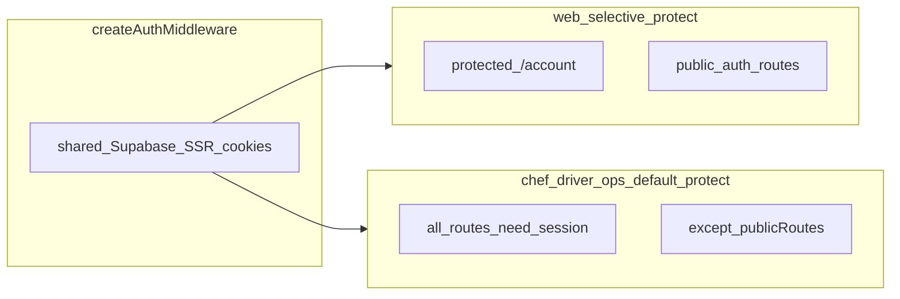

# Auth middleware by app

Factory: [packages/auth/src/middleware.ts](file:///c:/Users/sean/RIDENDINEV1/packages/auth/src/middleware.ts)

Per-app configs: [apps/web/src/middleware.ts](file:///c:/Users/sean/RIDENDINEV1/apps/web/src/middleware.ts), [apps/chef-admin/src/middleware.ts](file:///c:/Users/sean/RIDENDINEV1/apps/chef-admin/src/middleware.ts), [apps/ops-admin/src/middleware.ts](file:///c:/Users/sean/RIDENDINEV1/apps/ops-admin/src/middleware.ts), [apps/driver-app/src/middleware.ts](file:///c:/Users/sean/RIDENDINEV1/apps/driver-app/src/middleware.ts).

**EXISTING:** Ops adds `publicRoutes` prefix `/api/engine/processors` in [apps/ops-admin/src/middleware.ts](file:///c:/Users/sean/RIDENDINEV1/apps/ops-admin/src/middleware.ts); handler-level token check in [apps/ops-admin/src/app/api/engine/processors/sla/route.ts](file:///c:/Users/sean/RIDENDINEV1/apps/ops-admin/src/app/api/engine/processors/sla/route.ts).
