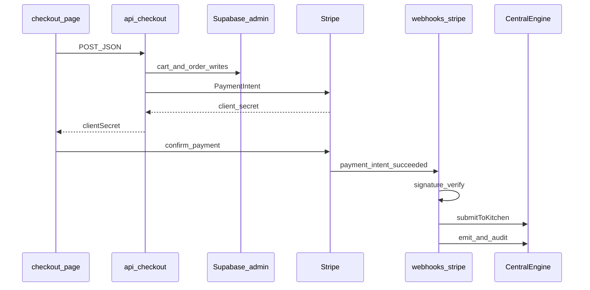

# Checkout and Stripe webhook

Files: [apps/web/src/app/checkout/page.tsx](file:///c:/Users/sean/RIDENDINEV1/apps/web/src/app/checkout/page.tsx), [apps/web/src/app/api/checkout/route.ts](file:///c:/Users/sean/RIDENDINEV1/apps/web/src/app/api/checkout/route.ts), [apps/web/src/app/api/webhooks/stripe/route.ts](file:///c:/Users/sean/RIDENDINEV1/apps/web/src/app/api/webhooks/stripe/route.ts).

