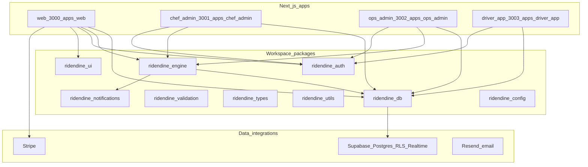

# Monorepo topology

Source inventory: [package.json](file:///c:/Users/sean/RIDENDINEV1/package.json), [CLAUDE.md](file:///c:/Users/sean/RIDENDINEV1/CLAUDE.md), [packages/engine/package.json](file:///c:/Users/sean/RIDENDINEV1/packages/engine/package.json).
