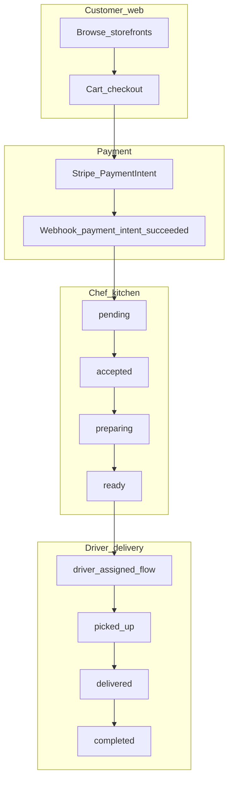

# Order status flow (documentation vs engine)

Align with [docs/ORDER_FLOW.md](file:///c:/Users/sean/RIDENDINEV1/docs/ORDER_FLOW.md) and DB enums in [docs/DATABASE_SCHEMA.md](file:///c:/Users/sean/RIDENDINEV1/docs/DATABASE_SCHEMA.md). **PARTIAL:** narrative mixes order and delivery labels; verify against [packages/engine/src/orchestrators/order-state-machine.ts](file:///c:/Users/sean/RIDENDINEV1/packages/engine/src/orchestrators/order-state-machine.ts) during implementation.

