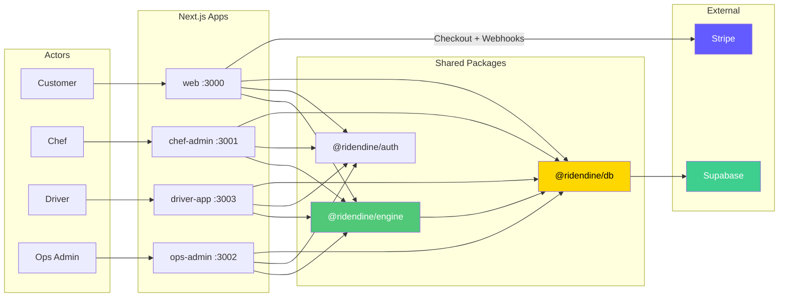
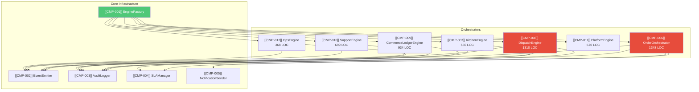
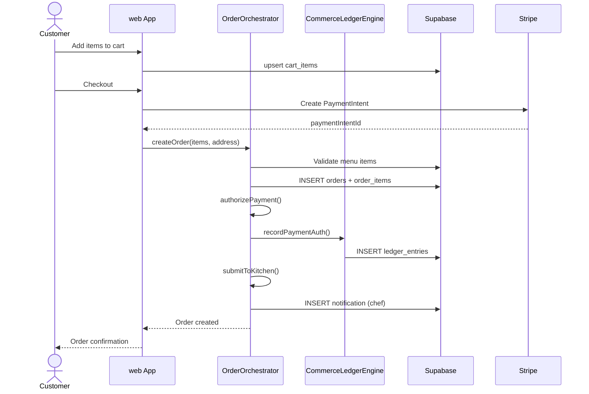
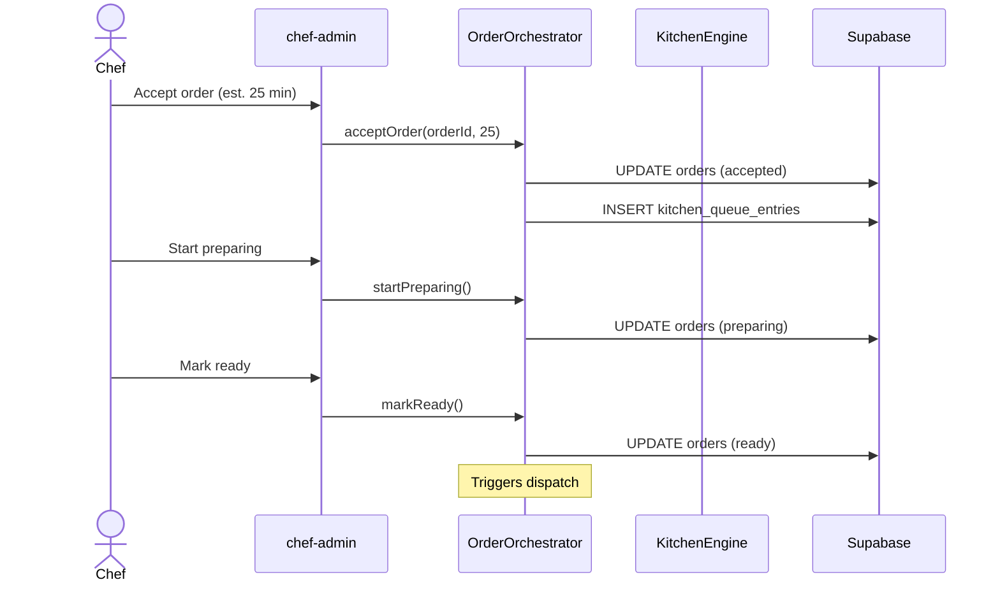
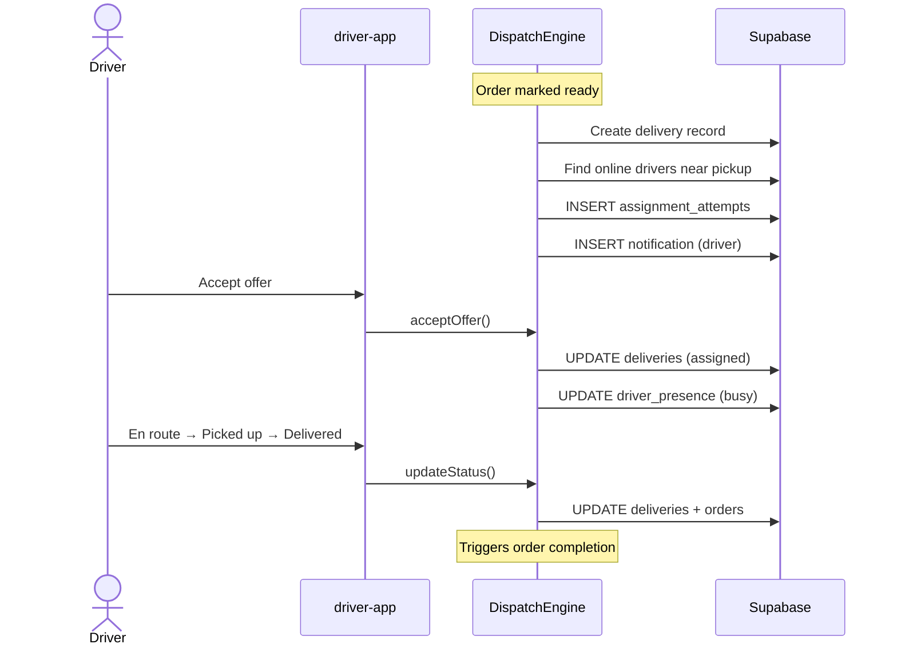
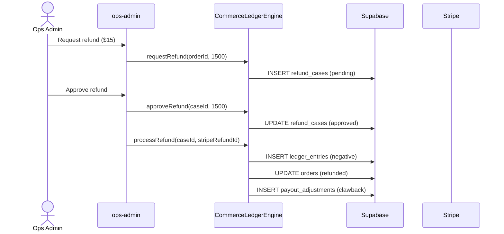
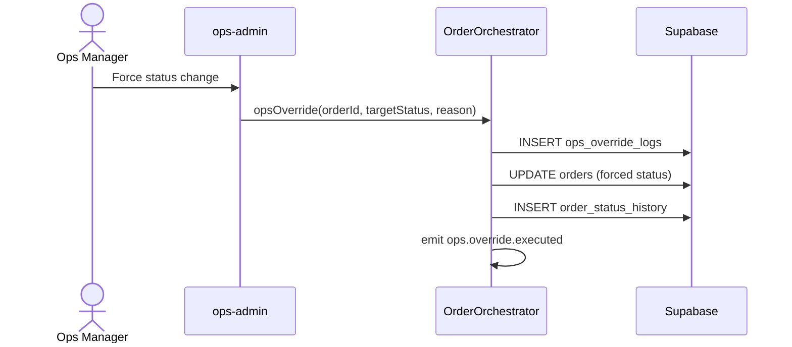

# Ridendine — System Map & Audit

_Generated: 2026-04-28T00:00:00Z  ·  Auditor: Claude Code  ·  Commit: cc549db_

## Table of Contents
- [0. Executive Summary](#0-executive-summary)
- [1. Reconnaissance](#1-reconnaissance)
- [2. File Census & Manifests](#2-file-census--manifests)
- [3. Entry Points & Boundaries](#3-entry-points--boundaries)
- [4. Component Inventory](#4-component-inventory)
- [5. Architecture Diagrams](#5-architecture-diagrams)
  - [5.1 System View](#51-system-view)
  - [5.2 Subsystem Views](#52-subsystem-views)
  - [5.3 Critical Flows](#53-critical-flows)
  - [5.4 Data Model (ERD)](#54-data-model-erd)
  - [5.5 Full Import Graph](#55-full-import-graph)
- [6. Audit Findings](#6-audit-findings)
  - [6.1 Duplicates](#61-duplicates)
  - [6.2 Orphans](#62-orphans)
  - [6.3 Broken Wires](#63-broken-wires)
  - [6.4 Circular Dependencies](#64-circular-dependencies)
  - [6.5 Layer Violations](#65-layer-violations)
  - [6.6 Secret Hygiene](#66-secret-hygiene)
  - [6.7 Test Coverage Gaps](#67-test-coverage-gaps)
  - [6.8 Code Smells](#68-code-smells)
  - [6.9 Configuration Drift](#69-configuration-drift)
- [7. Recommendations](#7-recommendations)
- [Appendix A: Glossary](#appendix-a-glossary)
- [Appendix B: Component Index](#appendix-b-component-index)
- [Appendix C: Finding Index](#appendix-c-finding-index)
- [Appendix D: Flow Index](#appendix-d-flow-index)
- [Appendix E: Assumptions Log](#appendix-e-assumptions-log)

---

## 0. Executive Summary

- **Languages:** TypeScript (primary — 172 files), SQL (13), JavaScript (11), CSS (4)
- **Frameworks:** Next.js 14, React 18, Supabase (PostgreSQL + Auth + Realtime), Stripe, Tailwind CSS
- **Build:** Turborepo + pnpm 9.15.0 monorepo (4 apps, 10 packages)
- **Components mapped:** 67
- **Findings:** Critical: 1, High: 5, Medium: 9, Low: 5 (20 total)
- **Top 3 risks:**
  1. [[FND-005]] No automated SLA processor — SLA breaches go undetected
  2. [[FND-017]] Stripe payment authorizations not voided on order rejection
  3. [[FND-012]] Missing test coverage — 11 test files for 331 source files
- **Suggested first sprint:**
  1. [[FND-004]] Fix delivery_events column name (5 min fix)
  2. [[FND-018]] Guard null notification user_id (5 min fix)
  3. [[FND-001]] Extract PasswordStrength to @ridendine/ui (30 min)

---

## 1. Reconnaissance

Ridendine is a **chef-first food delivery marketplace** connecting home chefs with customers. Built as a pnpm/Turborepo monorepo with four Next.js 14 applications backed by Supabase PostgreSQL.

### Workspaces

| Workspace | Path | Port | Description |
|-----------|------|------|-------------|
| Customer Web | `apps/web` | 3000 | Customer marketplace — browse chefs, order food, track deliveries |
| Chef Admin | `apps/chef-admin` | 3001 | Chef dashboard — manage menu, accept orders, track payouts |
| Ops Admin | `apps/ops-admin` | 3002 | Operations admin — dispatch, exceptions, finance, platform settings |
| Driver App | `apps/driver-app` | 3003 | Driver PWA — accept offers, navigate deliveries, track earnings |
| @ridendine/db | `packages/db` | — | Supabase clients (browser/server/admin) and 15 repositories |
| @ridendine/engine | `packages/engine` | — | Central business logic — 7 orchestrators + core infrastructure |
| @ridendine/auth | `packages/auth` | — | Authentication provider, hooks, and Next.js middleware |
| @ridendine/types | `packages/types` | — | Shared TypeScript types, domain models, engine state machine |
| @ridendine/validation | `packages/validation` | — | Zod validation schemas for all domains |
| @ridendine/ui | `packages/ui` | — | Shared React components (Button, Card, Input, Modal, etc.) |
| @ridendine/utils | `packages/utils` | — | API helpers, logger, date/currency formatting, error handling |
| @ridendine/config | `packages/config` | — | Shared Tailwind, TypeScript, and ESLint configs |
| @ridendine/notifications | `packages/notifications` | — | Notification message templates |

### External Integrations

| Service | Purpose | Status |
|---------|---------|--------|
| **Supabase** | PostgreSQL database, Auth, Realtime subscriptions | 🟢 Active |
| **Stripe** | Payments (PaymentIntents, Connect, Webhooks, Refunds) | 🟢 Active |
| **Leaflet** | Map visualization (ops-admin, driver-app, web) | 🟢 Active |
| **Resend** | Email delivery | ⚠️ INFERRED: configured but not integrated |
| **Google Maps** | Geocoding / maps | ⚠️ INFERRED: env key commented out |

> Raw data: [raw/repo-meta.json](raw/repo-meta.json)

---

## 2. File Census & Manifests

- **Total source files:** ~331
- **TypeScript:** 172 files (.ts, .tsx)
- **SQL migrations:** 13 files
- **JavaScript:** 11 files (config files)
- **CSS:** 4 files (globals.css per app)
- **Test files:** 11

### Top 20 Largest Files

| File | LOC | Role |
|------|-----|------|
| `packages/engine/src/orchestrators/order.orchestrator.ts` | 1348 | Service |
| `packages/engine/src/orchestrators/dispatch.engine.ts` | 1310 | Service |
| `packages/engine/src/orchestrators/commerce.engine.ts` | 934 | Service |
| `packages/engine/src/orchestrators/support.engine.ts` | 699 | Service |
| `packages/engine/src/orchestrators/platform.engine.ts` | 670 | Service |
| `packages/engine/src/orchestrators/kitchen.engine.ts` | 665 | Service |
| `packages/db/src/repositories/ops.repository.ts` | 616 | Repository |
| `supabase/migrations/00007_central_engine_tables.sql` | 525 | Migration |
| `apps/chef-admin/src/components/menu/menu-list.tsx` | 496 | UI |
| `supabase/migrations/00010_contract_drift_repair.sql` | 427 | Migration |
| `apps/ops-admin/src/components/map/live-map.tsx` | 410 | UI |
| `packages/engine/src/orchestrators/ops.engine.ts` | 368 | Service |
| `packages/db/src/repositories/delivery.repository.ts` | 326 | Repository |
| `apps/web/src/components/storefront/storefront-menu.tsx` | 322 | UI |
| `apps/chef-admin/src/components/orders/orders-list.tsx` | 322 | UI |
| `packages/db/src/repositories/order.repository.ts` | 309 | Repository |
| `packages/db/src/repositories/finance.repository.ts` | 262 | Repository |
| `packages/db/src/repositories/driver.repository.ts` | 256 | Repository |
| `packages/db/src/repositories/chef.repository.ts` | 250 | Repository |
| `apps/web/src/components/notifications/notification-bell.tsx` | 234 | UI |

### Dependency Counts

| Package | Runtime Deps | Workspace Deps |
|---------|-------------|----------------|
| apps/web | 7 | 8 (all packages) |
| apps/chef-admin | 4 | 8 |
| apps/ops-admin | 6 | 8 |
| apps/driver-app | 5 | 8 |
| packages/engine | 2 | 4 (db, notifications, types, validation) |
| packages/db | 2 | 1 (types) |
| packages/auth | 2 | 2 (db, types) |

> Raw data: [raw/file-census.json](raw/file-census.json), [raw/manifests.json](raw/manifests.json)

---

## 3. Entry Points & Boundaries

### Entry Points (9 total)

| ID | Kind | Path | Invocation |
|----|------|------|------------|
| EP-001 | HTTP Server | `apps/web` | `next dev -p 3000` |
| EP-002 | HTTP Server | `apps/chef-admin` | `next dev -p 3001` |
| EP-003 | HTTP Server | `apps/ops-admin` | `next dev -p 3002` |
| EP-004 | HTTP Server | `apps/driver-app` | `next dev -p 3003` |
| EP-005 | Webhook | `apps/web/src/app/api/webhooks/stripe/route.ts` | Stripe callback |
| EP-006 | Middleware | `apps/web/src/middleware.ts` | Next.js request pipeline |
| EP-007 | Middleware | `apps/chef-admin/src/middleware.ts` | Next.js request pipeline |
| EP-008 | Middleware | `apps/ops-admin/src/middleware.ts` | Next.js request pipeline |
| EP-009 | Middleware | `apps/driver-app/src/middleware.ts` | Next.js request pipeline |

⚠️ INFERRED: No cron jobs, scheduled workers, lambda handlers, or message consumers detected.

### API Routes (55 total)

| App | Routes | Key Endpoints |
|-----|--------|---------------|
| **web** | 13 | `/api/checkout`, `/api/webhooks/stripe`, `/api/cart`, `/api/orders` |
| **chef-admin** | 11 | `/api/menu`, `/api/orders`, `/api/payouts/setup`, `/api/storefront` |
| **ops-admin** | 22 | `/api/engine/*` (10 routes), `/api/orders/[id]/refund`, `/api/support` |
| **driver-app** | 10 | `/api/offers`, `/api/deliveries`, `/api/location`, `/api/driver/presence` |

### Boundaries

**Ingress:** 4 HTTP APIs + 1 Stripe webhook
**Egress:** Supabase (DB + Auth + Realtime), Stripe (Payments + Connect + Refunds)
**Not integrated:** Resend (email), Google Maps (geocoding)

### Domain Events (31 event types)

All events flow through [[CMP-002]] DomainEventEmitter → `domain_events` table → Supabase Realtime broadcast. **No server-side event subscribers exist** — all reactions require explicit API calls. The event system is fire-and-forget with persistence.

Key event types: `order.created`, `order.accepted`, `order.ready`, `dispatch.requested`, `driver.offer.created`, `driver.assigned`, `delivery.delivered`, `refund.processed`, `storefront.paused`

> Raw data: [raw/entry-points.json](raw/entry-points.json), [raw/routes.json](raw/routes.json), [raw/boundaries.json](raw/boundaries.json), [raw/events.json](raw/events.json)

---

## 4. Component Inventory

### Engine Subsystem (CMP-001 through CMP-020)

| ID | Name | Layer | LOC | Smells |
|----|------|-------|-----|--------|
| [[CMP-001]] | EngineFactory | Service | 92 | |
| [[CMP-002]] | DomainEventEmitter | Service | ~100 | |
| [[CMP-003]] | AuditLogger | Service | ~100 | |
| [[CMP-004]] | SLAManager | Service | ~100 | |
| [[CMP-005]] | NotificationSender | Service | 44 | |
| [[CMP-006]] | OrderOrchestrator | Service | 1348 | 🟡 God class |
| [[CMP-007]] | KitchenEngine | Service | 665 | |
| [[CMP-008]] | DispatchEngine | Service | 1310 | 🟡 God class |
| [[CMP-009]] | CommerceLedgerEngine | Service | 934 | |
| [[CMP-010]] | SupportExceptionEngine | Service | 699 | |
| [[CMP-011]] | PlatformWorkflowEngine | Service | 670 | |
| [[CMP-012]] | OpsControlEngine | Service | 368 | |
| [[CMP-013]] | OrdersService | Service | — | Legacy compat |
| [[CMP-014]] | ChefsService | Service | — | Legacy compat |
| [[CMP-015]] | CustomersService | Service | — | Legacy compat |
| [[CMP-016]] | PermissionsService | Service | — | |
| [[CMP-017]] | StorageService | Service | — | |
| [[CMP-018]] | DispatchService | Service | — | Legacy compat |
| [[CMP-019]] | EngineConstants | Config | 104 | |
| [[CMP-020]] | EngineServer | Adapter | 205 | |

### Database Subsystem (CMP-021 through CMP-039)

| ID | Name | Layer | LOC | Smells |
|----|------|-------|-----|--------|
| [[CMP-021]] | BrowserClient | Adapter | 28 | |
| [[CMP-022]] | ServerClient | Adapter | 46 | |
| [[CMP-023]] | AdminClient | Adapter | 32 | |
| [[CMP-024]] | OrderRepository | Repository | 309 | |
| [[CMP-025]] | ChefRepository | Repository | 250 | 🟡 Manual aggregation |
| [[CMP-026]] | CustomerRepository | Repository | 208 | |
| [[CMP-027]] | DeliveryRepository | Repository | 326 | |
| [[CMP-028]] | DriverRepository | Repository | 256 | |
| [[CMP-029]] | PlatformRepository | Repository | 211 | 🟡 Fallback logic |
| [[CMP-030]] | MenuRepository | Repository | 169 | |
| [[CMP-031]] | CartRepository | Repository | 133 | |
| [[CMP-032]] | StorefrontRepository | Repository | 181 | |
| [[CMP-033]] | FinanceRepository | Repository | 262 | |
| [[CMP-034]] | SupportRepository | Repository | 108 | |
| [[CMP-035]] | PromoRepository | Repository | 123 | |
| [[CMP-036]] | AddressRepository | Repository | 96 | |
| [[CMP-037]] | DriverPresenceRepository | Repository | 102 | 🟡 Schema drift aliases |
| [[CMP-038]] | OpsRepository | Repository | 616 | 🟡 Layer violation |
| [[CMP-039]] | RealtimeHook | Util | 49 | |

### Auth Subsystem (CMP-040 through CMP-042)

| ID | Name | Layer | LOC |
|----|------|-------|-----|
| [[CMP-040]] | AuthProvider | Adapter | 79 |
| [[CMP-041]] | UseAuth | Util | 147 |
| [[CMP-042]] | AuthMiddleware | Adapter | 126 |

### Shared UI (CMP-043 through CMP-046)

| ID | Name | Layer | LOC |
|----|------|-------|-----|
| [[CMP-043]] | Button | UI | 77 |
| [[CMP-044]] | Card | UI | — |
| [[CMP-045]] | Input | UI | — |
| [[CMP-046]] | Modal | UI | — |

### Utils & Notifications (CMP-047 through CMP-049)

| ID | Name | Layer | LOC |
|----|------|-------|-----|
| [[CMP-047]] | ApiHelpers | Util | 143 |
| [[CMP-048]] | Logger | Util | 84 |
| [[CMP-049]] | NotificationTemplates | Adapter | 80 |

### App-Level Components (CMP-050 through CMP-067)

| ID | Name | Layer | App | Smells |
|----|------|-------|-----|--------|
| [[CMP-050]] | WebCheckoutRoute | Controller | web | |
| [[CMP-051]] | StripeWebhookRoute | Controller | web | |
| [[CMP-052]] | WebCartContext | Adapter | web | |
| [[CMP-053]] | ChefOrdersList | UI | chef-admin | |
| [[CMP-054]] | ChefMenuList | UI | chef-admin | 🟡 496 LOC |
| [[CMP-055]] | OpsLiveMap | UI | ops-admin | 🟡 410 LOC |
| [[CMP-056]] | OpsAlertsPanel | UI | ops-admin | |
| [[CMP-057]] | DriverLocationTracker | Util | driver-app | |
| [[CMP-058]] | WebPasswordStrength | UI | web | |
| [[CMP-059]] | ChefPasswordStrength | UI | chef-admin | 🔴 Duplicate of [[CMP-058]] |
| [[CMP-060]] | StorefrontMenu | UI | web | |
| [[CMP-061]] | NotificationBell | UI | web | |
| [[CMP-062]] | OrderTrackingMap | UI | web | |
| [[CMP-063]] | DashboardLayout | UI | ops-admin | |
| [[CMP-064]] | EngineWebClient | Adapter | web | |
| [[CMP-065]] | EngineChefClient | Adapter | chef-admin | |
| [[CMP-066]] | EngineOpsClient | Adapter | ops-admin | |
| [[CMP-067]] | EngineDriverClient | Adapter | driver-app | |

> Full component cards: [components/](components/)

---

## 5. Architecture Diagrams

### 5.1 System View



**Diagram 5.1 — Top-level system view.** Actors connect to dedicated Next.js apps which share engine, auth, and DB packages. All database access flows through @ridendine/db to Supabase. Only the web app integrates directly with Stripe.

### 5.2 Subsystem Views

#### Engine Subsystem



**Diagram 5.2.1 — Engine subsystem.** EngineFactory wires 7 orchestrators with shared core infrastructure. Red nodes are god classes (>1000 LOC).

> Additional subsystem diagrams: [diagrams/subsystems/](diagrams/subsystems/) (WebApp, ChefAdmin, OpsAdmin, DriverApp, Database)

### 5.3 Critical Flows

#### [[FLOW-001]] Order Placement



**Diagram 5.3.1 — Order placement flow.** Customer cart → Stripe payment → order creation → kitchen submission.

#### [[FLOW-002]] Chef Order Processing



**Diagram 5.3.2 — Chef order processing.** Accept → prepare → ready, triggering dispatch.

#### [[FLOW-003]] Dispatch & Delivery



**Diagram 5.3.3 — Dispatch and delivery lifecycle.** Driver scoring → offer → accept → pickup → deliver.

#### [[FLOW-004]] Refund Processing



**Diagram 5.3.4 — Refund processing.** Request → approve → Stripe refund → ledger + payout adjustments.

#### [[FLOW-005]] Ops Override



**Diagram 5.3.5 — Ops override.** Bypasses state machine with full audit trail.

> Full flow documentation: [flows/](flows/)

### 5.4 Data Model (ERD)

The database contains **50+ tables** across 8 domains. Key entity groups:

- **Chef domain (7 tables):** `chef_profiles` → `chef_kitchens` → `chef_storefronts` → `chef_availability`, `chef_delivery_zones`, `chef_documents`, `chef_payout_accounts`
- **Catalog domain (4 tables):** `menu_categories` → `menu_items` → `menu_item_options` → `menu_item_option_values`
- **Customer domain (5 tables):** `customers` → `customer_addresses`, `carts` → `cart_items`, `favorites`
- **Order domain (6 tables):** `orders` → `order_items` → `order_item_modifiers`, `order_status_history`, `reviews`, `promo_codes`
- **Driver domain (8 tables):** `drivers` → `driver_documents`, `driver_vehicles`, `driver_shifts`, `driver_presence`, `driver_locations`, `driver_earnings`, `driver_payouts`
- **Delivery domain (4 tables):** `deliveries` → `delivery_assignments`, `delivery_events`, `delivery_tracking_events`
- **Engine domain (10 tables):** `domain_events`, `order_exceptions`, `sla_timers`, `kitchen_queue_entries`, `ledger_entries`, `assignment_attempts`, `refund_cases`, `payout_adjustments`, `storefront_state_changes`, `system_alerts`, `ops_override_logs`
- **Platform domain (6 tables):** `platform_users`, `platform_settings`, `notifications`, `audit_logs`, `admin_notes`, `payout_runs`, `push_subscriptions`

> Full ERD: [diagrams/erd.mmd](diagrams/erd.mmd) · Schema JSON: [raw/data-model.json](raw/data-model.json)

### 5.5 Full Import Graph

The package dependency graph forms a **clean DAG** with no circular dependencies:

```
Apps (web, chef-admin, ops-admin, driver-app)
  └→ @ridendine/engine, auth, ui, utils, validation
       └→ @ridendine/db, types, notifications
            └→ @ridendine/types (leaf node)
```

> Graphviz: [diagrams/graph/import-graph.dot](diagrams/graph/import-graph.dot) · JSON: [diagrams/graph/import-graph.json](diagrams/graph/import-graph.json)

---

## 6. Audit Findings

### 6.1 Duplicates

| ID | Severity | Title | Components | Effort |
|----|----------|-------|------------|--------|
| [[FND-001]] | Medium | Duplicate PasswordStrength component | [[CMP-058]], [[CMP-059]] | S |
| [[FND-015]] | Low | Similar AuthLayout components | — | S |
| [[FND-016]] | Medium | Duplicate engine client wrappers | [[CMP-064]]–[[CMP-067]] | S |

**[[FND-001]]** Identical 90-LOC PasswordStrength component in `apps/web` and `apps/chef-admin`. Should be moved to `@ridendine/ui`.

**[[FND-015]]** AuthLayout in web and chef-admin differ by 6 LOC (gradient color, badge text). Minor.

**[[FND-016]]** All 4 apps have near-identical `src/lib/engine.ts` singleton wrappers. Should be a shared module in the engine package.

### 6.2 Orphans

None detected. All source files participate in the import graph.

### 6.3 Broken Wires

| ID | Severity | Title | Components | Effort |
|----|----------|-------|------------|--------|
| [[FND-004]] | High | delivery_events column name mismatch | [[CMP-008]] | S |
| [[FND-005]] | **Critical** | No automated SLA processor | [[CMP-004]] | L |
| [[FND-014]] | High | No expired offer scheduler | [[CMP-008]] | M |
| [[FND-017]] | Medium | Stripe payments not voided on rejection | [[CMP-006]] | M |
| [[FND-018]] | Medium | Notification insert with null user_id | [[CMP-006]] | S |

**[[FND-004]]** 🔴 BROKEN: `DispatchEngine.updateDeliveryStatus()` inserts into `delivery_events` using key `data` but the column is `event_data`. Inserts silently fail or write to wrong column.

**[[FND-005]]** 🔴 BROKEN: SLA timers are created with deadlines but **nothing processes them automatically**. SLA breaches go completely undetected unless ops manually triggers `process_sla_timers` from the dashboard. This is the single highest-risk finding.

**[[FND-014]]** 🔴 BROKEN: `processExpiredOffers()` exists but is never called on a schedule. Expired delivery offers sit in 'pending' status indefinitely, blocking the dispatch pipeline.

**[[FND-017]]** 🟡 SMELL: `rejectOrder()` and `cancelOrder()` write ledger entries for payment voids but never call `stripe.paymentIntents.cancel()`. Card authorizations are never released — customers see holds for up to 7 days.

**[[FND-018]]** 🔴 BROKEN: If chef lookup fails in `submitToKitchen()`, `chefUserId` is null and the notification INSERT violates the NOT NULL constraint on `notifications.user_id`.

### 6.4 Circular Dependencies

None detected. The package dependency graph is a clean DAG. No intra-package circular imports found.

### 6.5 Layer Violations

| ID | Severity | Title | Components | Effort |
|----|----------|-------|------------|--------|
| [[FND-007]] | Medium | OpsRepository contains orchestration logic | [[CMP-038]] | M |

**[[FND-007]]** `ops.repository.ts` (616 LOC) contains driver scoring algorithms, coverage gap calculations, and dispatch queue orchestration logic that belongs in the engine layer. Repositories should only contain data access queries.

### 6.6 Secret Hygiene

| ID | Severity | Title | Effort |
|----|----------|-------|--------|
| [[FND-019]] | Medium | BYPASS_AUTH env var | S |

**[[FND-019]]** Development-only `BYPASS_AUTH` env var exists with no build-time guard preventing accidental production deployment.

🟢 OK: No committed secrets detected. All `.env` files are gitignored. Secret keys are read from environment variables only.

### 6.7 Test Coverage Gaps

| ID | Severity | Title | Effort |
|----|----------|-------|--------|
| [[FND-011]] | High | No CI/CD pipeline | M |
| [[FND-012]] | High | Missing test coverage | L |

**[[FND-011]]** ⚠️ INFERRED: No GitHub Actions workflow files found. All verification is manual.

**[[FND-012]]** Only **11 test files** for ~331 source files:
- Engine: 8 test files (best covered)
- Web app: 4 test files (3 auth component tests + 1 API test)
- All other apps: **0 tests**
- All repositories: **0 tests**
- Auth, validation, notifications, utils: **0 tests**

### 6.8 Code Smells

| ID | Severity | Title | Components | Effort |
|----|----------|-------|------------|--------|
| [[FND-006]] | Medium | No email/SMS notification delivery | [[CMP-005]] | M |
| [[FND-008]] | Medium | OrderOrchestrator god class (1348 LOC) | [[CMP-006]] | L |
| [[FND-009]] | Medium | DispatchEngine god class (1310 LOC) | [[CMP-008]] | L |
| [[FND-010]] | Low | ChefMenuList 496 LOC with embedded modals | [[CMP-054]] | S |
| [[FND-013]] | Low | Hardcoded Hamilton coordinates in 4 files | [[CMP-055]], [[CMP-062]] | S |

**[[FND-006]]** NotificationSender writes to DB but no actual email/SMS delivery. `RESEND_API_KEY` is commented out. Customers/chefs/drivers receive no external notifications.

**[[FND-008]]** OrderOrchestrator at 1348 LOC handles the entire order lifecycle — creation, payment, kitchen, acceptance, rejection, preparation, readiness, cancellation, completion, and ops override.

**[[FND-009]]** DispatchEngine at 1310 LOC handles dispatch, driver matching with complex scoring, offer management, status updates, manual assignment, reassignment, and expired offer processing.

### 6.9 Configuration Drift

| ID | Severity | Title | Effort |
|----|----------|-------|--------|
| [[FND-002]] | High | Schema drift — duplicate table definitions | M |
| [[FND-003]] | High | platform_settings triple definition | M |
| [[FND-020]] | Medium | RLS role mismatch | M |

**[[FND-002]]** `promo_codes`, `driver_locations`, and `chef_payout_accounts` are each defined in 2 migrations with different column types (VARCHAR vs TEXT). Mitigated by `IF NOT EXISTS` but is a maintenance hazard.

**[[FND-003]]** `platform_settings` table defined in migrations 00004, 00009, and 00010 with conflicting schemas. Migration 00010 creates columns (`setting_key`, `setting_value`) that may conflict with the additive ALTER approach in 00009.

**[[FND-020]]** Some RLS policies still reference `ops_admin` while the engine uses `ops_agent`, `ops_manager`, `finance_admin`. Migration 00010 expanded the CHECK constraint but not all policies were updated.

> Full finding details: [findings/](findings/)

---

## 7. Recommendations

### Quick Wins (< 1 day, low risk)

| # | Action | Findings | Effort |
|---|--------|----------|--------|
| QW-1 | Extract PasswordStrength to @ridendine/ui | [[FND-001]] | S |
| QW-2 | Extract Hamilton coordinates to shared constant | [[FND-013]] | S |
| QW-3 | Fix delivery_events column name (`data` → `event_data`) | [[FND-004]] | S |
| QW-4 | Guard null notification user_id | [[FND-018]] | S |
| QW-5 | Consolidate engine client wrappers | [[FND-016]] | S |

### Consolidation

| # | Action | Findings | Effort |
|---|--------|----------|--------|
| CON-1 | Unify duplicate schema definitions | [[FND-002]], [[FND-003]] | M |
| CON-2 | Extract OpsRepository logic to engine | [[FND-007]] | M |
| CON-3 | Split OrderOrchestrator into focused modules | [[FND-008]] | L |
| CON-4 | Split DispatchEngine and extract driver scoring | [[FND-009]] | L |

### Structural Fixes

| # | Action | Findings | Effort |
|---|--------|----------|--------|
| **STR-1** | **Add automated SLA/offer processor** | **[[FND-005]], [[FND-014]]** | **L** |
| STR-2 | Add actual Stripe void calls on rejection/cancel | [[FND-017]] | M |
| STR-3 | Align RLS policies with expanded role set | [[FND-020]] | M |

**STR-1 is the highest-impact fix.** Without automated SLA and expired offer processing, delivery offers expire silently and SLA breaches go undetected.

### Risk Reduction

| # | Action | Findings | Effort |
|---|--------|----------|--------|
| RISK-1 | Add CI/CD pipeline | [[FND-011]] | L |
| RISK-2 | Add test coverage for critical paths | [[FND-012]] | L |
| RISK-3 | Implement email/SMS delivery | [[FND-006]] | M |
| RISK-4 | Remove or protect BYPASS_AUTH | [[FND-019]] | S |

> Full recommendation details: [recommendations.md](recommendations.md)

---

## Appendix A: Glossary

| Term | Definition | Aliases in codebase |
|------|-----------|---------------------|
| Storefront | A chef's public-facing profile and menu listing | `chef_storefronts` table |
| Kitchen | Physical location where a chef prepares food | `chef_kitchens` table |
| Order | A customer's food purchase with items, fees, delivery | `orders` table |
| Delivery | Physical transport of an order from kitchen to customer | `deliveries` table |
| Assignment Attempt | An offer sent to a driver to take a delivery | `assignment_attempts` table; also `delivery_assignments` (legacy) |
| Ledger Entry | A financial transaction record (charge, refund, payout) | `ledger_entries` table |
| Refund Case | A request to return money to a customer | `refund_cases` table |
| Domain Event | An event emitted by engine orchestrators | `domain_events` table |
| SLA Timer | A deadline tracker for service level agreements | `sla_timers` table |
| Kitchen Queue | Ordered list of orders being prepared by a chef | `kitchen_queue_entries` table |
| Engine Status | Extended 32-state order status used by the engine | `orders.engine_status` column |
| Legacy Status | Original 11-state order status | `orders.status` column |
| Actor Context | Identity and role of the user performing an operation | `ActorContext` TypeScript type |
| Platform Settings | Global config for fees, SLAs, dispatch rules | `platform_settings` table |
| Payout Adjustment | A modification to a chef/driver payout | `payout_adjustments` table |
| Ops Override | A forced status change by operations staff | `ops_override_logs` table |
| Dispatch Board | Real-time view of pending/active deliveries | OpsAdmin `/dashboard/map` page |

---

## Appendix B: Component Index

| ID | Name | Layer | Subsystem | Responsibility |
|----|------|-------|-----------|----------------|
| [[CMP-001]] | EngineFactory | Service | Engine | Creates and wires all engine orchestrators |
| [[CMP-002]] | DomainEventEmitter | Service | Engine | Queues, persists, and broadcasts domain events |
| [[CMP-003]] | AuditLogger | Service | Engine | Records all mutations to audit_logs and ops_override_logs |
| [[CMP-004]] | SLAManager | Service | Engine | Creates and manages SLA timer deadlines |
| [[CMP-005]] | NotificationSender | Service | Engine | Sends notifications via templates to DB |
| [[CMP-006]] | OrderOrchestrator | Service | Order | Full order lifecycle state machine (1348 LOC) |
| [[CMP-007]] | KitchenEngine | Service | Kitchen | Chef-side kitchen queue and storefront availability |
| [[CMP-008]] | DispatchEngine | Service | Dispatch | Driver matching, offers, delivery lifecycle (1310 LOC) |
| [[CMP-009]] | CommerceLedgerEngine | Service | Commerce | Financial transactions, refunds, payouts |
| [[CMP-010]] | SupportExceptionEngine | Service | Support | Exception/incident management |
| [[CMP-011]] | PlatformWorkflowEngine | Service | Platform | Global platform rules and settings |
| [[CMP-012]] | OpsControlEngine | Service | Ops | Operations team interventions |
| [[CMP-013]]–[[CMP-018]] | Legacy Services | Service | Various | Backwards-compatible service layer |
| [[CMP-019]] | EngineConstants | Config | Engine | Fee rates, status enums, transition rules |
| [[CMP-020]] | EngineServer | Adapter | Engine | Actor context extraction helpers |
| [[CMP-021]]–[[CMP-023]] | DB Clients | Adapter | Database | Browser, Server, Admin Supabase clients |
| [[CMP-024]]–[[CMP-038]] | Repositories (15) | Repository | Database | Data access for all domains |
| [[CMP-039]] | RealtimeHook | Util | Database | Client-side Supabase subscription hook |
| [[CMP-040]]–[[CMP-042]] | Auth | Adapter/Util | Auth | Provider, hooks, middleware |
| [[CMP-043]]–[[CMP-046]] | UI Components | UI | SharedUI | Button, Card, Input, Modal |
| [[CMP-047]]–[[CMP-048]] | Utils | Util | Utils | API helpers, Logger |
| [[CMP-049]] | NotificationTemplates | Adapter | Notifications | Message templates |
| [[CMP-050]]–[[CMP-067]] | App Components (18) | Various | Apps | Route handlers, UI components, adapters |

> Full cards: [components/](components/)

---

## Appendix C: Finding Index

| ID | Category | Severity | Title |
|----|----------|----------|-------|
| [[FND-001]] | Duplicate | Medium | Duplicate PasswordStrength component |
| [[FND-002]] | ConfigDrift | High | Schema drift — duplicate table definitions |
| [[FND-003]] | ConfigDrift | High | platform_settings triple definition |
| [[FND-004]] | BrokenWire | High | delivery_events column name mismatch |
| [[FND-005]] | BrokenWire | **Critical** | No automated SLA processor |
| [[FND-006]] | Smell | Medium | No email/SMS notification delivery |
| [[FND-007]] | LayerViolation | Medium | OpsRepository contains orchestration logic |
| [[FND-008]] | Smell | Medium | OrderOrchestrator god class (1348 LOC) |
| [[FND-009]] | Smell | Medium | DispatchEngine god class (1310 LOC) |
| [[FND-010]] | Smell | Low | ChefMenuList 496 LOC with embedded modals |
| [[FND-011]] | TestGap | High | No CI/CD pipeline |
| [[FND-012]] | TestGap | High | Missing test coverage (11 of 331 files) |
| [[FND-013]] | Smell | Low | Hardcoded Hamilton coordinates |
| [[FND-014]] | BrokenWire | High | No expired offer scheduler |
| [[FND-015]] | Duplicate | Low | Similar AuthLayout components |
| [[FND-016]] | Duplicate | Medium | Duplicate engine client wrappers |
| [[FND-017]] | BrokenWire | Medium | Stripe payments not voided on rejection |
| [[FND-018]] | BrokenWire | Medium | Notification insert with null user_id |
| [[FND-019]] | SecretHygiene | Medium | BYPASS_AUTH env var |
| [[FND-020]] | ConfigDrift | Medium | RLS role mismatch |

> Full finding details: [findings/](findings/)

---

## Appendix D: Flow Index

| ID | Name | Entry Point | Key Components |
|----|------|-------------|----------------|
| [[FLOW-001]] | Order Placement | `/api/checkout` | [[CMP-006]], [[CMP-009]], [[CMP-050]] |
| [[FLOW-002]] | Chef Order Processing | `/api/orders/[id]` | [[CMP-006]], [[CMP-007]] |
| [[FLOW-003]] | Dispatch & Delivery | DispatchEngine | [[CMP-008]], [[CMP-057]] |
| [[FLOW-004]] | Refund Processing | `/api/engine/refunds` | [[CMP-009]] |
| [[FLOW-005]] | Ops Override | `/api/engine/orders/[id]` | [[CMP-006]], [[CMP-012]] |

> Full flow documentation: [flows/](flows/)

---

## Appendix E: Assumptions Log

- ⚠️ INFERRED: Test framework is vitest — detected from .test.ts file patterns but no vitest.config found at root
- ⚠️ INFERRED: NEXT_PUBLIC_GOOGLE_MAPS_API_KEY and RESEND_API_KEY are commented out in .env.example — assumed not yet integrated
- ⚠️ INFERRED: packages/engine tests use inline test files (*.test.ts alongside source) rather than a separate test directory
- ⚠️ INFERRED: No CI/CD pipeline detected in .github/workflows/ — may exist but not examined
- ⚠️ INFERRED: driver_locations table appears in both migration 00001 and 00004 — 00004 uses CREATE TABLE IF NOT EXISTS, so no conflict at runtime but indicates schema planning drift
- ⚠️ INFERRED: promo_codes table defined in both 00001 and 00004 with slightly different column types (VARCHAR vs TEXT) — IF NOT EXISTS prevents runtime error but is a maintenance concern
- ⚠️ INFERRED: chef_payout_accounts defined in both 00001 and 00004 with different columns — 00001 has stripe_account_id VARCHAR, 00004 has stripe_account_id TEXT plus additional columns
- ⚠️ INFERRED: platform_settings table defined in migrations 00004, 00009, and 00010 with additive columns — possible column type conflicts
- ⚠️ INFERRED: delivery_events insert uses 'data' field key but column is 'event_data' — fixed in migration 00010 RPC but direct inserts in dispatch.engine.ts line 734 still use 'data'
- ⚠️ INFERRED: audit_logs table schema has actor_type constraint CHECK but 00007 migration adds actor_type column again — IF NOT EXISTS prevents error
- ⚠️ INFERRED: Legacy services (CMP-013 through CMP-018) are marked "for backwards compatibility" in engine index.ts — LOC not measured
- ⚠️ INFERRED: Engine client files (CMP-065, CMP-066, CMP-067) are structurally similar to CMP-064 based on consistent pattern across apps
