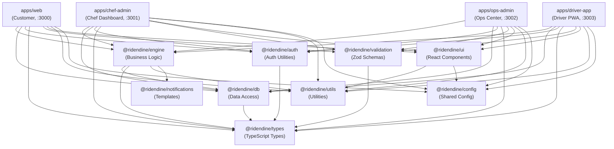

# 04 - System Architecture

**Audit Date**: 2026-04-23
**Scope**: Monorepo topology, package dependency graph, data flow, auth flow, deployment, and key design decisions

---

## Monorepo Architecture

```
┌─────────────────────────────────────────────────────────────────────────────────┐
│                          RIDENDINE MONOREPO                                      │
│                     pnpm 9.15.0 + Turborepo 2.3.0                               │
│                                                                                   │
│  ┌───────────────┐  ┌───────────────┐  ┌───────────────┐  ┌──────────────────┐ │
│  │   apps/web    │  │apps/chef-admin│  │apps/ops-admin │  │ apps/driver-app  │ │
│  │   Port 3000   │  │   Port 3001   │  │   Port 3002   │  │    Port 3003     │ │
│  │   Customer    │  │  Chef Dash    │  │  Ops Center   │  │   Driver PWA     │ │
│  └───────┬───────┘  └───────┬───────┘  └───────┬───────┘  └────────┬─────────┘ │
│          │                  │                  │                    │           │
│          └──────────────────┴──────────────────┴────────────────────┘           │
│                                        │                                         │
│                    ┌───────────────────▼──────────────────────┐                 │
│                    │            SHARED PACKAGES                │                 │
│                    │                                           │                 │
│                    │  @ridendine/engine  (business logic)      │                 │
│                    │  @ridendine/db      (data access)         │                 │
│                    │  @ridendine/auth    (auth utilities)      │                 │
│                    │  @ridendine/types   (TypeScript types)    │                 │
│                    │  @ridendine/validation (Zod schemas)      │                 │
│                    │  @ridendine/ui      (React components)    │                 │
│                    │  @ridendine/utils   (utility functions)   │                 │
│                    │  @ridendine/notifications (templates)     │                 │
│                    │  @ridendine/config  (shared config)       │                 │
│                    └───────────────────────────────────────────┘                 │
└─────────────────────────────────────────────────────────────────────────────────┘
```

---

## Package Dependency Graph



**Key Observations**:
- `@ridendine/types` is the lowest-level shared package with no internal dependencies
- `@ridendine/db` depends only on `types`; it is the exclusive data access layer
- `@ridendine/engine` depends on `db`, `types`, `utils`, `notifications` - it is the primary business logic hub
- All apps depend on `engine` and `db` directly; apps should not have direct DB queries outside repositories
- `@ridendine/config` provides build-time config; it is a dev dependency for all packages

---

## Request/Response Data Flow

### Standard Page Request (Server Component)
```
Browser
  │
  ▼
Next.js App Router (SSR)
  │  ├── Next.js middleware.ts (auth check)
  │  │     └── createServerClient() [from @ridendine/db]
  │  │           └── Supabase Auth → JWT verification
  │  │
  │  └── Page Component (Server Component)
  │        └── Direct repository call [from @ridendine/db]
  │              └── Supabase PostgreSQL (RLS enforced)
  │
  ▼
HTML → Browser
```

### API Route Request (Client-Initiated Action)
```
Browser
  │  POST /api/checkout
  │
  ▼
Next.js API Route (route.ts)
  │  ├── Read session [createAdminClient or getSession from @ridendine/auth]
  │  ├── Validate request body [Zod schema from @ridendine/validation] *
  │  └── Call engine [getEngine() from local lib/engine.ts]
  │         │
  │         ▼
  │    @ridendine/engine Orchestrator
  │         │  ├── Validate business rules
  │         │  ├── Emit domain events [DomainEventEmitter]
  │         │  ├── Record SLA [SLAManager]
  │         │  └── Call repositories [from @ridendine/db]
  │         │         └── Supabase PostgreSQL (via service role client)
  │         │
  │         └── Return OperationResult<T>
  │
  └── JSON Response → Browser

* Note: Zod validation is inconsistently applied. Some routes validate, many do not.
```

### Stripe Payment Flow
```
Browser (Stripe Elements)
  │  POST /api/checkout → receives clientSecret
  │
  ▼
Stripe (hosted)
  │  Customer enters card → Stripe confirms PaymentIntent
  │
  ▼
Stripe Webhook → POST /api/webhooks/stripe (apps/web)
  │  ├── Verify stripe-signature header
  │  ├── Parse event type
  │  ├── payment_intent.succeeded → engine.orders.confirmPayment()
  │  └── payment_intent.payment_failed → engine.orders.handlePaymentFailed()
  │
  ▼
Order status updated in database
```

---

## Authentication and Authorization Flow

### Auth Architecture
```
Supabase Auth (PostgreSQL-backed)
  │
  ├── Browser: createBrowserClient() [from @ridendine/db/client/browser]
  │     └── Manages auth tokens in localStorage/cookies
  │
  ├── Server: createServerClient() [from @ridendine/db/client/server]
  │     └── Reads auth tokens from Next.js request cookies
  │
  └── Admin: createAdminClient() [from @ridendine/db/client/admin]
        └── Uses SUPABASE_SERVICE_ROLE_KEY - bypasses RLS
              (used by engine orchestrators and webhook handlers)
```

### Middleware Auth Check (per app)
```
Request arrives
  │
  ▼
middleware.ts
  │  ├── Check BYPASS_AUTH condition (DEV/preview - SECURITY GAP)
  │  │     └── If bypass → NextResponse.next() immediately (no auth)
  │  │
  │  └── Production path:
  │        ├── createServerClient() with cookie adapter
  │        ├── supabase.auth.getSession() → JWT validation
  │        ├── If protected route + no session → redirect to /auth/login
  │        └── If auth route + active session → redirect to dashboard
  │
  ▼
Page/API Route Handler
  │
  └── API routes call getChefActorContext() / getCustomerActorContext() / etc.
        └── Builds ActorContext { userId, role, storefrontId/customerId/driverId }
              └── Passed to engine.method(data, actor) for role-based authorization
```

### Row Level Security (RLS)
All Supabase tables have RLS enabled. Browser and server clients (using anon key) are subject to RLS policies defined in:
- `00002_rls_policies.sql` - Core policies
- `00003_fix_rls.sql` - Policy corrections
- `00005_anon_read_policies.sql` - Anonymous read for public browse

Admin client (service role) bypasses RLS - used exclusively in engine orchestrators and server-side operations where actor context has already been validated.

---

## Engine Pattern (Central Business Logic)

The engine pattern is the most significant architectural decision in the codebase:

```
┌─────────────────────────────────────────────────────────────────┐
│                    @ridendine/engine                             │
│                                                                   │
│  EngineFactory (engine.factory.ts)                               │
│  ┌─────────────────────────────────────────────────────────────┐ │
│  │                                                              │ │
│  │  OrderOrchestrator      ← Core order lifecycle              │ │
│  │  KitchenEngine          ← Prep state machine                │ │
│  │  DispatchEngine         ← Driver assignment + offers        │ │
│  │  CommerceEngine         ← Refunds + promos                  │ │
│  │  SupportEngine          ← Support ticket workflow           │ │
│  │  PlatformEngine         ← Settings management               │ │
│  │  OpsEngine              ← Governance actions                │ │
│  │                                                              │ │
│  └─────────────────────────────────────────────────────────────┘ │
│                                                                   │
│  Core Infrastructure:                                            │
│  ├── AuditLogger           ← Records all state changes           │
│  ├── DomainEventEmitter    ← Pub/sub for cross-domain events     │
│  └── SLAManager            ← Tracks SLA compliance               │
└─────────────────────────────────────────────────────────────────┘
```

**Pattern rules enforced**:
1. All state transitions validated via `isValidTransition()` from `@ridendine/types`
2. Every state change emits a `DomainEvent` (logged to `engine_events` table)
3. Every action records an `AuditLog` entry (`audit_log` table)
4. Operations return `OperationResult<T>` (typed success/failure union)
5. Actor context is always passed to and validated by engine methods

---

## Deployment Architecture

```
┌──────────────────────────────────────────────────────────────────┐
│                      VERCEL (4 Projects)                          │
│                                                                    │
│  ┌──────────────┐  ┌──────────────┐  ┌──────────────┐           │
│  │  ridendine-  │  │  ridendine-  │  │  ridendine-  │           │
│  │    web       │  │ chef-admin   │  │  ops-admin   │           │
│  │  (web app)   │  │  (chef app)  │  │  (ops app)   │           │
│  └──────┬───────┘  └──────┬───────┘  └──────┬───────┘           │
│         │                 │                  │                    │
│  ┌──────────────┐         │                  │                    │
│  │  ridendine-  │         │                  │                    │
│  │  driver-app  │         │                  │                    │
│  │ (driver app) │         │                  │                    │
│  └──────┬───────┘         │                  │                    │
│         │                 │                  │                    │
└─────────┼─────────────────┼──────────────────┼────────────────────┘
          │                 │                  │
          └─────────────────┴──────────────────┘
                            │
                            ▼
               ┌────────────────────────┐
               │    SUPABASE (Shared)    │
               │                         │
               │  PostgreSQL (56 tables) │
               │  Supabase Auth          │
               │  Supabase Storage       │
               │  Row Level Security     │
               └────────────────────────┘
```

**Deployment Notes**:
- Each Vercel project deploys independently from the monorepo
- All 4 Vercel projects share a single Supabase project instance
- Vercel environment variables are configured per-project
- The `BYPASS_AUTH` env var must be explicitly set to `"false"` on preview deployments, or auth is bypassed
- No staging environment exists; preview = Vercel preview deployments (which bypass auth by default)
- Stripe webhook is only configured for `apps/web` (the customer-facing app handles payment confirmation)

---

## Database Architecture

```
SUPABASE POSTGRESQL
│
├── Core Domain Tables (from migration 00001)
│   ├── profiles               User profiles (linked to auth.users)
│   ├── chef_storefronts       Primary listing entity (chef-first)
│   ├── menu_items             Items for sale
│   ├── menu_categories        Menu organization
│   ├── orders                 Order records
│   ├── order_items            Line items per order
│   ├── customers              Customer profiles
│   ├── drivers                Driver profiles
│   ├── deliveries             Delivery records
│   └── ...
│
├── Feature Tables (from migrations 00004-00006)
│   ├── reviews                Customer reviews of chefs
│   ├── promo_codes            Promotional discount codes
│   ├── notifications          In-app notifications
│   ├── cart                   Shopping cart sessions
│   ├── cart_items             Cart line items
│   ├── addresses              Customer delivery addresses
│   └── ...
│
├── Engine Infrastructure Tables (from migration 00007)
│   ├── engine_events          Domain event log
│   ├── sla_records            SLA tracking per order
│   ├── audit_log              All engine actions
│   ├── assignment_attempts    Driver offer records
│   └── driver_presence        Online/offline status
│
├── Ops Control Tables (from migration 00009)
│   ├── platform_settings      Fee rates, feature flags, dispatch config
│   ├── ops_actions            Ops admin action log
│   └── exceptions             Escalation and exception records
│
└── Schema Repair Columns (from migration 00010)
    └── Alias columns added for backwards compat
        (promo_codes: valid_from/valid_until/max_uses aliases)
```

---

## Key Design Decisions

### 1. Chef-First Data Model
`chef_storefronts` is the primary listing entity, not individual chefs or menu items. This means:
- Customers browse storefronts, not chef profiles
- Orders are placed against a `storefront_id`
- A chef can theoretically have multiple storefronts (though the current UI assumes one)

**Rationale**: Aligns with home chef business model where the brand is the storefront.

### 2. Engine Orchestrator Pattern
All business logic lives in `@ridendine/engine`. Apps are thin API wrappers that:
1. Parse and validate the HTTP request
2. Build an `ActorContext` from the session
3. Call the appropriate engine method
4. Return the `OperationResult`

**Rationale**: Single source of truth for business rules. Prevents logic drift between apps. Enables testing business logic independently of HTTP.

### 3. Repository Pattern for Data Access
All database access goes through repository functions in `@ridendine/db`. Raw Supabase queries outside this package are considered violations (though some exist in API routes using `createAdminClient` for custom selects not yet represented in repositories).

**Rationale**: Enables type-safe data access, centralizes query logic, makes it possible to swap database without touching app code.

### 4. Admin Client for Engine Operations
The engine uses `createAdminClient()` (service role key) to bypass RLS when performing multi-table operations. RLS is enforced at the middleware/session level before the engine is invoked.

**Trade-off**: Simpler engine code vs. relying on application-level auth enforcement. The RLS policies remain as a second line of defense for direct database access.

### 5. Separate Vercel Projects per App
Rather than a single monolithic deployment, each app is deployed independently.

**Rationale**: Independent scaling, independent deployments, independent domain names (web.ridendine.ca, chef.ridendine.ca, etc.)

**Trade-off**: 4x deployment management overhead. No single CI/CD pipeline coordinates all deployments.

### 6. No Real-Time Subscriptions (Current Gap)
Supabase Realtime is not used anywhere in the codebase. All updates require page refresh.

**Impact**: Poor UX for chef dashboard (new order notifications), customer order tracking, and ops dashboard live updates.

**Recommendation**: Add Supabase Realtime channel subscriptions in chef-admin dashboard and customer order tracking page as Phase 3 work.
