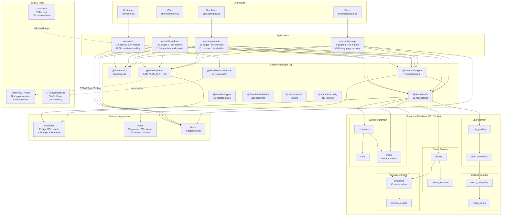
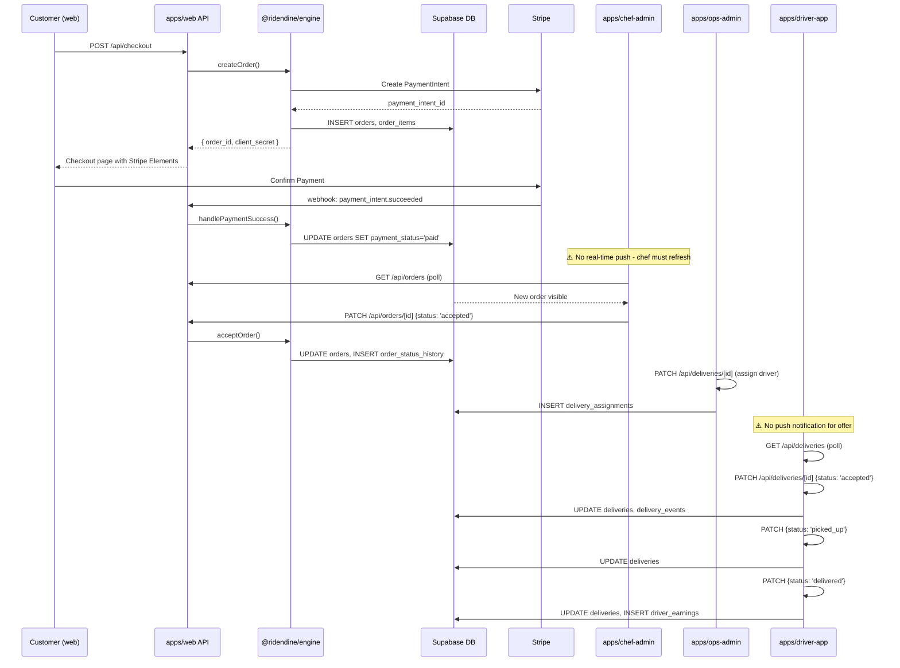
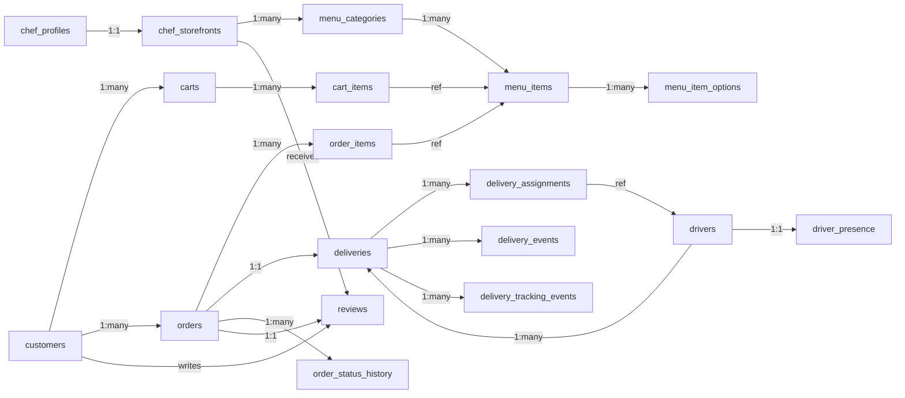
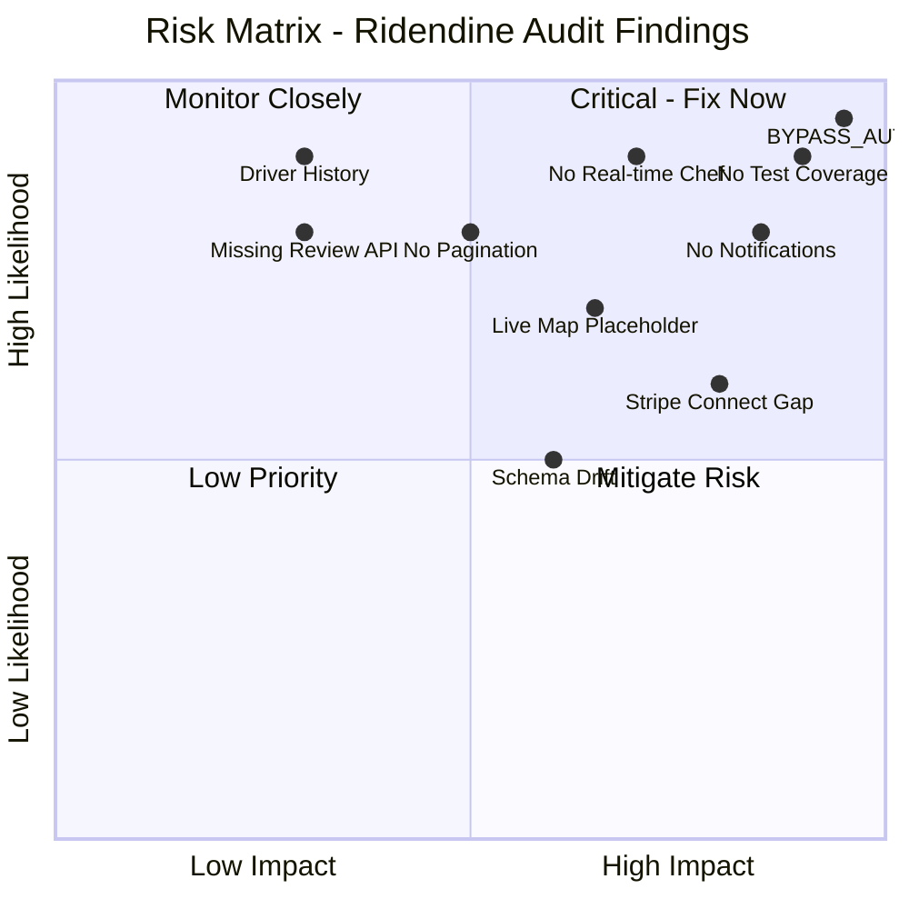

# Master System Graph - Ridendine Full System

Combined view showing apps, packages, database, roles, and risk annotations.

---

## Full System Dependency Graph

---

## Order Flow Graph

---

## Database Entity Relationships (Simplified)

---

## Risk Heat Map

