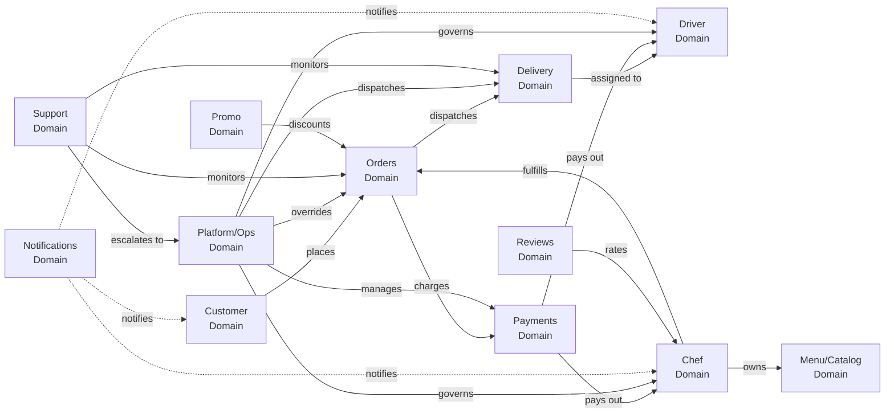

# Domain Map

> Ownership boundaries for every domain in the Ride N Dine platform.

## Domain Ownership Matrix

| Domain | Primary App | DB Tables | Repositories | Engine Orchestrator | Validation Schemas |
|--------|-------------|-----------|-------------|--------------------|--------------------|
| **Customer** | web | customers, customer_addresses, carts, cart_items | customer, address, cart | — | customer schemas |
| **Chef** | chef-admin | chef_profiles, chef_kitchens, chef_storefronts, chef_documents, chef_availability, chef_delivery_zones, chef_payout_accounts | chef, storefront | KitchenEngine | chef schemas |
| **Menu/Catalog** | chef-admin | menu_categories, menu_items, menu_item_options, menu_item_option_values, menu_item_availability | menu | KitchenEngine | chef schemas |
| **Orders** | web (create), chef-admin (manage), ops-admin (override) | orders, order_items, order_item_modifiers, order_status_history | order | OrderOrchestrator | order schemas |
| **Delivery** | driver-app (execute), ops-admin (dispatch) | deliveries, delivery_assignments, delivery_events, delivery_tracking_events, assignment_attempts | delivery | DispatchEngine | driver schemas |
| **Driver** | driver-app | drivers, driver_documents, driver_vehicles, driver_shifts, driver_presence, driver_locations, driver_earnings, driver_payouts | driver, driver-presence | DispatchEngine | driver schemas |
| **Payments** | web (charge), chef-admin (payout) | orders.payment_*, chef_payouts, ledger_entries, refund_cases, payout_adjustments, payout_runs | finance | CommerceLedgerEngine | order schemas |
| **Platform/Ops** | ops-admin | platform_users, platform_settings, admin_notes, audit_logs, domain_events, ops_override_logs, system_alerts | ops, platform | OpsControlEngine | ops schemas |
| **Support** | ops-admin | support_tickets, order_exceptions, sla_timers | support | SupportExceptionEngine | — |
| **Notifications** | web (display) | notifications, push_subscriptions | — | — | — |
| **Reviews** | web (create), chef-admin (respond) | reviews | — | — | order schemas |
| **Promo** | web (apply) | promo_codes | promo | — | — |
| **Storefront State** | ops-admin (governance) | storefront_state_changes, kitchen_queue_entries | — | KitchenEngine, PlatformWorkflowEngine | — |

## Domain Relationship Diagram

## Cross-Domain Workflows

### Order → Delivery → Complete (Platform Engine)

The `PlatformWorkflowEngine` orchestrates the most important cross-domain workflow:

1. **Order marked ready** (`markOrderReady`):
   - Updates order status to `ready_for_pickup`
   - Triggers `DispatchEngine.requestDispatch()` automatically
   - Creates delivery record
   - Starts driver matching

2. **Delivery completed** (`completeDeliveredOrder`):
   - Updates delivery status to `delivered`
   - Updates order status to `completed`
   - Creates ledger entries (platform fee, chef payout, driver payout)
   - Emits completion events

### Chef Governance (Ops → Chef)

1. Ops approves chef → storefront can be published
2. Ops publishes storefront → visible to customers
3. Ops suspends chef → storefront auto-unpublished
4. Kitchen overloaded → auto-pause (if setting enabled)

### Payment → Refund (Commerce Engine)

1. Customer or ops requests refund
2. Creates `refund_cases` entry
3. Ops reviews and approves/denies
4. Approved → Stripe refund processed
5. Payout adjustments created for chef/driver

## Domain Files Matrix

| Domain | Apps Files | Package Files | DB Tables |
|--------|-----------|---------------|-----------|
| Customer | `web/src/app/account/**`, `web/src/app/auth/**`, `web/src/contexts/cart-context.tsx` | `db/repositories/customer.repository.ts`, `db/repositories/address.repository.ts`, `db/repositories/cart.repository.ts`, `types/domains/customer.ts`, `validation/schemas/customer.ts` | customers, customer_addresses, carts, cart_items |
| Chef | `chef-admin/src/**` | `db/repositories/chef.repository.ts`, `db/repositories/storefront.repository.ts`, `engine/orchestrators/kitchen.engine.ts`, `types/domains/chef.ts`, `validation/schemas/chef.ts` | chef_profiles, chef_kitchens, chef_storefronts, chef_documents, chef_availability, chef_delivery_zones |
| Menu | `chef-admin/src/app/dashboard/menu/**`, `web/src/components/storefront/**` | `db/repositories/menu.repository.ts`, `validation/schemas/chef.ts` (menu schemas) | menu_categories, menu_items, menu_item_options, menu_item_option_values, menu_item_availability |
| Orders | `web/src/app/checkout/**`, `web/src/app/order-confirmation/**`, `chef-admin/src/app/dashboard/orders/**`, `ops-admin/src/app/dashboard/orders/**` | `db/repositories/order.repository.ts`, `engine/orchestrators/order.orchestrator.ts`, `types/domains/order.ts`, `validation/schemas/order.ts` | orders, order_items, order_item_modifiers, order_status_history |
| Delivery | `driver-app/src/**`, `ops-admin/src/app/dashboard/deliveries/**` | `db/repositories/delivery.repository.ts`, `engine/orchestrators/dispatch.engine.ts`, `types/domains/delivery.ts` | deliveries, delivery_assignments, delivery_events, delivery_tracking_events, assignment_attempts |
| Driver | `driver-app/src/**`, `ops-admin/src/app/dashboard/drivers/**` | `db/repositories/driver.repository.ts`, `db/repositories/driver-presence.repository.ts`, `types/domains/driver.ts`, `validation/schemas/driver.ts` | drivers, driver_documents, driver_vehicles, driver_shifts, driver_presence, driver_locations, driver_earnings |
| Payments | `web/src/app/api/checkout/**`, `web/src/app/api/webhooks/**`, `chef-admin/src/app/api/payouts/**`, `ops-admin/src/app/dashboard/finance/**` | `db/repositories/finance.repository.ts`, `engine/orchestrators/commerce.engine.ts` | ledger_entries, refund_cases, payout_adjustments, payout_runs, chef_payouts |
| Platform | `ops-admin/src/**` | `db/repositories/ops.repository.ts`, `db/repositories/platform.repository.ts`, `engine/orchestrators/ops.engine.ts` | platform_users, platform_settings, admin_notes, audit_logs, domain_events, ops_override_logs, system_alerts, storefront_state_changes |
