# System Topology

> High-level architecture of the Ride N Dine platform as it exists in code.

## Architecture Diagram

```mermaid
graph TB
    subgraph "Client Layer"
        WEB["apps/web<br/>Customer Marketplace<br/>:3000"]
        CHEF["apps/chef-admin<br/>Chef Dashboard<br/>:3001"]
        OPS["apps/ops-admin<br/>Ops Control Plane<br/>:3002"]
        DRV["apps/driver-app<br/>Driver PWA<br/>:3003"]
    end

    subgraph "Shared Package Layer"
        AUTH["@ridendine/auth<br/>AuthProvider, hooks"]
        UI["@ridendine/ui<br/>Button, Card, Modal..."]
        TYPES["@ridendine/types<br/>All domain types"]
        VAL["@ridendine/validation<br/>Zod schemas"]
        UTILS["@ridendine/utils<br/>Formatting, helpers"]
        NOTIF["@ridendine/notifications<br/>Templates"]
        CONFIG["@ridendine/config<br/>Tailwind, TS, ESLint"]
    end

    subgraph "Engine Layer"
        ENGINE["@ridendine/engine"]
        ORD_E["OrderOrchestrator"]
        DISP_E["DispatchEngine"]
        KITCH_E["KitchenEngine"]
        COMM_E["CommerceLedgerEngine"]
        SUPP_E["SupportExceptionEngine"]
        PLAT_E["PlatformWorkflowEngine"]
        OPS_E["OpsControlEngine"]
        EVENTS["DomainEventEmitter"]
        AUDIT["AuditLogger"]
        SLA["SLAManager"]
    end

    subgraph "Data Access Layer"
        DB["@ridendine/db"]
        REPO["14 Repositories"]
        CLIENTS["Server / Browser / Admin clients"]
    end

    subgraph "External Services"
        SUPA["Supabase<br/>(PostgreSQL + Auth + Realtime + Storage)"]
        STRIPE["Stripe<br/>(Payments + Connect + Webhooks)"]
        LEAFLET["Leaflet / OpenStreetMap<br/>(Maps)"]
    end

    WEB --> AUTH & UI & TYPES & VAL & UTILS & ENGINE & DB
    CHEF --> AUTH & UI & TYPES & VAL & ENGINE & DB
    OPS --> AUTH & UI & TYPES & VAL & ENGINE & DB
    DRV --> AUTH & UI & TYPES & VAL & ENGINE & DB

    ENGINE --> ORD_E & DISP_E & KITCH_E & COMM_E & SUPP_E & PLAT_E & OPS_E
    ENGINE --> EVENTS & AUDIT & SLA
    ENGINE --> DB

    DB --> REPO --> CLIENTS --> SUPA

    WEB --> STRIPE
    CHEF --> STRIPE
    WEB --> LEAFLET
    DRV --> LEAFLET
```



## Layer Architecture

### 1. Client Layer (4 Next.js Apps)

Each app is a standalone Next.js 14 application using the App Router. All share the same package dependencies but have independent:
- Middleware (auth gating)
- API routes (backend-for-frontend)
- Components (domain-specific UI)
- `lib/engine.ts` (actor context creation)

**Cross-app communication**: None directly. All apps communicate through the shared database and engine layer. There are no inter-app API calls.

### 2. Shared Package Layer (9 packages)

| Package | Consumers | Purpose |
|---------|-----------|---------|
| `@ridendine/auth` | All 4 apps | AuthProvider context, useAuth/useUser hooks, role utilities |
| `@ridendine/ui` | All 4 apps | 10 shared UI components (Button, Card, Input, Badge, Modal, etc.) |
| `@ridendine/types` | All 4 apps + engine + db | Domain types, enums, engine types, state transitions |
| `@ridendine/validation` | All 4 apps | 30+ Zod schemas for all domain inputs |
| `@ridendine/utils` | All 4 apps | Date/currency formatting, helpers, Haversine distance |
| `@ridendine/notifications` | Referenced but not actively dispatched | Notification templates for 13+ event types |
| `@ridendine/config` | All 4 apps | Shared Tailwind, TypeScript, ESLint configs |
| `@ridendine/engine` | All 4 apps (server-side) | Business logic orchestration |
| `@ridendine/db` | All 4 apps + engine | Database clients + 14 repository classes |

### 3. Engine Layer

The engine is the **central nervous system** of the platform. It enforces all business rules, state transitions, and cross-domain workflows.

**Orchestrators**:
- `OrderOrchestrator` — Order lifecycle (create → accept → prepare → ready → complete/cancel)
- `DispatchEngine` — Delivery assignment, driver matching, offer management
- `KitchenEngine` — Kitchen queue, prep time, storefront pause/resume
- `CommerceLedgerEngine` — Refunds, ledger entries, payout adjustments
- `SupportExceptionEngine` — Exception creation, escalation, resolution
- `PlatformWorkflowEngine` — Cross-engine workflows (ready → dispatch, delivery → complete)
- `OpsControlEngine` — Dashboard read models, platform rules, manual interventions

**Core Infrastructure**:
- `DomainEventEmitter` — Event sourcing with Supabase Realtime broadcast
- `AuditLogger` — All operations logged with actor, before/after state
- `SLAManager` — Timer tracking, breach detection

### 4. Data Access Layer

All database access goes through `@ridendine/db` repositories. No app makes raw Supabase queries for mutations (reads sometimes use direct queries for simple lookups).

**Three client types**:
| Client | RLS | Used By |
|--------|-----|---------|
| `createServerClient(cookies)` | Enforced | Server components, API routes (user context) |
| `createBrowserClient()` | Enforced | Client components (real-time, direct reads) |
| `createAdminClient()` | Bypassed | Engine operations, server-side mutations |

### 5. External Services

| Service | Integration Point | Status |
|---------|-------------------|--------|
| **Supabase** | Auth, DB, Realtime, Storage | Fully integrated |
| **Stripe** | PaymentIntents (web), Connect Express (chef-admin), Webhooks (web) | Fully integrated |
| **Leaflet/OSM** | Customer order tracking (web), Driver route map (driver-app) | Fully integrated |
| **Push Notifications** | Web push subscription table exists | Partially integrated (subscribe endpoint exists, no dispatch) |
| **Email/SMS** | Notification templates exist | Not integrated (templates only, no send mechanism) |

---

## Application Responsibility Matrix

| Capability | Web | Chef | Ops | Driver |
|-----------|-----|------|-----|--------|
| Browse storefronts | **Primary** | - | View | - |
| Place orders | **Primary** | - | Override | - |
| Manage menus | - | **Primary** | View | - |
| Accept/reject orders | - | **Primary** | Override | - |
| Dispatch deliveries | - | - | **Primary** | Accept/decline |
| Track deliveries | View | - | Monitor | **Primary** |
| Process payments | **Primary** | View earnings | Refund | - |
| Manage users | - | Self | **Primary** | Self |
| Platform settings | - | - | **Primary** | - |
| Exception handling | - | - | **Primary** | - |
| Financial operations | - | - | **Primary** | - |
| Support tickets | Create | - | **Primary** | - |

---

## Dependency Flow

```
Apps → Engine → Repositories → Supabase Client → PostgreSQL
       ↓              ↓
    Events         Types/Validation
       ↓
  Supabase Realtime → Client subscriptions
```

**Key constraint**: The engine is server-only. All apps access it through their own API routes, never from client components directly.
