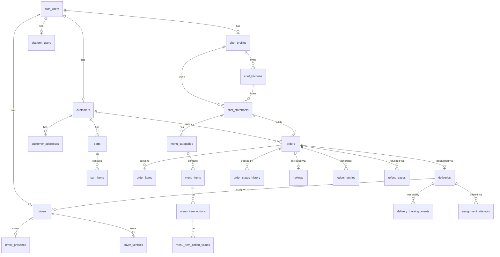

# Database Map

> All 36+ PostgreSQL tables via Supabase, their columns, relationships, RLS policies, and usage.

## Entity Relationship Overview

## Tables by Domain

### Chef Domain (7 tables)

#### `chef_profiles`
| Column | Type | Notes |
|--------|------|-------|
| id | UUID PK | |
| user_id | UUID FK → auth.users | UNIQUE |
| display_name | VARCHAR | |
| bio | TEXT | |
| profile_image_url | TEXT | |
| phone | VARCHAR | |
| status | ENUM | pending / approved / rejected / suspended |
| created_at, updated_at | TIMESTAMP | |

**Used by**: chef-admin (all pages), ops-admin (chefs, orders), web (storefront display via join)
**Repository**: `chef.repository.ts`

#### `chef_kitchens`
| Column | Type | Notes |
|--------|------|-------|
| id | UUID PK | |
| chef_id | UUID FK → chef_profiles | |
| name, address_line1/2, city, state, postal_code, country | VARCHAR | Physical location |
| lat, lng | DECIMAL | Geolocation |
| is_verified | BOOLEAN | |

**Used by**: chef-admin (storefront creation), ops-admin (delivery context)

#### `chef_storefronts`
| Column | Type | Notes |
|--------|------|-------|
| id | UUID PK | |
| chef_id | UUID FK → chef_profiles | |
| kitchen_id | UUID FK → chef_kitchens | |
| slug | VARCHAR UNIQUE | URL identifier |
| name, description | TEXT | |
| cuisine_types | TEXT[] | Array (GIN indexed) |
| cover_image_url, logo_url | TEXT | |
| is_active, is_featured | BOOLEAN | |
| average_rating | DECIMAL | |
| total_reviews | INTEGER | |
| min_order_amount | DECIMAL | |
| estimated_prep_time_min/max | INTEGER | |
| **Engine columns**: engine_status, storefront_state, is_paused, paused_reason, paused_at, paused_by, current_queue_size, max_queue_size, is_overloaded, average_prep_minutes, address | | Added in migration 00007 |

**Used by**: All 4 apps. Most-referenced table in the system.
**Repository**: `storefront.repository.ts`

#### `chef_documents`
| Column | Type | Notes |
|--------|------|-------|
| id | UUID PK | |
| chef_id | UUID FK | |
| document_type | ENUM | food_handler_certificate, kitchen_inspection, business_license, insurance |
| document_url, status, expires_at, notes | | |
| reviewed_by | UUID FK → auth.users | |

**Used by**: No UI currently surfaces this. **Schema exists but not integrated.**

#### `chef_availability`
| Column | Type | Notes |
|--------|------|-------|
| storefront_id + day_of_week | UNIQUE | |
| start_time, end_time | TIME | |
| is_available | BOOLEAN | |

**Used by**: No UI currently surfaces this. **Schema exists but not integrated.**

#### `chef_delivery_zones`
| Column | Type | Notes |
|--------|------|-------|
| storefront_id | UUID FK | |
| name, radius_km | | |
| polygon | GEOMETRY(POLYGON, 4326) | PostGIS |
| delivery_fee, min_order_for_free_delivery | | |

**Used by**: No UI currently surfaces this. **Schema exists but not integrated.**

#### `chef_payout_accounts`
| Column | Type | Notes |
|--------|------|-------|
| chef_id | UUID FK UNIQUE | |
| stripe_account_id | VARCHAR | Stripe Connect Express |
| is_verified, stripe_account_status, payout_enabled | | |

**Used by**: chef-admin (payouts page, setup/request APIs)

### Customer Domain (4 tables)

#### `customers`
| Column | Type | Notes |
|--------|------|-------|
| id | UUID PK | |
| user_id | UUID FK → auth.users | UNIQUE |
| first_name, last_name, phone, email | | |
| profile_image_url | TEXT | |

**Used by**: web (all auth flows, orders, profile), ops-admin (customer management)

#### `customer_addresses`
Full address with lat/lng, delivery_instructions, is_default flag.
**Used by**: web (checkout, account/addresses), ops-admin (order context)

#### `carts` + `cart_items`
Per-customer-per-storefront cart with item details, unit_price, selected_options (JSONB).
**Used by**: web only (cart context, checkout)

### Order Domain (6 tables)

#### `orders`
| Column | Type | Notes |
|--------|------|-------|
| id | UUID PK | |
| order_number | VARCHAR UNIQUE | Format: RD-{timestamp}-{random} |
| customer_id | UUID FK → customers | |
| storefront_id | UUID FK → chef_storefronts | |
| delivery_address_id | UUID FK → customer_addresses | |
| status | ENUM | 11 states (see [[Order Lifecycle]]) |
| subtotal, delivery_fee, service_fee, tax, tip, total | DECIMAL | |
| payment_status | ENUM | pending/processing/completed/failed/refunded |
| payment_intent_id | VARCHAR | Stripe reference |
| **Engine columns**: engine_status, rejection_reason, rejection_notes, cancellation_reason, cancellation_notes, cancelled_by, cancelled_at, estimated_prep_minutes, actual_prep_minutes, prep_started_at, ready_at, completed_at, exception_count | | |

**Used by**: All 4 apps. Second most-referenced table.

#### `order_items`
Line items with menu_item_id FK, quantity, unit_price, selected_options (JSONB).
Auto-populates `menu_item_name` via trigger.

#### `order_status_history`
Audit trail: order_id, status, notes, changed_by, created_at.

#### `reviews`
One review per order (UNIQUE order_id). Rating 1-5, comment, chef_response.
**Used by**: web (creation), chef-admin (viewing + responding)

#### `promo_codes`
Discount codes with usage tracking. Validated at checkout.
**Used by**: web (checkout only)

### Driver Domain (9 tables)

#### `drivers`
Similar to chef_profiles: user_id FK, name, phone, email, status enum.
**Used by**: driver-app, ops-admin

#### `driver_presence`
Real-time status: driver_id (UNIQUE), status (offline/online/busy), current_lat/lng, last_location_update.
**Used by**: driver-app (presence API), web (order tracking), ops-admin (dispatch, map)

#### `driver_locations`
GPS history: driver_id, lat, lng, accuracy, heading, speed, recorded_at.
**Used by**: driver-app (location API)

#### `driver_vehicles`, `driver_documents`, `driver_shifts`, `driver_earnings`
All have schema but **driver_vehicles is only displayed, not CRUD'd through UI**. Driver_shifts, driver_earnings are **referenced but not actively populated** through the current UI flows.

#### `driver_payouts`
Payout records. Schema exists, referenced in ops finance read model.

### Delivery Domain (4 tables + 1 engine table)

#### `deliveries`
Links order to driver. Full tracking: pickup/dropoff addresses + lat/lng, timestamps, proof URLs.
**Used by**: All apps except web directly (web sees via order joins).

#### `delivery_tracking_events`
GPS breadcrumbs: delivery_id, driver_id, lat, lng, accuracy, recorded_at.
**Used by**: driver-app (location API writes), web (order tracking reads)

#### `assignment_attempts` (engine table)
Offer tracking: delivery_id, driver_id, attempt_number, offered_at, expires_at, response.
**Used by**: driver-app (offers API), ops-admin (delivery detail)

### Platform/Engine Domain (11+ tables)

#### `platform_settings`
Centralized configuration with 15+ fields for fees, SLAs, dispatch rules.
**Used by**: ops-admin (settings page), engine (all orchestrators read these)

#### `platform_users`
Ops team members with role (ops_admin/super_admin/support).
**Used by**: ops-admin (login, role gating)

#### `audit_logs`
Generic audit: actor, action, entity_type, entity_id, old_data/new_data JSONB.
**Used by**: ops-admin (order detail audit trail)

#### `domain_events`
Event sourcing: event_type, entity, payload JSONB, actor context, published flag.
**Used by**: Engine (event emitter writes, Supabase Realtime broadcasts)

#### `order_exceptions`
Exception tracking with severity, status, linked entities, SLA deadline, assignment.
**Used by**: ops-admin (support, deliveries, orders)

#### `sla_timers`
Active/warning/breached/completed SLA monitoring.
**Used by**: Engine (SLA manager), ops-admin (dashboard)

#### `kitchen_queue_entries`
Per-storefront order queue with position, prep time estimates.
**Used by**: Engine (kitchen engine)

#### `ledger_entries`
Financial record: order_id, entry_type, amount_cents, entity reference.
**Used by**: ops-admin (finance)

#### `refund_cases`
Refund lifecycle: requested → approved/denied → processing → completed/failed.
**Used by**: ops-admin (finance)

#### `payout_adjustments`
Chef/driver payout modifications linked to refunds.
**Used by**: ops-admin (finance)

## RLS Summary

| Actor | Access Pattern |
|-------|---------------|
| **Anonymous** | Read active storefronts, menus, available items, visible reviews, active promos |
| **Customer** | CRUD own profile/addresses/carts; Read/Create orders; Create reviews for delivered orders |
| **Chef** | CRUD own profile/kitchens/storefronts/menus/availability/zones; Read own orders |
| **Driver** | CRUD own profile/vehicles/presence; Read/Update assigned deliveries |
| **Ops Admin** | Full SELECT/UPDATE on all tables via `is_ops_admin()` check |
| **Bypass** | Full unrestricted SELECT when `BYPASS_AUTH=true` (dev/staging) |

## RPC Functions

| Function | Purpose | Called By |
|----------|---------|----------|
| `increment_queue_size(storefront_id)` | Kitchen queue management | KitchenEngine |
| `decrement_queue_size(storefront_id)` | Kitchen queue management | KitchenEngine |
| `increment_order_exception_count(order_id)` | Exception tracking | SupportEngine |
| `get_orders_needing_dispatch()` | Find ready orders without delivery | DispatchEngine |
| `get_available_drivers_near(lat, lng, radius)` | Haversine driver matching | DispatchEngine |
| `get_ops_dashboard_stats()` | 11 platform metrics | OpsControlEngine |
| `get_order_timeline(order_id)` | Unified audit timeline | Ops order detail |
| `get_financial_summary(start, end)` | Ledger aggregation | Ops finance |
| `increment_promo_usage(promo_id)` | Promo code tracking | Web checkout |

## Table Usage Matrix

| Table | Web | Chef | Ops | Driver | Engine |
|-------|-----|------|-----|--------|--------|
| chef_profiles | Read | CRUD | Read/Update | — | Read |
| chef_storefronts | Read | CRUD | Read/Update | — | Read/Update |
| menu_categories | Read | CRUD | Read | — | — |
| menu_items | Read | CRUD | Read | — | Read |
| customers | CRUD | — | Read | — | Read |
| customer_addresses | CRUD | — | Read | — | — |
| carts / cart_items | CRUD | — | — | — | — |
| orders | Create/Read | Read/Update | Read/Update | Read | Read/Update |
| order_items | Create/Read | Read | Read | Read | Read |
| deliveries | Read | — | Read/Update | Read/Update | Create/Update |
| drivers | — | — | Read/Update | CRUD | Read |
| driver_presence | Read | — | Read | Update | Read/Update |
| platform_settings | — | — | CRUD | — | Read |
| notifications | CRUD | — | — | — | — |
| audit_logs | — | — | Read | — | Write |
| domain_events | — | — | — | — | Write/Read |

## Tables That Exist But Are Not Surfaced in UI

| Table | Schema Status | UI Status |
|-------|--------------|-----------|
| `chef_documents` | Complete schema | **No UI** — no upload/review flow |
| `chef_availability` | Complete schema | **No UI** — no schedule editor |
| `chef_delivery_zones` | Complete schema + PostGIS | **No UI** — no zone editor/map |
| `menu_item_availability` | Complete schema | **No UI** — no time-based availability |
| `driver_documents` | Complete schema | **No UI** — no upload/review flow |
| `driver_shifts` | Complete schema | **Not actively populated** — referenced in location tracking |
| `driver_earnings` | Complete schema | **Not populated** — earnings calculated from deliveries directly |
| `payout_runs` | Complete schema | **Not populated** — individual payouts exist but no batch runs |
| `admin_notes` | Complete schema | **No UI** — exists in DB only |
| `delivery_assignments` | Complete schema | **Superseded** by `assignment_attempts` (engine table) |
