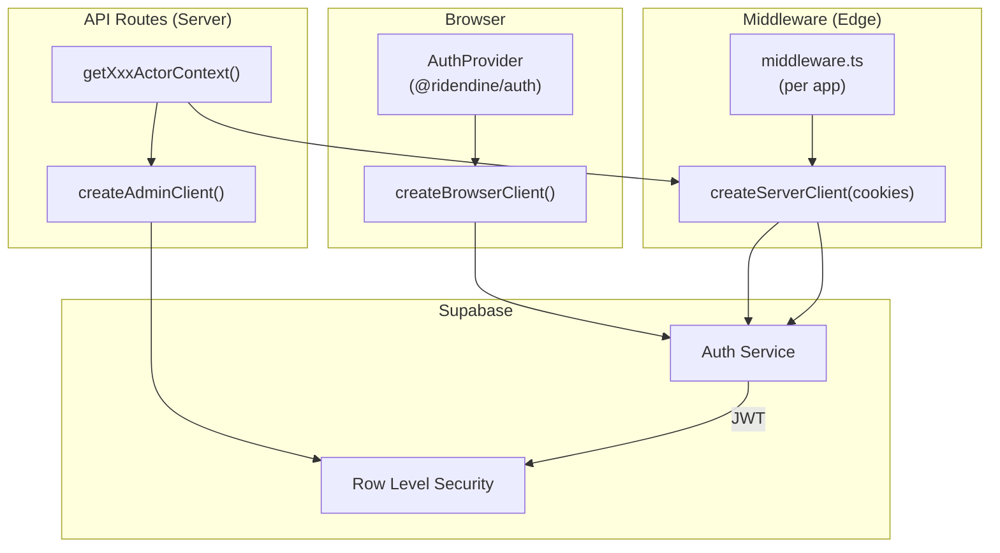
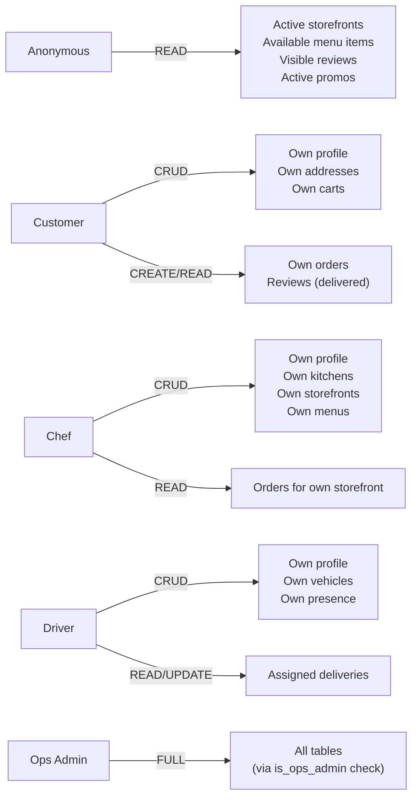

# Auth and Roles Map

> Authentication providers, middleware, role gating, and access control across all apps.

## Auth Provider

**Supabase Auth** (email/password only)
- No OAuth/social providers configured
- JWT expiry: 3600s (1 hour)
- Refresh token rotation enabled
- Email signup enabled, SMS disabled

## Auth Architecture



## Middleware Configuration

| App | Protected Routes | Public Routes | Bypass |
|-----|-----------------|---------------|--------|
| web | `/account/*` | `/auth/login`, `/auth/signup` | Dev mode or `BYPASS_AUTH=true` |
| chef-admin | All except public | `/auth/login`, `/auth/signup` | Dev mode or `BYPASS_AUTH=true` |
| ops-admin | All except public | `/auth/login` | Dev mode or `BYPASS_AUTH=true` |
| driver-app | All except public | `/auth/login`, `/auth/signup` | Dev mode or `BYPASS_AUTH=true` |

**Behavior**: All middleware creates a Supabase SSR client, checks session, redirects unauthenticated users to `/auth/login?redirect={pathname}`. Authenticated users on auth pages are redirected to the app root.

## Role System

### Role Types (from `@ridendine/types`)

```typescript
type ActorRole = 
  | 'customer'
  | 'chef_user'
  | 'chef_manager'    // Defined but not used in current code
  | 'driver'
  | 'ops_agent'
  | 'ops_manager'
  | 'finance_admin'
  | 'super_admin'
  | 'system'          // For webhook/automated actions
```

### Role → User Entity Mapping

| Role | Identity Source | Entity Table | Lookup Method |
|------|---------------|--------------|---------------|
| customer | `auth.users` | `customers` | `getCustomerByUserId(supabase, user.id)` |
| chef_user | `auth.users` | `chef_profiles` | `getChefByUserId(supabase, user.id)` |
| driver | `auth.users` | `drivers` | `getDriverByUserId(supabase, user.id)` |
| ops_agent | `auth.users` | `platform_users` | `SELECT * FROM platform_users WHERE user_id = ?` |
| ops_manager | `auth.users` | `platform_users` | Same, role field = 'ops_manager' |
| finance_admin | `auth.users` | `platform_users` | Same, role field = 'finance_admin' |
| super_admin | `auth.users` | `platform_users` | Same, role field = 'super_admin' |
| system | Hardcoded | None | `{userId: 'system', role: 'system'}` |

### Actor Context per App

| App | Function | Returns | Fails If |
|-----|----------|---------|----------|
| web | `getCustomerActorContext()` | `{actor: {userId, role: 'customer', entityId: customerId}, customerId}` | No user or no customer record |
| chef-admin | `getChefActorContext()` | `{actor: {userId, role: 'chef_user', entityId: chefId}, chefId, storefrontId}` | No user, no chef, or no storefront |
| chef-admin | `getChefBasicContext()` | `{userId, chefId, chefStatus, storefrontId}` | No user or no chef (allows no storefront) |
| driver-app | `getDriverActorContext()` | `{actor: {userId, role: 'driver', entityId: driverId}, driverId}` | No user, no driver, or driver.status !== 'approved' |
| ops-admin | `getOpsActorContext()` | `{actor: {userId, role: <from platform_users>, entityId: userId}}` | No user or no platform_users record |

## Role-Based Access Control

### Route-Level Access

| Route Pattern | Required Role | Enforcement |
|---------------|--------------|-------------|
| `web /account/*` | customer (any authenticated) | Middleware |
| `web /api/cart`, `/api/checkout`, `/api/orders` | customer | `getCustomerActorContext()` |
| `chef-admin /dashboard/*` | chef_user | Middleware + `getChefActorContext()` |
| `ops-admin /dashboard/*` | ops_agent+ | Middleware + `getOpsActorContext()` |
| `ops-admin /dashboard/finance` | ops_manager, finance_admin, super_admin | `hasRequiredRole()` check |
| `ops-admin /dashboard/settings` | ops_manager, super_admin | `hasRequiredRole()` check |
| `ops-admin /api/chefs/[id]` (governance) | ops_manager, super_admin | `hasRequiredRole()` check |
| `ops-admin /api/drivers/[id]` (governance) | ops_manager, super_admin | `hasRequiredRole()` check |
| `ops-admin /api/orders/[id]/refund` | ops_manager, finance_admin, super_admin | `hasRequiredRole()` check |
| `driver-app /` | driver (approved) | Middleware + server-side check |
| `driver-app /api/*` | driver (approved) | `getDriverActorContext()` |

### Role Hierarchy (inferred from code)

```
super_admin
  └── ops_manager
       ├── finance_admin (finance-specific)
       └── ops_agent
            └── (basic ops access)
```

**Note**: There is no formal role hierarchy in code. `hasRequiredRole(actor, requiredRoles)` checks if `actor.role` is in the `requiredRoles` array. There is no inheritance — each elevated route explicitly lists all allowed roles.

## Database-Level Security (RLS)

### Helper Functions

```sql
is_ops_admin(user_id) → Checks platform_users.is_active WHERE user_id
get_chef_id(user_id) → Returns chef_profiles.id WHERE user_id
get_customer_id(user_id) → Returns customers.id WHERE user_id
get_driver_id(user_id) → Returns drivers.id WHERE user_id
```

### RLS Policy Summary



## Auth Flow Diagrams

### Customer Auth
```
1. User visits /auth/signup → fills form → POST /api/auth/signup
2. Supabase creates auth.users record + session
3. API creates customers record (linked via user_id)
4. Redirect to /chefs
5. Middleware sets session cookies via Supabase SSR
```

### Chef Auth
```
1. Chef visits /auth/signup → fills form → POST /api/auth/signup (chef-admin)
2. Supabase creates auth.users record
3. API creates chef_profiles record (status: 'pending')
4. Chef CANNOT access storefront until ops approves (status → 'approved')
5. Chef creates storefront → ops publishes it (is_active: true)
```

### Driver Auth
```
1. Driver created by ops (or external signup - not in current UI)
2. Driver visits /auth/login → POST /api/auth/login (driver-app)
3. API checks driver.status === 'approved' BEFORE returning success
4. If not approved: signOut() + 403 error
5. If approved: session created, redirect to dashboard
```

### Ops Auth
```
1. Ops user created directly in platform_users table (seeded or manual)
2. Ops visits /auth/login → supabase.auth.signInWithPassword()
3. getOpsActorContext() checks platform_users for role
4. Role determines which dashboard sections are accessible
```

## Auth Gaps & Observations

| Issue | Details | Severity |
|-------|---------|----------|
| No password reset flow | Forgot password page exists in web but makes no API call | Medium |
| No email verification enforcement | Supabase sends confirmation email but signup proceeds regardless | Low |
| No OAuth/social login | Email/password only | Enhancement |
| Driver registration | No driver signup UI exists — drivers must be created by ops or directly in DB | Gap |
| Chef email confirmation | Chef signup may redirect to dashboard even if email not confirmed | Low |
| Session token storage | Standard Supabase SSR cookies — follows best practices | OK |
| BYPASS_AUTH in staging | All auth bypassed when flag is set — must be disabled in production | Risk |
| No MFA | No two-factor authentication | Enhancement |
| Role not stored in JWT | Role lookup requires DB query on every API call | Performance consideration |
