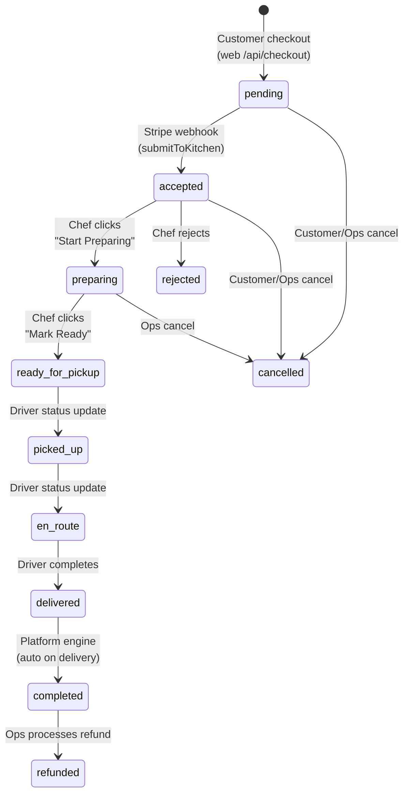

# Business Control Map

> What controls what in the Ride N Dine platform — both operational and technical.

## Order Lifecycle Control



### Who Controls Each Transition

| Transition | Controller | File | Method |
|-----------|-----------|------|--------|
| → pending | Customer (checkout submit) | `web/api/checkout/route.ts` | `engine.orders.createOrder()` |
| pending → accepted | Stripe webhook (auto) | `web/api/webhooks/stripe/route.ts` | `engine.orders.submitToKitchen()` |
| accepted → preparing | Chef (button click) | `chef-admin/api/orders/[id]/route.ts` | `engine.orders.startPreparing()` |
| preparing → ready | Chef (button click) | `chef-admin/api/orders/[id]/route.ts` | `engine.platform.markOrderReady()` |
| ready → dispatched | Platform engine (auto) | `engine/platform.engine.ts` | Triggers `dispatch.requestDispatch()` |
| dispatched → delivered | Driver (status updates) | `driver-app/api/deliveries/[id]/route.ts` | `engine.dispatch.updateDeliveryStatus()` |
| delivered → completed | Platform engine (auto) | `engine/platform.engine.ts` | `completeDeliveredOrder()` |
| Any → cancelled | Customer, Chef, or Ops | Various | `engine.orders.cancelOrder()` |
| accepted → rejected | Chef only | `chef-admin/api/orders/[id]/route.ts` | `engine.orders.rejectOrder()` |
| completed → refunded | Ops only (Manager+) | `ops-admin/api/orders/[id]/refund/route.ts` | Stripe refund API |

---

## Menu Lifecycle Control

| Action | Controller | Gate |
|--------|-----------|------|
| Create menu category | Chef | Must have storefront |
| Create menu item | Chef | Must have category + storefront |
| Update menu item | Chef | Ownership verified |
| Toggle item availability | Chef | Ownership verified |
| Delete menu item | Chef | Soft delete (is_available=false) |
| Mark item sold out | Engine (kitchen) | `markItemUnavailable()` — not currently triggered from UI |
| **Item visible to customers** | is_available=true AND storefront is_active=true | RLS policy |

---

## Chef Visibility Control Chain

```
1. Chef signs up → chef_profiles.status = 'pending'
2. Ops approves chef → chef_profiles.status = 'approved'
3. Chef creates storefront → chef_storefronts.is_active = FALSE
4. Ops publishes storefront → chef_storefronts.is_active = TRUE
5. NOW visible to customers (RLS: is_active=true)
```

**Who can unpublish**: Ops only (via StorefrontGovernanceActions)
**Who can suspend chef**: Ops only (via ChefGovernanceActions) → auto-unpublishes storefront
**Auto-pause**: Engine can pause if `storefront_auto_pause_enabled` setting is true and kitchen is overloaded

---

## Driver Assignment Control

| Action | Controller | Method |
|--------|-----------|--------|
| Auto-assign driver | Engine (dispatch) | `autoAssignDriver()` → `get_available_drivers_near()` RPC → score → offer |
| Manual assign driver | Ops | `POST /api/engine/dispatch` → `dispatch.manualAssign()` |
| Reassign driver | Ops | `POST /api/engine/dispatch` → reassign action |
| Accept offer | Driver | `POST /api/offers` → `dispatch.acceptOffer()` |
| Decline offer | Driver | `POST /api/offers` → `dispatch.declineOffer()` |
| Offer expiry | System timer | `assignment_attempts.expires_at` |

**Driver scoring** (`calculateDriverAssignmentScore`):
- Distance from pickup
- Current availability (online/busy)
- Rating and delivery count
- Returns numeric score for ranking

---

## Customer Checkout Control

| Control Point | What It Controls | Source |
|--------------|-----------------|--------|
| `min_order_amount` | Minimum cart total to checkout | `chef_storefronts.min_order_amount` |
| `is_active` | Whether storefront appears | `chef_storefronts.is_active` (ops-controlled) |
| `is_available` | Whether menu item is orderable | `menu_items.is_available` (chef-controlled) |
| `accepting_orders` | Whether storefront accepts orders | `chef_storefronts` field (chef-controlled) |
| Address validation | Required for delivery | `customer_addresses` (customer-managed) |
| Promo code validation | Discount application | `promo_codes` table + `increment_promo_usage` RPC |
| Stripe payment | Payment authorization | Stripe PaymentIntent API |

---

## Payment State Control

| State | Controller | Trigger |
|-------|-----------|---------|
| PaymentIntent created | Web checkout API | Order creation |
| Payment processing | Stripe | Customer submits card |
| Payment confirmed | Stripe webhook | `payment_intent.succeeded` |
| Payment failed | Stripe webhook | `payment_intent.payment_failed` |
| Refund initiated | Ops | `POST /api/orders/[id]/refund` |
| Refund processed | Stripe | `charge.refunded` webhook |

---

## Admin Oversight Control

### What Ops Can Override

| Domain | Actions Available | Role Required |
|--------|------------------|---------------|
| Chefs | Approve, Reject, Suspend, Unsuspend | ops_manager, super_admin |
| Storefronts | Publish, Unpublish, Pause, Unpause | ops_manager, super_admin |
| Drivers | Approve, Reject, Suspend, Restore | ops_manager, super_admin |
| Orders | Accept, Reject, Prepare, Ready, Cancel, Complete, Override | ops_agent+ (override: manager+) |
| Deliveries | Manual assign, Reassign, Retry, Escalate, Cancel, Add notes | ops_agent+ |
| Finance | Approve/deny refunds, Release payout holds | ops_manager, finance_admin, super_admin |
| Platform | Update all platform rules | ops_manager, super_admin |
| Exceptions | Create, Acknowledge, Escalate, Resolve, Add notes | ops_agent+ |
| Support | Start review, Resolve tickets | ops_agent+ |

---

## Status Transition Control

### Order Status State Machine (from engine constants)

```
VALID_ORDER_TRANSITIONS = {
  pending:           [accepted, cancelled],
  accepted:          [preparing, rejected, cancelled],
  preparing:         [ready_for_pickup, cancelled],
  ready_for_pickup:  [picked_up, cancelled],
  picked_up:         [in_transit],
  in_transit:        [delivered],
  delivered:         [completed],
  completed:         [refunded],
  rejected:          [],  // terminal
  cancelled:         [],  // terminal
  refunded:          []   // terminal
}
```

### Delivery Status Transitions (inferred from code)

```
pending → assigned → accepted → en_route_to_pickup → arrived_at_pickup → 
picked_up → en_route_to_dropoff → arrived_at_dropoff → delivered → completed

Also: any → cancelled, any → failed
```

---

## Pricing Control

| Parameter | Value | Source | Who Controls |
|-----------|-------|--------|-------------|
| Delivery fee | $5.00 flat | Engine constant `BASE_DELIVERY_FEE=399` (cents) | Code (not configurable via UI) |
| Service fee | 8% of subtotal | Engine constant `SERVICE_FEE_PERCENT=8` | Code |
| HST tax | 13% of (subtotal + service fee) | Engine constant `HST_RATE=13` | Code |
| Platform fee | 15% of order total | Engine constant `PLATFORM_FEE_PERCENT=15` | Code |
| Driver payout | 80% of delivery fee | Engine constant `DRIVER_PAYOUT_PERCENT=80` | Code |
| Tip | 0/10/15/20% or custom | Customer choice at checkout | Customer |
| Promo discount | Per promo code | `promo_codes` table | Ops (direct DB) |
| Min order amount | Per storefront | `chef_storefronts.min_order_amount` | Chef |

**Note**: Fee constants are in engine code, not in `platform_settings`. The platform_settings table has `platform_fee_percent` and `service_fee_percent` fields but the checkout calculation uses hardcoded engine constants. This is a **potential inconsistency**.

---

## Notification Control

| Event | Notification Created | Delivery Method |
|-------|---------------------|-----------------|
| Order placed | Planned (template exists) | **Not dispatched** |
| Order accepted | Planned (template exists) | **Not dispatched** |
| Order ready | Planned (template exists) | **Not dispatched** |
| Delivery offer | Planned (template exists) | **Not dispatched** |
| Order delivered | Planned (template exists) | **Not dispatched** |
| In-app notifications | Written to `notifications` table | **Supabase Realtime → NotificationBell** |
| Browser push | Subscription stored | **Not dispatched** (no service worker) |

**Current state**: Only in-app notifications via database writes + Supabase Realtime. No email, SMS, or push notifications are actually sent despite templates and subscription infrastructure existing.

---

## Platform Settings Control

These settings in `platform_settings` are read by the engine:

| Setting | Controls | Default |
|---------|----------|---------|
| `platform_fee_percent` | Chef payout deduction | 15 |
| `dispatch_radius_km` | Driver search radius | 10 |
| `max_delivery_distance_km` | Maximum delivery distance | 25 |
| `default_prep_time_minutes` | Default prep estimate | 30 |
| `offer_timeout_seconds` | How long driver has to respond | 120 |
| `max_assignment_attempts` | Max driver offers before escalation | 5 |
| `auto_assign_enabled` | Whether auto-dispatch runs | true |
| `refund_auto_review_threshold_cents` | Auto-approve refunds below this | 1000 |
| `support_sla_warning_minutes` | SLA warning threshold | 15 |
| `support_sla_breach_minutes` | SLA breach threshold | 30 |
| `storefront_auto_pause_enabled` | Auto-pause overloaded storefronts | false |

**Who can change**: ops_manager, super_admin only (via settings page with `hasRequiredRole()` check)
