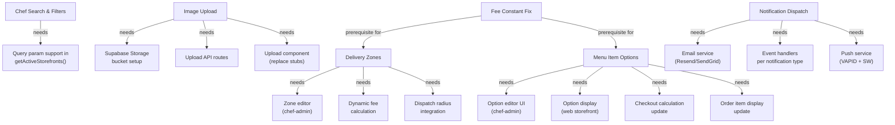

# Enhancement Planning Inputs

> Areas for future enhancement, organized by priority, risk, and readiness. This is NOT a task list — it is a mapping of what the codebase is ready for.

## Areas Ready for Enhancement (Schema + Types Already Exist)

These features have database schemas, types, and validation schemas already defined. They need UI and API route wiring.

| Feature | Schema Ready | Types Ready | Validation Ready | Risk Level |
|---------|-------------|-------------|-----------------|-----------|
| Chef availability/hours | `chef_availability` table | Types exist | `setAvailabilitySchema` | Low — isolated, no cross-dependencies |
| Menu item options/modifiers | `menu_item_options`, `option_values`, `order_item_modifiers` | Types exist | `createMenuItemOptionSchema` | Medium — affects checkout calculation |
| Chef delivery zones | `chef_delivery_zones` + PostGIS | Types exist | `createDeliveryZoneSchema` | Medium — affects delivery fee + dispatch radius |
| Chef document verification | `chef_documents` table | Types exist | — | Low — isolated admin workflow |
| Driver document verification | `driver_documents` table | Types exist | `uploadDriverDocumentSchema` | Low — isolated admin workflow |
| Admin notes | `admin_notes` table | — | — | Low — simple CRUD |
| Menu item time-based availability | `menu_item_availability` table | Types exist | — | Low — display-only impact |
| Driver signup flow | `drivers` table, auth schemas | Types exist | `createDriverProfileSchema` | Medium — new auth flow |
| Batch payout runs | `payout_runs` table | — | — | High — financial operations |

## Areas That Need New Schema

| Feature | What's Needed | Risk Level |
|---------|--------------|-----------|
| Favorites system | `favorites` table (customer_id, storefront_id), API routes, UI heart button | Low |
| Image upload pipeline | Supabase Storage buckets, upload API routes, image processing | Medium |
| Email/SMS notifications | Email service integration, notification dispatch system | Medium |
| Push notification dispatch | VAPID keys, service worker, push sender | Medium |
| Password reset flow | API route connecting to Supabase auth.resetPasswordForEmail | Low |
| Customer profile settings save | Wire settings form to API instead of setTimeout mock | Low |
| Chef search/filter | Query parameters on `getActiveStorefronts()`, filter UI wiring | Low |

## Areas That Are Safest to Evolve

These areas have clean boundaries, good test coverage potential, and low coupling:

1. **Chef availability/hours** — Isolated to chef-admin UI + one new component + storefront display
2. **Admin notes** — Simple CRUD, no business logic
3. **Password reset** — Supabase has built-in support, just needs API route
4. **Customer settings save** — Replace setTimeout with PATCH `/api/profile`
5. **Favorites** — New table + simple toggle + display
6. **Chef document upload** — Isolated to chef-admin + ops review
7. **Search/filter on chefs page** — Query param wiring only

## Areas That Are Tightly Coupled and Risky

These areas touch multiple systems and require careful coordination:

1. **Menu item options** — Affects: menu display (web), checkout calculation (web), order item creation (engine), order display (all apps), pricing
2. **Dynamic delivery fees** — Affects: delivery zones, checkout calculation, driver payout, ledger entries, finance reporting
3. **Platform settings → checkout fees** — Engine constants vs platform_settings inconsistency must be resolved before adding dynamic pricing
4. **Batch payout system** — Affects: finance operations, Stripe integration, chef/driver earnings display
5. **Real-time notification dispatch** — Cross-cuts all domains, needs event handler for each notification type

## Areas Needing More Validation

| Area | What to Validate |
|------|-----------------|
| Delivery fee constant ($3.99 vs $5.00 displayed) | Verify which is correct and whether platform_settings should override |
| Engine status vs order status dual tracking | Verify which field is source of truth for each context |
| `delivery_assignments` vs `assignment_attempts` | Confirm `delivery_assignments` can be safely dropped |
| `driver_earnings` vs calculated earnings | Confirm whether to populate table or continue calculating from deliveries |
| Stripe webhook endpoint registration | Verify webhook URL is configured in Stripe dashboard |
| RLS bypass policies (migration 00005) | Verify these are not active in production |
| Support ticket creation | Web contact form should create support_tickets, currently only logs |

## Dependency Graph for Future Work

## Phasing Recommendation (Mapping Only)

Based on the dependency analysis:

**Phase A (Low risk, independent)**:
- Password reset flow
- Customer settings save
- Admin notes
- Chef availability/hours

**Phase B (Medium risk, isolated)**:
- Image upload pipeline
- Chef document verification
- Driver document verification
- Favorites system
- Chef search/filters

**Phase C (Medium risk, cross-cutting)**:
- Fee constant resolution (prerequisite for D)
- Menu item options/modifiers
- Notification dispatch system

**Phase D (High risk, dependent on C)**:
- Dynamic delivery fees/zones
- Batch payout system
- Driver signup flow
- Real-time push notifications

---

## Top 25 Most Important Control Relationships

1. **Order status display** controlled by `orders.status` field, rendered in order-confirmation page via `getStatusIndex()`, sourced from Supabase realtime subscription
2. **Chef visibility to customers** controlled by `chef_storefronts.is_active` (ops-set) AND `chef_profiles.status === 'approved'`
3. **Menu item visibility** controlled by `menu_items.is_available` (chef-set) AND storefront `is_active` (RLS policy)
4. **Checkout authorization** controlled by Stripe PaymentIntent, mediated by engine `createOrder()` → `authorizePayment()`
5. **Payment confirmation → kitchen** controlled by Stripe webhook → `engine.orders.submitToKitchen()`
6. **Ready → dispatch** controlled by `PlatformWorkflowEngine.markOrderReady()` which auto-triggers `DispatchEngine.requestDispatch()`
7. **Driver assignment** controlled by `DispatchEngine.autoAssignDriver()` using `get_available_drivers_near()` RPC + scoring
8. **Driver offer expiry** controlled by `assignment_attempts.expires_at` timestamp
9. **Delivery completion → financials** controlled by `PlatformWorkflowEngine.completeDeliveredOrder()` creating ledger entries
10. **Chef governance** controlled by `PlatformWorkflowEngine.updateChefGovernance()` → status update → storefront cascade
11. **Driver approval gate** controlled by `driver-app/api/auth/login` checking `driver.status === 'approved'`
12. **Ops role gating** controlled by `hasRequiredRole(actor, requiredRoles)` checking `platform_users.role`
13. **Platform rules** controlled by `platform_settings` table, updatable only by ops_manager/super_admin
14. **Cart state** controlled by `CartContext` (web), synced with `carts`/`cart_items` tables
15. **Real-time notifications** controlled by `notifications` table INSERT + Supabase Realtime subscription in NotificationBell
16. **Real-time order updates** controlled by Supabase Realtime postgres_changes on `orders` table
17. **Chef order countdown** controlled by OrdersList component's 8-minute timer from order `created_at`
18. **Driver location tracking** controlled by `useLocationTracker` hook (15s interval) → POST `/api/location`
19. **Customer delivery tracking** controlled by polling `driver_presence` table every 15s in order-confirmation page
20. **Refund processing** controlled by `refund_cases` lifecycle: requested → approved → processed (ops_manager+ gate)
21. **Exception escalation** controlled by `SupportExceptionEngine` severity/status fields + SLA timers
22. **Storefront pause** controlled by `KitchenEngine.pauseStorefront()` (manual) or auto-pause setting
23. **Promo code validation** controlled by `promo_codes` table fields: is_active, valid_from/until, usage_limit
24. **Audit trail** controlled by `AuditLogger` writing to `audit_logs` + triggers on orders/deliveries/storefronts/refund_cases
25. **Route protection** controlled by per-app `middleware.ts` checking Supabase session + actor context functions

## Top 25 Most Important Gaps in Connectivity

1. **ChefsFilters component** renders but doesn't filter — no query param integration
2. **Forgot password page** exists but makes no API call
3. **Account settings form** submit is a `setTimeout` mock, not wired to API
4. **Favorites page** shows empty state but no favorites table or save mechanism exists
5. **Image upload buttons** in chef forms are stubs with no backend
6. **Notification templates** (13+ types) exist but are never dispatched
7. **Push notification subscriptions** are stored but no push sender exists
8. **Email/SMS notification types** are defined but no email/SMS service is integrated
9. **Chef availability table** has schema but no editor UI
10. **Chef delivery zones table** has schema + PostGIS but no zone management UI
11. **Menu item options tables** have schema but no option editor UI
12. **Driver documents table** has schema but no upload/review flow
13. **Chef documents table** has schema but no upload/review flow
14. **Driver shifts table** has schema but is not actively populated
15. **Driver earnings table** has schema but earnings are calculated from deliveries
16. **Delivery fee constant** ($3.99 in engine) doesn't match displayed fee ($5.00)
17. **Platform settings fee fields** exist but checkout uses hardcoded engine constants
18. **delivery_assignments table** appears superseded by assignment_attempts but not removed
19. **Support ticket creation** from web contact form logs but doesn't write to DB
20. **Service worker / PWA manifest** referenced in driver-app but files don't exist
21. **DriverDashboard todayStats** hardcoded to zeros
22. **Admin notes table** exists but no UI to create or view notes
23. **Payout runs table** exists for batch payouts but no batch system implemented
24. **menu_item_availability table** exists for time-based availability but no UI
25. **orders.engine_status vs orders.status** dual tracking with unclear canonical source
