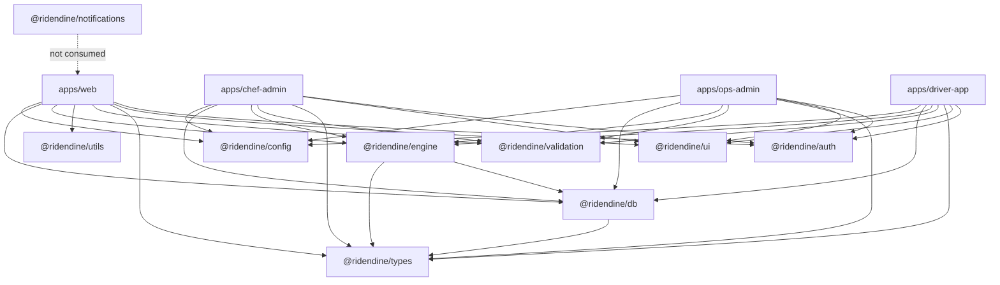

# Shared Infrastructure

> Cross-cutting packages and patterns used across all applications.

## Package Dependency Graph

## @ridendine/config

Shared configuration for all apps:
- **Tailwind**: Brand colors (orange #E85D26, teal), animations, font families
- **TypeScript**: Strict mode, ES2022 target, bundler resolution
- **ESLint**: Shared rules

## @ridendine/utils

Utility functions used across apps:

| Category | Functions |
|----------|----------|
| Formatting | `formatCurrency`, `formatCurrencyFromDollars`, `formatPhoneNumber`, `formatDistance`, `formatDuration`, `formatRating`, `truncate`, `capitalize`, `slugify`, `formatOrderNumber`, `formatAddressSingleLine` |
| Dates | `formatDate`, `formatDateTime`, `formatTime`, `getRelativeTime`, `getEstimatedTime`, `isToday`, `getDayName`, `timeToMinutes`, `minutesToTime` |
| Helpers | `generateId`, `generateOrderNumber`, `sleep`, `debounce`, `throttle`, `groupBy`, `unique`, `isEmpty`, `safeJsonParse`, `calculateDistance` (Haversine), `clamp` |
| Errors | Error classes and utilities |

## @ridendine/ui

10 shared components using CVA (Class Variance Authority) for variants:

| Component | Variants | Usage Pattern |
|-----------|----------|---------------|
| Button | 6 color × 4 size + loading state | All interactive actions |
| Card | 4 padding levels + Header/Title/Description/Content/Footer | All content containers |
| Input | Standard + focus styles | All form inputs |
| Badge | 6 color × 2 size | All status indicators |
| Spinner | 3 sizes | All loading states |
| Avatar | Image + Fallback | User displays |
| Modal | Header/Title/Close/Content/Footer (Headless UI) | Action dialogs |
| EmptyState | icon + title + description + action | Empty list states |
| ErrorState | title + description + action | Error displays |
| `cn()` | — | Tailwind class merging (clsx + tailwind-merge) |

## @ridendine/auth

| Export | Type | Used By |
|--------|------|---------|
| `AuthProvider` | React Context | All app root layouts |
| `useAuthContext()` | Hook | Components needing user/session |
| `useAuth()` | Hook | Login/signup forms (signIn, signUp, signOut, resetPassword) |
| `useUser()` | Hook | User state |
| `useSession()` | Hook | Session state |
| `useIsAuthenticated()` | Hook | Boolean auth check |
| `getUserRoles()` | Server util | Role resolution from DB |
| `hasRole()`, `hasAnyRole()`, `isAdmin()` | Server util | Role checking |

## @ridendine/types

All domain types exported from a single package:
- **Domain types**: Chef, Customer, Order, Driver, Delivery, Platform (6 files)
- **Enums**: OrderStatus (13), DeliveryStatus (14), ChefStatus (4), DriverStatus (4), PaymentStatus (5), etc.
- **Engine types**: ActorRole (8), OperationResult, DomainEvent, AuditEntry, SLATimer, all read models
- **State machine**: `isValidTransition()`, `getAllowedActions()`

## @ridendine/validation

30+ Zod schemas organized by domain:
- **auth**: login, signup, resetPassword, changePassword, updateProfile
- **chef**: createProfile, createStorefront, createMenuItem, createCategory, setAvailability, createDeliveryZone
- **customer**: createAddress, updateAddress, updateProfile
- **driver**: createProfile, createVehicle, locationUpdate, goOnline, confirmPickup/Dropoff, uploadDocument
- **order**: createOrder, updateStatus, createReview, respondToReview, applyPromoCode, processRefund
- **ops**: deliveryInterventionAction, financeAction, platformSettingsUpdate
- **common**: email, password, phone, price, rating, address, coordinates, time, dayOfWeek, imageUrl

## @ridendine/engine

Central business logic layer (server-only):
- **Factory**: `createCentralEngine()` creates singleton with all orchestrators
- **7 orchestrators**: Order, Kitchen, Dispatch, Commerce, Support, Platform, Ops
- **3 core services**: EventEmitter, AuditLogger, SLAManager
- **6 legacy service wrappers**: Orders, Chefs, Customers, Dispatch, Permissions, Storage

## @ridendine/db

Data access layer:
- **3 client types**: Server (RLS), Browser (RLS, singleton), Admin (no RLS)
- **14 repositories**: address, cart, chef, customer, delivery, driver, driver-presence, finance, menu, ops, order, platform, promo, storefront, support
- **Generated types**: `database.types.ts` from Supabase schema

## @ridendine/notifications

Template-only package (no dispatch):
- 13+ notification templates
- 4 notification types: NotificationPayload, EmailNotification, PushNotification, SMSNotification
- `createNotification()` factory function
- **Not consumed** by any app currently

## Cross-App Patterns

1. **lib/engine.ts**: Every app has this file creating a singleton engine + app-specific actor context
2. **middleware.ts**: Every app has auth middleware with same structure (bypass, session check, redirect)
3. **Root layout**: All wrap with `AuthProvider`, web also wraps with `CartProvider`
4. **Error boundary**: All apps have `error.tsx` with similar pattern
5. **Loading skeleton**: All apps have `loading.tsx` with brand-colored spinner
6. **Force dynamic**: All data-fetching pages export `dynamic = 'force-dynamic'`
