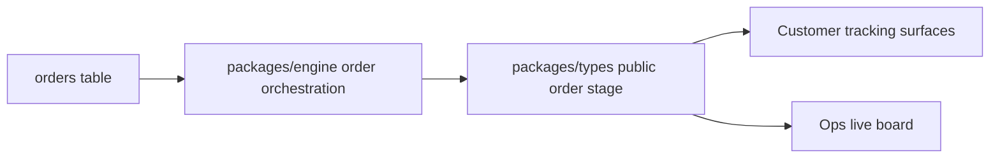
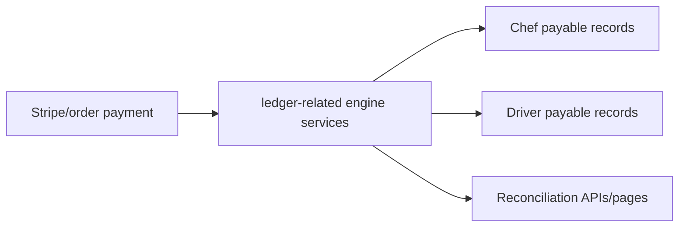
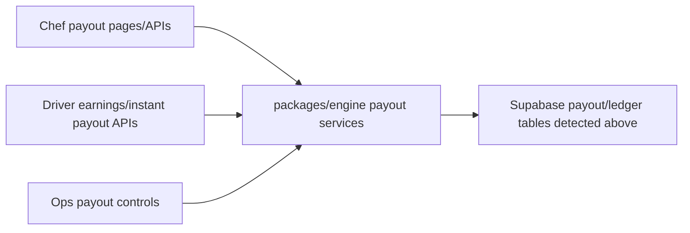
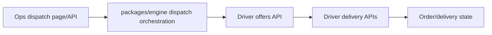
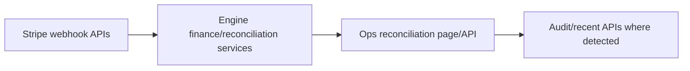
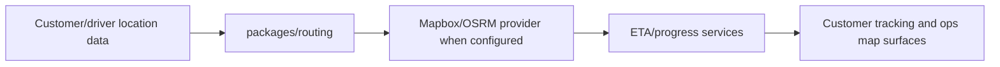
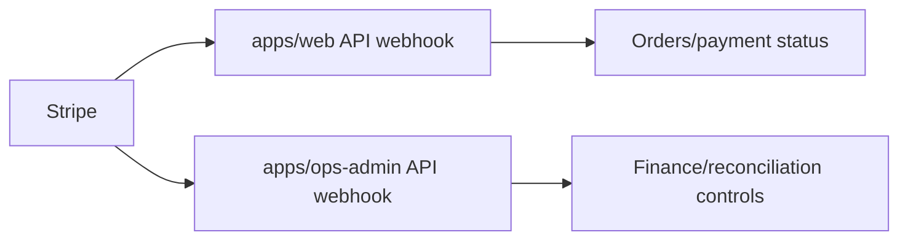

# Data And Engine Map

## Tables And RPCs Detected

- `IF`
- `admin_notes`
- `analytics_events`
- `assignment_attempts`
- `audit_logs`
- `cart_items`
- `carts`
- `checkout_idempotency_keys`
- `chef_availability`
- `chef_delivery_zones`
- `chef_documents`
- `chef_kitchens`
- `chef_payout_accounts`
- `chef_payouts`
- `chef_profiles`
- `chef_storefronts`
- `customer_addresses`
- `customers`
- `deliveries`
- `delivery_assignments`
- `delivery_events`
- `delivery_tracking_events`
- `domain_events`
- `driver_documents`
- `driver_earnings`
- `driver_locations`
- `driver_payouts`
- `driver_presence`
- `driver_profiles`
- `driver_shifts`
- `driver_vehicles`
- `drivers`
- `favorites`
- `get_ops_dashboard_stats`
- `idx_assignment_attempts_delivery`
- `idx_assignment_attempts_driver`
- `idx_assignment_attempts_pending`
- `idx_chef_profiles_status`
- `idx_chef_profiles_user_id`
- `idx_chef_storefronts_chef_id`
- `idx_chef_storefronts_cuisine_types`
- `idx_chef_storefronts_is_active`
- `idx_customer_addresses_customer_id`
- `idx_customers_user_id`
- `idx_deliveries_driver_id`
- `idx_deliveries_order_id`
- `idx_deliveries_status`
- `idx_delivery_assignments_delivery_id`
- `idx_delivery_assignments_driver_id`
- `idx_domain_events_created`
- `idx_domain_events_entity`
- `idx_domain_events_type`
- `idx_domain_events_unpublished`
- `idx_driver_presence_status`
- `idx_driver_shifts_driver_id`
- `idx_drivers_status`
- `idx_drivers_user_id`
- `idx_favorites_customer_id`
- `idx_kitchen_queue_order`
- `idx_kitchen_queue_storefront`
- `idx_ledger_entries_entity`
- `idx_ledger_entries_order`
- `idx_ledger_entries_stripe`
- `idx_ledger_entries_type`
- `idx_menu_categories_storefront_id`
- `idx_menu_items_category_id`
- `idx_menu_items_storefront_id`
- `idx_notifications_is_read`
- `idx_notifications_user_id`
- `idx_ops_override_logs_actor`
- `idx_ops_override_logs_created`
- `idx_ops_override_logs_entity`
- `idx_order_exceptions_open`
- `idx_order_exceptions_order`
- `idx_order_exceptions_severity`
- `idx_order_exceptions_status`
- `idx_order_items_order_id`
- `idx_orders_created_at`
- `idx_orders_customer_id`
- `idx_orders_status`
- `idx_orders_storefront_id`
- `idx_payout_adjustments_order`
- `idx_payout_adjustments_payee`
- `idx_payout_adjustments_status`
- `idx_refund_cases_order`
- `idx_refund_cases_pending`
- `idx_refund_cases_status`
- `idx_reviews_storefront_id`
- `idx_sla_timers_active`
- `idx_sla_timers_entity`
- `idx_sla_timers_type`
- `idx_storefront_state_changes_created`
- `idx_storefront_state_changes_storefront`
- `idx_system_alerts_active`
- `idx_system_alerts_created`
- `idx_system_alerts_type`
- `instant_payout_requests`
- `kitchen_queue_entries`
- `ledger_entries`
- `menu_categories`
- `menu_item_availability`
- `menu_item_option_values`
- `menu_item_options`
- `menu_items`
- `notifications`
- `ops_override_logs`
- `order_exceptions`
- `order_item_modifiers`
- `order_items`
- `order_status_history`
- `orders`
- `payout_adjustments`
- `payout_runs`
- `platform_accounts`
- `platform_settings`
- `platform_users`
- `promo_codes`
- `push_subscriptions`
- `refund_cases`
- `reviews`
- `service_areas`
- `sla_timers`
- `storefront_state_changes`
- `stripe_events_processed`
- `stripe_reconciliation`
- `support_tickets`
- `system_alerts`

## Migration Sources

- [supabase/migrations/00001_initial_schema.sql](../../supabase/migrations/00001_initial_schema.sql)
- [supabase/migrations/00002_rls_policies.sql](../../supabase/migrations/00002_rls_policies.sql)
- [supabase/migrations/00003_fix_rls.sql](../../supabase/migrations/00003_fix_rls.sql)
- [supabase/migrations/00004_additions.sql](../../supabase/migrations/00004_additions.sql)
- [supabase/migrations/00005_anon_read_policies.sql](../../supabase/migrations/00005_anon_read_policies.sql)
- [supabase/migrations/00006_fix_order_items.sql](../../supabase/migrations/00006_fix_order_items.sql)
- [supabase/migrations/00007_central_engine_tables.sql](../../supabase/migrations/00007_central_engine_tables.sql)
- [supabase/migrations/00008_engine_rpc_functions.sql](../../supabase/migrations/00008_engine_rpc_functions.sql)
- [supabase/migrations/00009_ops_admin_control_plane.sql](../../supabase/migrations/00009_ops_admin_control_plane.sql)
- [supabase/migrations/00010_contract_drift_repair.sql](../../supabase/migrations/00010_contract_drift_repair.sql)
- [supabase/migrations/00011_rls_role_alignment.sql](../../supabase/migrations/00011_rls_role_alignment.sql)
- [supabase/migrations/00012_schema_drift_cleanup.sql](../../supabase/migrations/00012_schema_drift_cleanup.sql)
- [supabase/migrations/00013_analytics_events.sql](../../supabase/migrations/00013_analytics_events.sql)
- [supabase/migrations/00014_fix_audit_trigger.sql](../../supabase/migrations/00014_fix_audit_trigger.sql)
- [supabase/migrations/00015_phase2_platform_roles.sql](../../supabase/migrations/00015_phase2_platform_roles.sql)
- [supabase/migrations/00016_phase3_stripe_idempotency_order_events_promo.sql](../../supabase/migrations/00016_phase3_stripe_idempotency_order_events_promo.sql)
- [supabase/migrations/00017_phase_b_security_rls_hardening.sql](../../supabase/migrations/00017_phase_b_security_rls_hardening.sql)
- [supabase/migrations/00018_phase_c_checkout_idempotency.sql](../../supabase/migrations/00018_phase_c_checkout_idempotency.sql)
- [supabase/migrations/00019_business_engine.sql](../../supabase/migrations/00019_business_engine.sql)
- [supabase/migrations/00020_ledger_entries_order_optional.sql](../../supabase/migrations/00020_ledger_entries_order_optional.sql)
- [supabase/migrations/00021_finance_hardening.sql](../../supabase/migrations/00021_finance_hardening.sql)
- [supabase/migrations/20260501080818_phase_b_security_rls_hardening.sql](../../supabase/migrations/20260501080818_phase_b_security_rls_hardening.sql)

## Core Services And Packages

| Source file | Tables/RPCs touched | Ridéndine packages imported |
| --- | --- | --- |
| [packages/db/src/repositories/address.repository.ts](../../packages/db/src/repositories/address.repository.ts) | `customer_addresses` | None detected |
| [packages/db/src/repositories/cart.repository.ts](../../packages/db/src/repositories/cart.repository.ts) | `cart_items`, `carts` | None detected |
| [packages/db/src/repositories/chef.repository.ts](../../packages/db/src/repositories/chef.repository.ts) | `chef_profiles`, `orders` | None detected |
| [packages/db/src/repositories/customer.repository.ts](../../packages/db/src/repositories/customer.repository.ts) | `customer_addresses`, `customers`, `orders` | None detected |
| [packages/db/src/repositories/delivery.repository.ts](../../packages/db/src/repositories/delivery.repository.ts) | `deliveries`, `delivery_tracking_events` | None detected |
| [packages/db/src/repositories/driver-presence.repository.ts](../../packages/db/src/repositories/driver-presence.repository.ts) | `driver_presence` | None detected |
| [packages/db/src/repositories/driver.repository.ts](../../packages/db/src/repositories/driver.repository.ts) | `deliveries`, `drivers` | None detected |
| [packages/db/src/repositories/finance.repository.ts](../../packages/db/src/repositories/finance.repository.ts) | `chef_profiles`, `drivers`, `ledger_entries`, `payout_adjustments`, `refund_cases` | None detected |
| [packages/db/src/repositories/menu.repository.ts](../../packages/db/src/repositories/menu.repository.ts) | `menu_categories`, `menu_items` | None detected |
| [packages/db/src/repositories/ops.repository.ts](../../packages/db/src/repositories/ops.repository.ts) | `admin_notes`, `assignment_attempts`, `deliveries`, `delivery_events`, `delivery_tracking_events`, `driver_presence`, `drivers`, `get_ops_dashboard_stats`, `order_exceptions`, `payout_adjustments`, `refund_cases`, `support_tickets` | @ridendine/types, @ridendine/utils |
| [packages/db/src/repositories/order.repository.ts](../../packages/db/src/repositories/order.repository.ts) | `order_items`, `orders` | None detected |
| [packages/db/src/repositories/platform.repository.ts](../../packages/db/src/repositories/platform.repository.ts) | `platform_settings` | @ridendine/types |
| [packages/db/src/repositories/promo.repository.ts](../../packages/db/src/repositories/promo.repository.ts) | `promo_codes` | None detected |
| [packages/db/src/repositories/storefront.repository.ts](../../packages/db/src/repositories/storefront.repository.ts) | `chef_storefronts` | None detected |
| [packages/db/src/repositories/support.repository.test.ts](../../packages/db/src/repositories/support.repository.test.ts) | None detected | None detected |
| [packages/db/src/repositories/support.repository.ts](../../packages/db/src/repositories/support.repository.ts) | `support_tickets` | None detected |
| [packages/db/src/schema/phase0-business-engine.migration.test.ts](../../packages/db/src/schema/phase0-business-engine.migration.test.ts) | `IF` | None detected |
| [packages/engine/src/client-helpers.ts](../../packages/engine/src/client-helpers.ts) | None detected | @ridendine/db |
| [packages/engine/src/constants.test.ts](../../packages/engine/src/constants.test.ts) | None detected | None detected |
| [packages/engine/src/constants.ts](../../packages/engine/src/constants.ts) | None detected | None detected |
| [packages/engine/src/core/audit-logger.ts](../../packages/engine/src/core/audit-logger.ts) | `audit_logs`, `ops_override_logs` | @ridendine/types |
| [packages/engine/src/core/business-rules-engine.test.ts](../../packages/engine/src/core/business-rules-engine.test.ts) | None detected | None detected |
| [packages/engine/src/core/business-rules-engine.ts](../../packages/engine/src/core/business-rules-engine.ts) | `chef_profiles`, `chef_storefronts`, `deliveries`, `driver_presence`, `driver_profiles`, `menu_items`, `order_exceptions`, `orders` | None detected |
| [packages/engine/src/core/email-provider.test.ts](../../packages/engine/src/core/email-provider.test.ts) | None detected | None detected |
| [packages/engine/src/core/email-provider.ts](../../packages/engine/src/core/email-provider.ts) | None detected | @ridendine/types |
| [packages/engine/src/core/engine-factory.test.ts](../../packages/engine/src/core/engine-factory.test.ts) | None detected | None detected |
| [packages/engine/src/core/engine.factory.ts](../../packages/engine/src/core/engine.factory.ts) | None detected | @ridendine/routing |
| [packages/engine/src/core/event-emitter.broadcast-public.test.ts](../../packages/engine/src/core/event-emitter.broadcast-public.test.ts) | None detected | None detected |
| [packages/engine/src/core/event-emitter.test.ts](../../packages/engine/src/core/event-emitter.test.ts) | None detected | @ridendine/types |
| [packages/engine/src/core/event-emitter.ts](../../packages/engine/src/core/event-emitter.ts) | `domain_events` | @ridendine/types |
| [packages/engine/src/core/health-checks.test.ts](../../packages/engine/src/core/health-checks.test.ts) | None detected | None detected |
| [packages/engine/src/core/health-checks.ts](../../packages/engine/src/core/health-checks.ts) | `deliveries`, `driver_presence`, `order_exceptions`, `orders`, `sla_timers` | None detected |
| [packages/engine/src/core/index.ts](../../packages/engine/src/core/index.ts) | None detected | None detected |
| [packages/engine/src/core/notification-sender.test.ts](../../packages/engine/src/core/notification-sender.test.ts) | None detected | None detected |
| [packages/engine/src/core/notification-sender.ts](../../packages/engine/src/core/notification-sender.ts) | `notifications` | @ridendine/notifications, @ridendine/types |
| [packages/engine/src/core/notification-triggers.test.ts](../../packages/engine/src/core/notification-triggers.test.ts) | None detected | None detected |
| [packages/engine/src/core/notification-triggers.ts](../../packages/engine/src/core/notification-triggers.ts) | `chef_storefronts`, `customers`, `driver_profiles`, `orders` | @ridendine/types |
| [packages/engine/src/core/public-broadcast-sanitizer.test.ts](../../packages/engine/src/core/public-broadcast-sanitizer.test.ts) | None detected | None detected |
| [packages/engine/src/core/public-broadcast-sanitizer.ts](../../packages/engine/src/core/public-broadcast-sanitizer.ts) | None detected | None detected |
| [packages/engine/src/core/sla-checks.test.ts](../../packages/engine/src/core/sla-checks.test.ts) | None detected | None detected |
| [packages/engine/src/core/sla-checks.ts](../../packages/engine/src/core/sla-checks.ts) | `deliveries`, `orders` | None detected |
| [packages/engine/src/core/sla-manager.ts](../../packages/engine/src/core/sla-manager.ts) | `order_exceptions`, `sla_timers`, `system_alerts` | @ridendine/types |
| [packages/engine/src/e2e/order-lifecycle.e2e.ts](../../packages/engine/src/e2e/order-lifecycle.e2e.ts) | `chef_storefronts`, `customer_addresses`, `customers`, `deliveries`, `drivers`, `kitchen_queue_entries`, `ledger_entries`, `menu_items`, `order_items`, `orders` | None detected |
| [packages/engine/src/e2e/stripe-payment.e2e.ts](../../packages/engine/src/e2e/stripe-payment.e2e.ts) | `chef_storefronts`, `customer_addresses`, `customers`, `deliveries`, `drivers`, `ledger_entries`, `menu_items`, `order_items`, `orders` | None detected |
| [packages/engine/src/index.ts](../../packages/engine/src/index.ts) | None detected | @ridendine/routing |
| [packages/engine/src/orchestrators/commerce.engine.test.ts](../../packages/engine/src/orchestrators/commerce.engine.test.ts) | None detected | None detected |
| [packages/engine/src/orchestrators/commerce.engine.ts](../../packages/engine/src/orchestrators/commerce.engine.ts) | `deliveries`, `ledger_entries`, `orders`, `payout_adjustments`, `refund_cases` | @ridendine/types |
| [packages/engine/src/orchestrators/delivery-engine.test.ts](../../packages/engine/src/orchestrators/delivery-engine.test.ts) | None detected | @ridendine/types |
| [packages/engine/src/orchestrators/delivery-engine.ts](../../packages/engine/src/orchestrators/delivery-engine.ts) | `deliveries`, `delivery_events` | @ridendine/types |
| [packages/engine/src/orchestrators/dispatch-engine-driver-guards.test.ts](../../packages/engine/src/orchestrators/dispatch-engine-driver-guards.test.ts) | None detected | None detected |
| [packages/engine/src/orchestrators/dispatch.engine.test.ts](../../packages/engine/src/orchestrators/dispatch.engine.test.ts) | None detected | None detected |
| [packages/engine/src/orchestrators/dispatch.engine.ts](../../packages/engine/src/orchestrators/dispatch.engine.ts) | `assignment_attempts`, `deliveries`, `delivery_events`, `driver_presence`, `drivers`, `notifications`, `order_exceptions`, `orders`, `service_areas`, `system_alerts` | @ridendine/db, @ridendine/routing, @ridendine/types |
| [packages/engine/src/orchestrators/kitchen-availability.test.ts](../../packages/engine/src/orchestrators/kitchen-availability.test.ts) | None detected | None detected |
| [packages/engine/src/orchestrators/kitchen-availability.ts](../../packages/engine/src/orchestrators/kitchen-availability.ts) | None detected | None detected |
| [packages/engine/src/orchestrators/kitchen.engine.ts](../../packages/engine/src/orchestrators/kitchen.engine.ts) | `chef_availability`, `chef_profiles`, `chef_storefronts`, `kitchen_queue_entries`, `menu_items`, `order_exceptions`, `order_items`, `orders`, `storefront_state_changes` | @ridendine/types |
| [packages/engine/src/orchestrators/master-order-engine.test.ts](../../packages/engine/src/orchestrators/master-order-engine.test.ts) | None detected | @ridendine/types |
| [packages/engine/src/orchestrators/master-order-engine.ts](../../packages/engine/src/orchestrators/master-order-engine.ts) | `order_status_history`, `orders` | @ridendine/types |
| [packages/engine/src/orchestrators/ops.engine.ts](../../packages/engine/src/orchestrators/ops.engine.ts) | `admin_notes`, `deliveries`, `driver_presence`, `orders` | @ridendine/db, @ridendine/types |
| [packages/engine/src/orchestrators/ops.validation.test.ts](../../packages/engine/src/orchestrators/ops.validation.test.ts) | None detected | @ridendine/validation |
| [packages/engine/src/orchestrators/order-state-machine.test.ts](../../packages/engine/src/orchestrators/order-state-machine.test.ts) | None detected | @ridendine/types |
| [packages/engine/src/orchestrators/order-state-machine.ts](../../packages/engine/src/orchestrators/order-state-machine.ts) | None detected | @ridendine/types |
| [packages/engine/src/orchestrators/order.orchestrator.ts](../../packages/engine/src/orchestrators/order.orchestrator.ts) | `chef_profiles`, `chef_storefronts`, `deliveries`, `kitchen_queue_entries`, `ledger_entries`, `menu_items`, `notifications`, `order_exceptions`, `order_items`, `order_status_history`, `orders` | @ridendine/routing, @ridendine/types |
| [packages/engine/src/orchestrators/payout-engine.test.ts](../../packages/engine/src/orchestrators/payout-engine.test.ts) | None detected | None detected |
| [packages/engine/src/orchestrators/payout-engine.ts](../../packages/engine/src/orchestrators/payout-engine.ts) | `chef_payouts`, `ledger_entries`, `order_exceptions`, `orders` | @ridendine/types |
| [packages/engine/src/orchestrators/platform-settings.test.ts](../../packages/engine/src/orchestrators/platform-settings.test.ts) | None detected | @ridendine/db |
| [packages/engine/src/orchestrators/platform.engine.ts](../../packages/engine/src/orchestrators/platform.engine.ts) | `customers`, `ledger_entries`, `notifications`, `order_status_history`, `orders`, `storefront_state_changes` | @ridendine/db, @ridendine/types |
| [packages/engine/src/orchestrators/repair-validation.test.ts](../../packages/engine/src/orchestrators/repair-validation.test.ts) | None detected | None detected |
| [packages/engine/src/orchestrators/risk.engine.test.ts](../../packages/engine/src/orchestrators/risk.engine.test.ts) | None detected | None detected |
| [packages/engine/src/orchestrators/risk.engine.ts](../../packages/engine/src/orchestrators/risk.engine.ts) | None detected | None detected |
| [packages/engine/src/orchestrators/support.engine.ts](../../packages/engine/src/orchestrators/support.engine.ts) | `admin_notes`, `order_exceptions`, `support_tickets`, `system_alerts` | @ridendine/types |
| [packages/engine/src/server.ts](../../packages/engine/src/server.ts) | `chef_profiles`, `chef_storefronts`, `customers`, `deliveries`, `drivers`, `menu_items`, `orders`, `platform_users` | @ridendine/db, @ridendine/types |
| [packages/engine/src/services/chefs.service.ts](../../packages/engine/src/services/chefs.service.ts) | `chef_profiles`, `chef_storefronts`, `menu_items` | @ridendine/db |
| [packages/engine/src/services/customers.service.ts](../../packages/engine/src/services/customers.service.ts) | `customer_addresses`, `customers`, `orders` | @ridendine/db |
| [packages/engine/src/services/dispatch.service.ts](../../packages/engine/src/services/dispatch.service.ts) | `deliveries`, `driver_presence`, `drivers`, `notifications`, `orders` | @ridendine/db |
| [packages/engine/src/services/eta.service.test.ts](../../packages/engine/src/services/eta.service.test.ts) | None detected | None detected |
| [packages/engine/src/services/eta.service.ts](../../packages/engine/src/services/eta.service.ts) | None detected | @ridendine/routing |
| [packages/engine/src/services/ledger.service.test.ts](../../packages/engine/src/services/ledger.service.test.ts) | None detected | None detected |
| [packages/engine/src/services/ledger.service.ts](../../packages/engine/src/services/ledger.service.ts) | `ledger_entries` | None detected |
| [packages/engine/src/services/ops-analytics.service.ts](../../packages/engine/src/services/ops-analytics.service.ts) | None detected | @ridendine/utils |
| [packages/engine/src/services/orders.service.test.ts](../../packages/engine/src/services/orders.service.test.ts) | None detected | None detected |
| [packages/engine/src/services/orders.service.ts](../../packages/engine/src/services/orders.service.ts) | `order_status_history`, `orders` | @ridendine/db |
| [packages/engine/src/services/payout-risk.service.ts](../../packages/engine/src/services/payout-risk.service.ts) | `chef_payout_accounts`, `chef_payouts`, `driver_payouts`, `drivers`, `instant_payout_requests`, `platform_accounts` | None detected |
| [packages/engine/src/services/payout.service.test.ts](../../packages/engine/src/services/payout.service.test.ts) | None detected | None detected |
| [packages/engine/src/services/payout.service.ts](../../packages/engine/src/services/payout.service.ts) | `chef_payout_accounts`, `chef_payouts`, `chef_storefronts`, `driver_payouts`, `drivers`, `instant_payout_requests`, `payout_runs`, `platform_accounts` | @ridendine/types |
| [packages/engine/src/services/permissions.service.test.ts](../../packages/engine/src/services/permissions.service.test.ts) | None detected | @ridendine/types |
| [packages/engine/src/services/permissions.service.ts](../../packages/engine/src/services/permissions.service.ts) | `chef_profiles`, `customers`, `drivers`, `platform_users` | @ridendine/db, @ridendine/types |
| [packages/engine/src/services/platform-api-guards.test.ts](../../packages/engine/src/services/platform-api-guards.test.ts) | None detected | @ridendine/types |
| [packages/engine/src/services/platform-api-guards.ts](../../packages/engine/src/services/platform-api-guards.ts) | None detected | @ridendine/types |
| [packages/engine/src/services/reconciliation.service.test.ts](../../packages/engine/src/services/reconciliation.service.test.ts) | None detected | None detected |
| [packages/engine/src/services/reconciliation.service.ts](../../packages/engine/src/services/reconciliation.service.ts) | `ledger_entries`, `stripe_events_processed`, `stripe_reconciliation` | @ridendine/types |
| [packages/engine/src/services/storage.service.ts](../../packages/engine/src/services/storage.service.ts) | None detected | None detected |
| [packages/engine/src/services/stripe-webhook-finance.ts](../../packages/engine/src/services/stripe-webhook-finance.ts) | `chef_payouts`, `driver_payouts`, `instant_payout_requests`, `ledger_entries`, `stripe_reconciliation` | @ridendine/types |
| [packages/engine/src/services/stripe-webhook-idempotency.test.ts](../../packages/engine/src/services/stripe-webhook-idempotency.test.ts) | None detected | None detected |
| [packages/engine/src/services/stripe-webhook-idempotency.ts](../../packages/engine/src/services/stripe-webhook-idempotency.ts) | `stripe_events_processed` | None detected |
| [packages/engine/src/services/stripe.integration.test.ts](../../packages/engine/src/services/stripe.integration.test.ts) | None detected | @ridendine/types |
| [packages/engine/src/services/stripe.service.test.ts](../../packages/engine/src/services/stripe.service.test.ts) | None detected | None detected |
| [packages/engine/src/services/stripe.service.ts](../../packages/engine/src/services/stripe.service.ts) | None detected | None detected |
| [packages/types/src/engine/index.ts](../../packages/types/src/engine/index.ts) | None detected | None detected |
| [packages/types/src/engine/transitions.ts](../../packages/types/src/engine/transitions.ts) | None detected | None detected |
| [packages/validation/src/index.ts](../../packages/validation/src/index.ts) | None detected | None detected |
| [packages/validation/src/schemas/auth.ts](../../packages/validation/src/schemas/auth.ts) | None detected | None detected |
| [packages/validation/src/schemas/chef.ts](../../packages/validation/src/schemas/chef.ts) | None detected | None detected |
| [packages/validation/src/schemas/common.ts](../../packages/validation/src/schemas/common.ts) | None detected | None detected |
| [packages/validation/src/schemas/customer.ts](../../packages/validation/src/schemas/customer.ts) | None detected | None detected |
| [packages/validation/src/schemas/driver.ts](../../packages/validation/src/schemas/driver.ts) | None detected | None detected |
| [packages/validation/src/schemas/notifications.ts](../../packages/validation/src/schemas/notifications.ts) | None detected | None detected |
| [packages/validation/src/schemas/ops.ts](../../packages/validation/src/schemas/ops.ts) | None detected | None detected |
| [packages/validation/src/schemas/order.ts](../../packages/validation/src/schemas/order.ts) | None detected | None detected |
| [packages/validation/src/schemas/pagination.ts](../../packages/validation/src/schemas/pagination.ts) | None detected | None detected |
| [packages/routing/src/__tests__/eta.service.test.ts](../../packages/routing/src/__tests__/eta.service.test.ts) | None detected | None detected |
| [packages/routing/src/__tests__/mapbox.provider.test.ts](../../packages/routing/src/__tests__/mapbox.provider.test.ts) | None detected | None detected |
| [packages/routing/src/__tests__/osrm.provider.test.ts](../../packages/routing/src/__tests__/osrm.provider.test.ts) | None detected | None detected |
| [packages/routing/src/eta.service.ts](../../packages/routing/src/eta.service.ts) | `chef_kitchens`, `chef_storefronts`, `customer_addresses`, `deliveries`, `driver_presence`, `orders` | None detected |
| [packages/routing/src/mapbox.provider.ts](../../packages/routing/src/mapbox.provider.ts) | None detected | None detected |
| [packages/routing/src/osrm.provider.ts](../../packages/routing/src/osrm.provider.ts) | None detected | None detected |
| [packages/routing/src/provider.ts](../../packages/routing/src/provider.ts) | None detected | None detected |

## Public Order Stage Flow

## Ledger Flow

## Payout Flow

## Dispatch Flow

## Reconciliation Flow

## ETA / Routing Flow

## Stripe Webhook Flow

