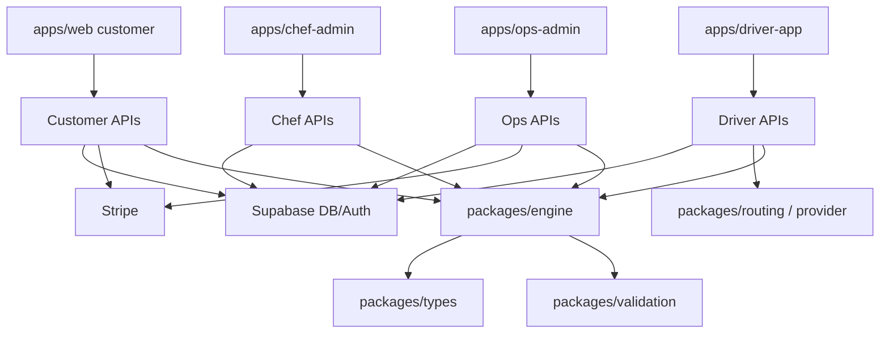
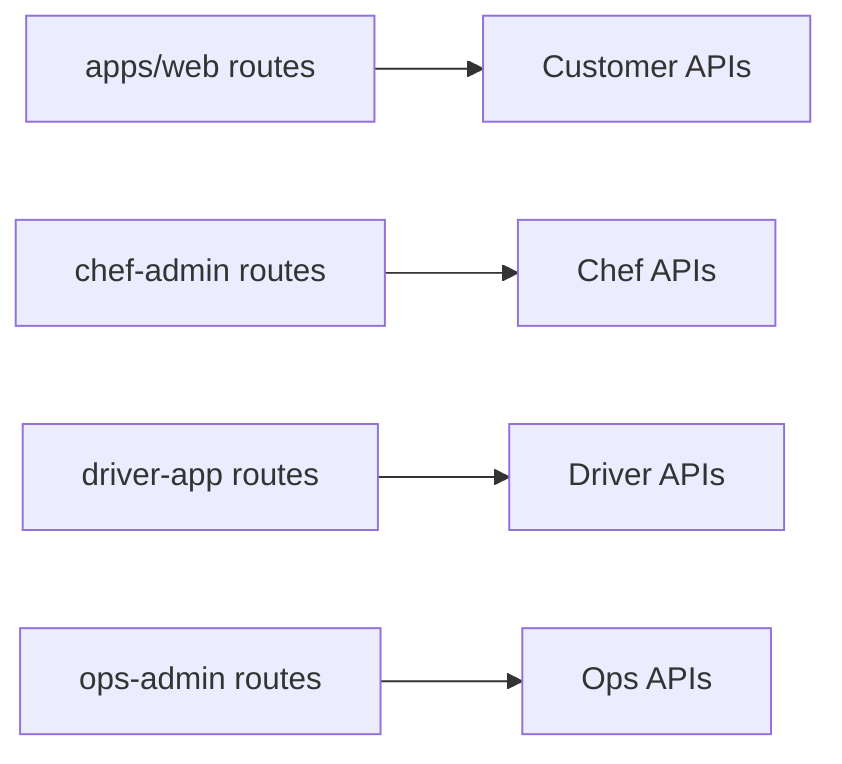
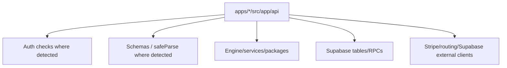
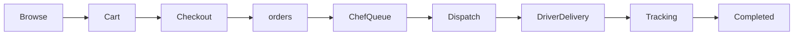
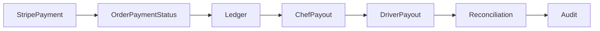
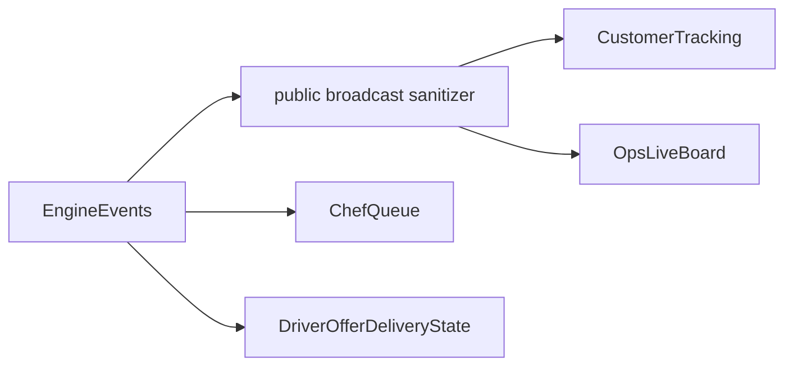
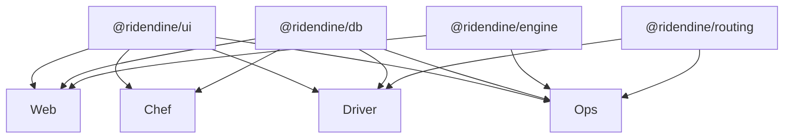

# Ridéndine Master Wiring Diagram

## System Diagram

## Route Map

Detected page routes: 80. Customer Web: 24, Ops Admin: 36, Chef Admin: 12, Driver App: 8.

## API Map

Detected API route files: 89. Customer Web: 18, Ops Admin: 46, Chef Admin: 13, Driver App: 12.

## Order Lifecycle Map

## Finance Lifecycle Map

## Realtime State Map

## App Dependency Map

