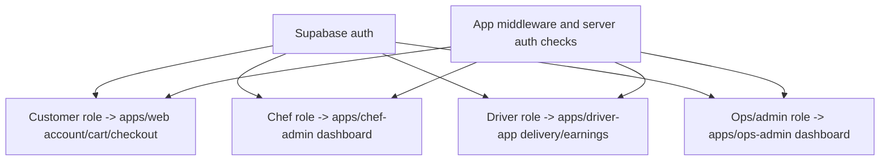

# Auth RBAC Flow

```mermaid
flowchart TB
  SupabaseAuth["Supabase auth"] --> Customer["Customer role -> apps/web account/cart/checkout"]
  SupabaseAuth --> Chef["Chef role -> apps/chef-admin dashboard"]
  SupabaseAuth --> Driver["Driver role -> apps/driver-app delivery/earnings"]
  SupabaseAuth --> Ops["Ops/admin role -> apps/ops-admin dashboard"]
  Middleware["App middleware and server auth checks"] --> Customer
  Middleware --> Chef
  Middleware --> Driver
  Middleware --> Ops
```
