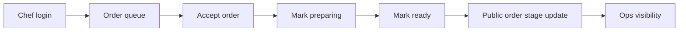

# Chef Order Flow

```mermaid
flowchart LR
  Login["Chef login"] --> Queue["Order queue"]
  Queue --> Accept["Accept order"]
  Accept --> Prep["Mark preparing"]
  Prep --> Ready["Mark ready"]
  Ready --> PublicStage["Public order stage update"]
  PublicStage --> Ops["Ops visibility"]
```
