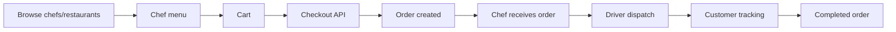

# Customer Order Flow

```mermaid
flowchart LR
  Browse["Browse chefs/restaurants"] --> Menu["Chef menu"]
  Menu --> Cart["Cart"]
  Cart --> Checkout["Checkout API"]
  Checkout --> OrderCreated["Order created"]
  OrderCreated --> ChefQueue["Chef receives order"]
  ChefQueue --> Dispatch["Driver dispatch"]
  Dispatch --> Tracking["Customer tracking"]
  Tracking --> Completed["Completed order"]
```
