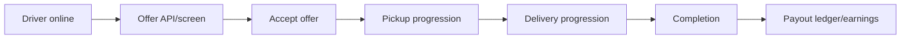

# Driver Delivery Flow

```mermaid
flowchart LR
  Online["Driver online"] --> Offer["Offer API/screen"]
  Offer --> Accept["Accept offer"]
  Accept --> Pickup["Pickup progression"]
  Pickup --> Dropoff["Delivery progression"]
  Dropoff --> Complete["Completion"]
  Complete --> Ledger["Payout ledger/earnings"]
```
