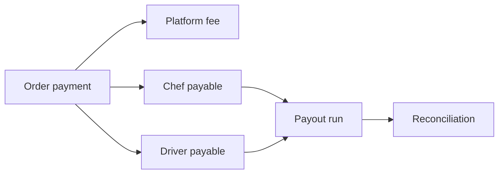

# Finance Ledger Flow

```mermaid
flowchart LR
  Payment["Order payment"] --> Fee["Platform fee"]
  Payment --> Chef["Chef payable"]
  Payment --> Driver["Driver payable"]
  Chef --> Run["Payout run"]
  Driver --> Run
  Run --> Reconciliation["Reconciliation"]
```
