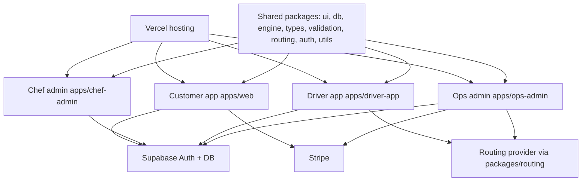

# Full System Context

```mermaid
flowchart TB
  Customer["Customer app apps/web"] --> Supabase["Supabase Auth + DB"]
  Chef["Chef admin apps/chef-admin"] --> Supabase
  Driver["Driver app apps/driver-app"] --> Supabase
  Ops["Ops admin apps/ops-admin"] --> Supabase
  Customer --> Stripe["Stripe"]
  Ops --> Stripe
  Driver --> Routing["Routing provider via packages/routing"]
  Ops --> Routing
  Vercel["Vercel hosting"] --> Customer
  Vercel --> Chef
  Vercel --> Driver
  Vercel --> Ops
  Shared["Shared packages: ui, db, engine, types, validation, routing, auth, utils"] --> Customer
  Shared --> Chef
  Shared --> Driver
  Shared --> Ops
```
