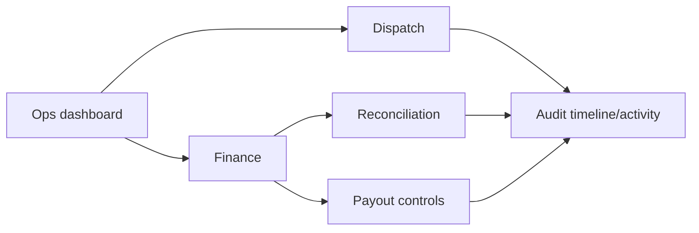

# Ops Control Flow

```mermaid
flowchart LR
  Dashboard["Ops dashboard"] --> Dispatch["Dispatch"]
  Dashboard --> Finance["Finance"]
  Finance --> Recon["Reconciliation"]
  Finance --> Payouts["Payout controls"]
  Dispatch --> Audit["Audit timeline/activity"]
  Recon --> Audit
  Payouts --> Audit
```
