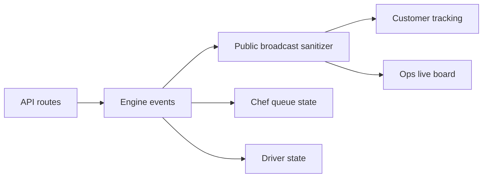

# Realtime Event Flow

```mermaid
flowchart LR
  API["API routes"] --> Engine["Engine events"]
  Engine --> Sanitizer["Public broadcast sanitizer"]
  Sanitizer --> Customer["Customer tracking"]
  Sanitizer --> Ops["Ops live board"]
  Engine --> Chef["Chef queue state"]
  Engine --> Driver["Driver state"]
```
