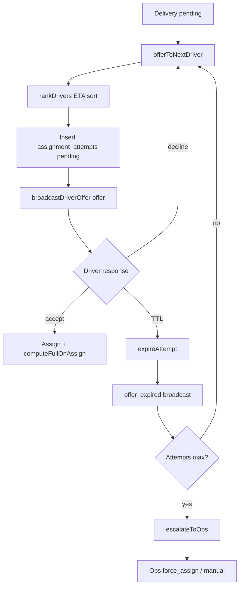

# ORDER FLOW WORKFLOW

## Canonical engine vs this document (IRR-017)

**Source of truth (code):**

- **Order states** — `@ridendine/types` **`EngineOrderStatus`** and transition map in `packages/engine/src/orchestrators/order-state-machine.ts` (`ORDER_TRANSITION_MAP`, `isValidOrderTransition`).
- **Delivery states** — **`EngineDeliveryStatus`** and `DELIVERY_TRANSITION_MAP` in the same file.
- **Who mutates** — **`MasterOrderEngine`** (orders + `order_status_history`), **`DeliveryEngine`** (deliveries). APIs should call these (or facades such as `order.orchestrator`), not invent transitions in UI.

**Legacy / DB-facing labels:** `ENGINE_TO_LEGACY_ORDER_STATUS` and `ENGINE_TO_LEGACY_DELIVERY_STATUS` map engine values to older `orders.status` / delivery row enums used by some queries and UIs. When a label in the tables below differs from an `EngineOrderStatus` value, the **engine value** wins for new code.

**Customer-safe projection (Phase 0 — `00019`):** Column **`orders.public_stage`** (`placed` \| `cooking` \| `on_the_way` \| `delivered` \| `cancelled` \| `refunded`) is derived **only** from **`orders.engine_status`** via DB trigger. Use **`@ridendine/types`** → `mapEngineStatusToPublicStage()` and `PublicOrderStage` in app code; keep SQL `orders_public_stage_from_engine()` and the TypeScript mapper **in sync**. Legacy **`orders.status`** remains unchanged by this trigger.

| Engine order (`EngineOrderStatus`) | Typical user-facing meaning | Legacy `orders.status` (approx.) |
|------------------------------------|-----------------------------|----------------------------------|
| `draft`, `checkout_pending`, `payment_*` | Cart / payment in progress | often `pending` |
| `pending` | Awaiting chef accept | `pending` |
| `accepted` → `preparing` → `ready` | Kitchen pipeline | `accepted` / `preparing` / `ready_for_pickup` |
| `dispatch_pending`, `driver_offered`, `driver_assigned` | Ops / dispatch | `ready_for_pickup` (collapsed) |
| `driver_en_route_pickup`, `picked_up` | Driver to chef / collected | `picked_up` |
| `driver_en_route_dropoff`, `driver_en_route_customer` | En route to customer | `in_transit` |
| `delivered` → `completed` | Handoff complete | `delivered` / `completed` |
| `cancelled`, `failed`, `exception`, `refund_*` | Terminal / exceptional | see state machine |

| Engine delivery (`EngineDeliveryStatus`) | Legacy / doc alias |
|------------------------------------------|---------------------|
| `unassigned`, `offered` | “pending” / offered pool |
| `accepted` | “assigned” (driver assigned) |
| `en_route_to_pickup` | Same string as older `en_route_to_pickup` |
| `arrived_at_pickup` | Arrived at chef |
| `picked_up` | Collected order |
| `en_route_to_customer` | Doc may say “en route to dropoff” — same leg |
| `arrived_at_customer` | Doc may say “arrived at dropoff” |
| `delivered`, `failed`, `cancelled` | Terminals |

**Events / audit:** On each successful engine transition, persist **`order_status_history`** (and delivery analogs) and emit **`domain_events`** per `MasterOrderEngine` / `DeliveryEngine` implementation; ops overrides must go through audited paths (see `docs/BUSINESS_ENGINE_FOUNDATION.md`). **Realtime channel naming + payload rules:** [`docs/REALTIME_EVENT_SYSTEM.md`](REALTIME_EVENT_SYSTEM.md).

### ETA & routing (Phase 1)

- **`@ridendine/routing`** implements **`EtaService`** against a **`RoutingProvider`**. Default provider is **OSRM** (`router.project-osrm.org`, no key). **Mapbox** matches the same interface but is a **stub** (throws until implemented).
- After **submit to kitchen**, the engine calls **`computeInitial(orderId)`** to cache **pickup → dropoff** route metrics on the delivery row (`route_to_dropoff_*`, `eta_dropoff_at`, `routing_*`).
- After **driver assignment** (accept offer or manual assign), **`computeFullOnAssign(deliveryId)`** fills **driver → pickup** and **pickup → dropoff** legs and ETAs.
- When delivery status becomes **picked up**, **`computeDropLegOnPickup(deliveryId)`** recomputes the **dropoff** leg from the driver’s last known position context (server-side).
- **`refreshFromDriverPing`** exists for future driver pings; it updates **`route_progress_pct`** and dropoff ETA from the cached dropoff polyline — **Phase 2** may expose **progress %** to customers, not raw coordinates (see [`BUSINESS_ENGINE.md`](BUSINESS_ENGINE.md)).

#### Customer stream (Phase 2)

- **Channel:** `order:{orderId}` — **Event:** `order_update`.
- **Payload:** only `public_stage`, ETA timestamps, `route_progress_pct`, `route_remaining_seconds`, `route_to_dropoff_polyline` (see sanitizer in engine). **No** `driver_lat` / `chef_lng` / `location` objects.
- **Driver → customer:** `POST /api/location` with `deliveryId` (on **picked_up** / **en_route_to_dropoff** / **arrived_at_dropoff**) triggers **`refreshFromDriverPing`** then **`broadcastPublic`**.
- **Web tracker:** `useOrderStream` + `LiveOrderTracker` — map shows **route polyline + progress** only; **no** driver or chef pins.

### Ops live board (Phase 4)

- **Dashboard** (`apps/ops-admin/src/app/dashboard/page.tsx`) renders **`LiveBoard`**, which loads **`GET /api/ops/live-board`** then keeps state fresh via **`ops:live`** Realtime (**`postgres_changes`** on orders, deliveries, driver presence, storefronts). If the channel errors or closes, a **60s** snapshot refetch runs until **`SUBSCRIBED`** again.
- **Columns:** Orders are grouped by **`public_stage`** (derived in the client with **`mapEngineStatusToPublicStage`** — same mapping as DB). **Delivered** shows **today only** (completed / updated same calendar day). **SLA / delayed / dispatch** badges are **client-computed** from timestamps, **`ready_at`**, prep start, delivery **`estimated_dropoff_at`**, **`escalated_to_ops`**, and **`assignment_attempts_count`** — see **`apps/ops-admin/src/lib/ops-sla.ts`**; they do **not** replace persisted SLA timers or exceptions.

### Dispatch offer chain (Phase 3)



- **Cron:** `POST .../engine/processors/expired-offers` loads expired **`assignment_attempts`** and calls **`expireAttempt`** per row (no polling on the driver UI for offers — **Supabase Realtime broadcast** on `driver:{id}:offers`).

---

## Customer Journey

```
Browse Chefs ──> Chef Menu ──> Cart ──> Checkout (Payment)
                     │              │
                     └── Add items ─┘
```

## Order Created (Status: PENDING)

When an order is created, it triggers notifications to:
- **OPS ADMIN** (ops.ridendine.ca) - Monitor
- **CHEF ADMIN** (chef.ridendine.ca) - Receives order
- **CUSTOMER** (ridendine.ca) - Confirmation

## Order Status Flow (simplified narrative)

The diagram below is a **storyline** for stakeholders. Implementations must use **`EngineOrderStatus`** and the state machine (see top of this file). Chef “ACCEPTED” = engine `accepted`; driver “ASSIGNED” spans engine `driver_assigned` / delivery `accepted`; “EN ROUTE TO CUSTOMER” aligns with `driver_en_route_dropoff` or `driver_en_route_customer`.

```
PENDING (chef acceptance)
    │
    ▼
ACCEPTED (Chef accepts)
    │
    ▼
PREPARING (Chef cooking)
    │
    ▼
READY (Ready for pickup)
    │
    ├──> OPS ADMIN assigns driver
    │
    ▼
DISPATCH / DRIVER ASSIGNED
    │
    ▼
DRIVER EN ROUTE TO PICKUP
    │
    ▼
PICKED UP (Photo Proof)
    │
    ▼
EN ROUTE TO CUSTOMER (Real-time Tracking)
    │
    ▼
DELIVERED (Photo + Signature)
    │
    ▼
COMPLETED
```

## Post-Delivery Actions

- **Customer** → Can leave review (confirmation URL: [`docs/CUSTOMER_ORDERING_FLOW.md`](CUSTOMER_ORDERING_FLOW.md))
- **Chef** → Receives payment
- **Driver** → Receives earnings
- **Ops** → Updates analytics

## Status Descriptions

| Legacy / DB-style label | `EngineOrderStatus` (when different) | Description |
|-------------------------|--------------------------------------|-------------|
| `pending` | `pending` (after payment) or earlier `checkout_pending` / `payment_*` | Waiting chef acceptance or pre-kitchen |
| `accepted` | `accepted` | Chef accepted |
| `preparing` | `preparing` | Chef cooking |
| `ready` / `ready_for_pickup` | `ready` | Ready for driver |
| `assigned` (story) | `driver_assigned` + delivery `accepted` | Driver assigned |
| `en_route_to_pickup` | `driver_en_route_pickup` | To chef |
| `picked_up` | `picked_up` | Collected |
| `en_route_to_dropoff` / `in_transit` | `driver_en_route_dropoff` or `driver_en_route_customer` | To customer |
| `delivered` | `delivered` | Arrived |
| `completed` | `completed` | Closed |
| `cancelled` | `cancelled` | Cancelled |
| `failed` | `failed` or `payment_failed` | Failed |

## App Responsibilities

### Customer Web (ridendine.ca)
- Browse chefs and menus
- Add items to cart
- Checkout with payment
- Track order status
- Leave reviews

### Chef Admin (chef.ridendine.ca)
- Receive order notifications
- Accept/reject orders
- Update order status (preparing → ready)
- Manage menu items
- View earnings and analytics

### Ops Admin (ops.ridendine.ca)
- Monitor all orders in real-time
- Assign drivers to deliveries
- Manage chefs, drivers, customers
- Handle support tickets
- View platform analytics

### Driver App (driver.ridendine.ca)
- View available deliveries
- Accept delivery assignments
- Navigate to pickup/dropoff
- Update delivery status
- Capture proof photos
- Track earnings
