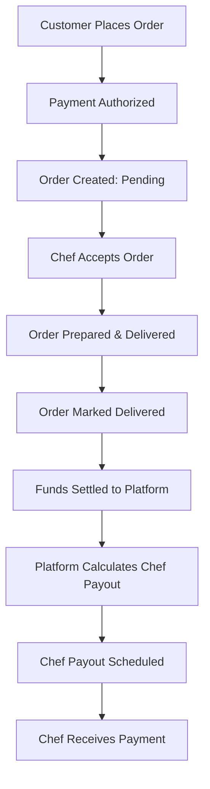

# Merchant Payment Flow (Ridendine)

This document describes the end-to-end payment flow for merchants (chefs) on the Ridendine platform.

## Overview

The payment flow covers the process from when a customer places an order to when the chef receives their payout.

## Payment Flow Steps

1. **Customer places order**
2. **Payment is authorized (via payment gateway)**
3. **Order is created with status: 'pending'**
4. **Chef accepts the order**
5. **Order is prepared and delivered**
6. **Order is marked as delivered**
7. **Funds are settled to the platform's account**
8. **Platform calculates chef payout (minus fees/commission)**
9. **Chef payout is scheduled (per payout schedule)**
10. **Chef receives payment (bank transfer or preferred method)**

## Payment Flow Diagram

## Notes
- Payment authorization occurs before the order is sent to the chef.
- Platform fees and commissions are deducted before chef payout.
- Payouts may be batched (e.g., daily/weekly) depending on platform policy.
- Refunds or disputes may interrupt the flow and delay payout.
