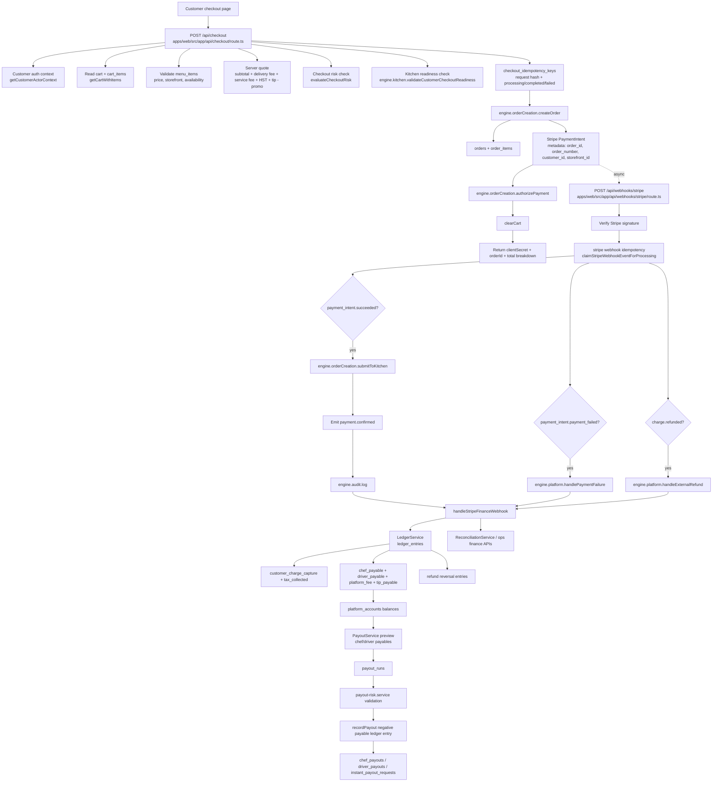
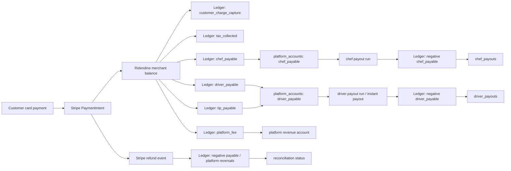

# Ridendine Payment Workflow Schematic

This schematic reflects the current repo wiring only. It shows Ridendine as merchant of record: the customer pays Ridendine through Stripe, the order moves into kitchen/dispatch flow after Stripe confirmation, and finance records ledger, payout, refund, and reconciliation state through engine services.

## End-To-End Payment Flow

## Money Movement Schematic

## Key Repo Evidence

| Area | Evidence |
| --- | --- |
| Checkout + PaymentIntent creation | `apps/web/src/app/api/checkout/route.ts` |
| Stripe webhook verification + processing | `apps/web/src/app/api/webhooks/stripe/route.ts` |
| Ledger entries and idempotency keys | `packages/engine/src/services/ledger.service.ts` |
| Payout preview/execution/instant payout | `packages/engine/src/services/payout.service.ts` |
| Engine exports for Stripe, ledger, payout, reconciliation | `packages/engine/src/index.ts` |

## Production Safety Notes

- The checkout route validates customer auth, request schema, menu item availability/pricing, risk, kitchen readiness, and checkout idempotency before creating the Stripe PaymentIntent.
- The Stripe webhook route verifies the Stripe signature, claims webhook events idempotently, then routes success/failure/refund/payout events into order, audit, and finance handlers.
- Ledger entries are designed to be idempotent through `idempotency_key` and should be the mandatory source for payables, payout debits, refund reversals, and reconciliation.
- Before production money movement, every payout/refund/reconciliation path still needs finance-grade negative tests, RBAC tests, and replay/idempotency tests.
