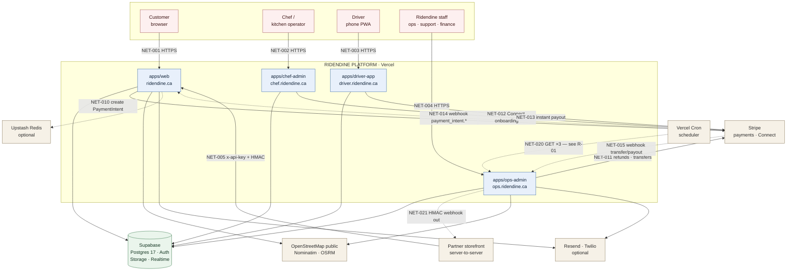

# 04 — System Context

Who and what the system talks to at its outer boundary.

Diagram source: [`diagrams/system-context.mmd`](diagrams/system-context.mmd)

---

## 1. Context diagram

**Legend.** Solid arrow = request initiated by the source. Dashed arrow = callback or scheduled invocation initiated by the external system. All arrows are HTTPS.

## 2. Numbered explanation

1. **NET-001…004 — human traffic.** Four separate Vercel projects on four subdomains. Session cookies are issued by Supabase Auth and shared across `*.ridendine.ca` only insofar as Supabase's cookie configuration allows; each app runs its own `middleware.ts` built from the same factory. *Why this exists:* four audiences with irreconcilable navigation, permission and device needs. *What breaks if it fails:* that audience alone loses access; the other three keep working, because they share nothing but the database.

2. **NET-005 — partner ingress.** Third parties POST complete orders to `/api/partner/checkout` on `apps/web`, authenticating with an `x-api-key` (or `Authorization: Bearer`) resolved against `api_partner_keys` by SHA-256 hash, optionally with an HMAC request signature. Ridendine is merchant of record. *Why:* revenue from storefronts that do not want to send customers to `ridendine.ca`. *What breaks if it fails:* partner orders stop; the marketplace is unaffected.

3. **Supabase — the single store of record.** Every app opens a Supabase client on every request. There is no second database and no read replica in the configuration. *Why:* one canonical schema was an explicit design decision ("no parallel models"). *What breaks if it fails:* **everything.** This is the system's single point of failure, with no fallback path anywhere in the code.

4. **NET-010…013 — Stripe outbound.** `apps/web` creates PaymentIntents at checkout; `apps/ops-admin` issues refunds and payout transfers; `apps/chef-admin` runs Stripe Connect onboarding for chefs; `apps/driver-app` triggers driver instant payouts. *Why:* Ridendine holds no card data and is not a money transmitter. *What breaks if it fails:* no new orders can be paid for, no money can be sent out. Existing orders in flight continue to be cooked and delivered.

5. **NET-014 / NET-015 — Stripe inbound, two endpoints.** `apps/web` `/api/webhooks/stripe` owns `payment_intent.*` and `charge.refunded` — it is the side that performs `submitToKitchen`. `apps/ops-admin` `/api/stripe/webhook` owns only `transfer.created`, `payout.paid`, `payout.failed`, and explicitly returns early on anything else *before* claiming the idempotency key, so it can never starve the web webhook. Different signing secrets (`STRIPE_WEBHOOK_SECRET` vs `STRIPE_WEBHOOK_SECRET_OPS`). *What breaks if NET-014 fails:* **paid orders never reach the kitchen.** This is the most consequential single arrow on the diagram.

6. **NET-020 — the scheduler.** `apps/ops-admin/vercel.json` declares three cron entries. **This arrow is drawn dashed and annotated because the evidence says it delivers nothing:** the three target routes implement their work in `POST` and expose `GET` only as a status ping, while Vercel Cron issues `GET`. See risk R-01 and evidence EV-021. *What breaks:* SLA enforcement, chef-acceptance auto-cancel, driver-assignment escalation, stale-offer expiry, and partner webhook delivery.

7. **NET-021 — partner webhooks outbound.** HMAC-signed order-lifecycle events pushed to partners who registered a `webhook_url`, with retry. Driven by the `partner-webhooks` processor — therefore subject to R-01.

8. **OpenStreetMap public services.** `nominatim.openstreetmap.org` for geocoding (`packages/engine/src/services/geocoding.service.ts`) and `router.project-osrm.org` for driving routes and driver ranking (`packages/routing/src/osrm.provider.ts`, default `DEFAULT_BASE`). **No API key, no account, no contract.** A `MapboxProvider` exists in the same package but is never instantiated. *What breaks if it fails:* ETA and driver ranking degrade — `rankCandidates` falls back to straight-line scoring; address validation returns `null` and delivery-zone checks fail open or closed depending on the caller.

9. **Resend / Twilio.** Registered as notification providers in `createCentralEngine` and active **only** when `RESEND_API_KEY` / `TWILIO_*` are present. Otherwise notifications are written to the database and shown in-app. *What breaks if it fails:* customers, chefs and drivers stop receiving out-of-app messages; the in-app record survives.

10. **Upstash Redis.** Distributed rate-limit store. When `UPSTASH_REDIS_REST_URL`/`_TOKEN` are absent the code falls back to a per-instance in-memory store and marks the response `degraded`. On Vercel that means the limit is effectively per-lambda, not per-platform.

## 3. Actor register

| Actor | Type | Identity mechanism | Trust level | Entry point |
|---|---|---|---|---|
| Customer | Human | Supabase Auth session → `customers.user_id` | Untrusted; authorised per own resources | `ridendine.ca` |
| Chef / kitchen operator | Human | Supabase Auth → `chef_profiles` (must be `approved`) → `chef_storefronts` / `chef_kitchens` | Semi-trusted; scoped to own storefront/kitchen | `chef.ridendine.ca` |
| Driver | Human | Supabase Auth → `drivers` (must be `approved`) | Semi-trusted; scoped to own deliveries | `driver.ridendine.ca` |
| Ops staff | Human | Supabase Auth → `platform_users` (`is_active`) → one of 8 roles | Privileged; capability-gated | `ops.ridendine.ca` |
| Partner system | Machine | SHA-256-hashed API key in `api_partner_keys` + optional HMAC signature | Scoped (`quote`, `checkout`); may be `test_mode` | `ridendine.ca/api/partner/*` |
| Stripe | Machine | Webhook signature (HMAC over raw body) | Trusted after signature verification | Two webhook routes |
| Vercel Cron | Machine | `Authorization: Bearer $CRON_SECRET` | Trusted after token check | Three processor routes |
| Legacy env-key partner | Machine | Shared `PARTNER_API_KEY`, `timingSafeEqual` | Scoped, anonymous — no per-partner identity | `ridendine.ca/api/partner/*` |
| System actor | Internal | `{ userId: 'system', role: 'system' }` | Full engine authority | Webhooks, processors, partner checkout |

## 4. What this system is *not* connected to

Verified absent from the codebase — worth stating so nobody assumes otherwise:

- No message broker (no Kafka, RabbitMQ, SQS, or Supabase queue usage).
- No separate cache tier beyond the optional Upstash rate-limit store and in-process `Map`s.
- No search engine (no Elasticsearch/Algolia/Typesense); discovery is SQL.
- No analytics warehouse; `@vercel/analytics` and `@vercel/speed-insights` are present in `apps/web` only.
- No CDN configuration beyond Vercel's default and the three `cdnjs.cloudflare.com` Leaflet marker images in `apps/driver-app`.
- No feature-flag service; behaviour toggles are environment variables and `platform_settings` rows.
- **No working APM/error tracker** — `@sentry/nextjs` is installed but not initialised. See R-03.
