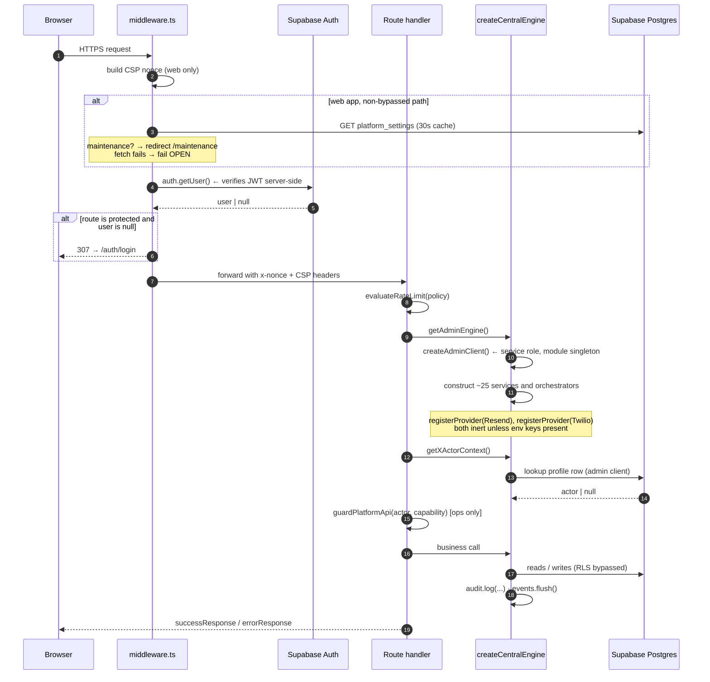
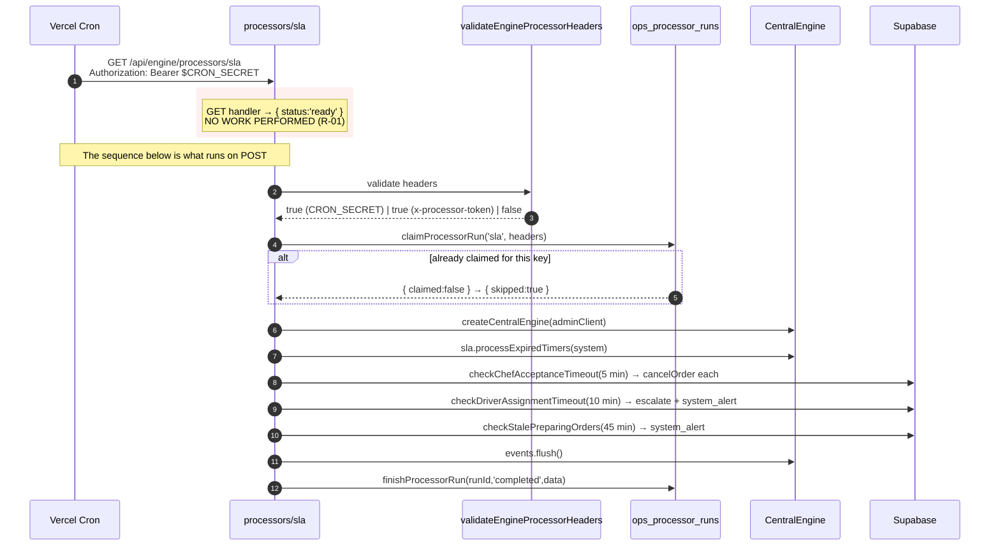
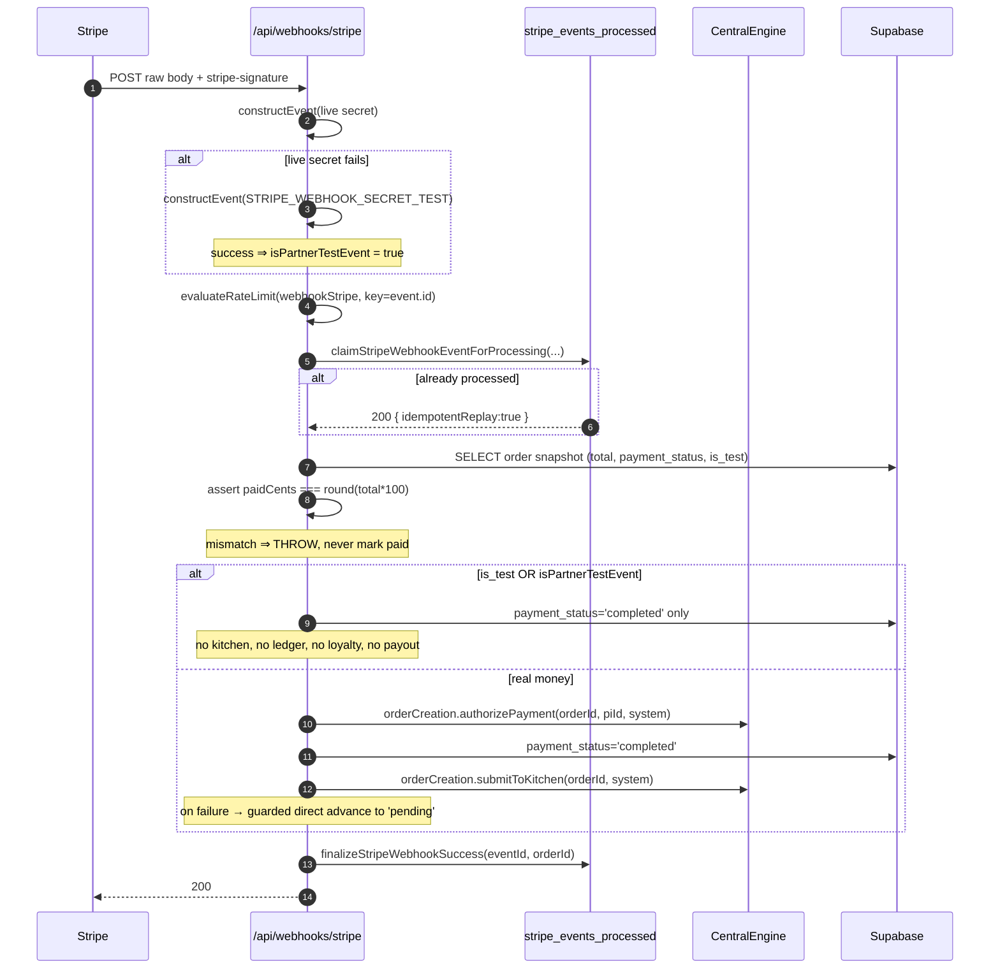

# 07 — Startup and Runtime Sequences

Every way execution begins, and what happens in what order.

Diagram source: [`diagrams/startup-sequence.mmd`](diagrams/startup-sequence.mmd)

---

## 1. Entry-point inventory

### 1.1 Application entry points (production)

| # | Entry point | Invoked by | Environment | Evidence |
|---|---|---|---|---|
| E-01 | `apps/web` HTTP request | Vercel edge → serverless function | prod, preview, dev | `apps/web/vercel.json`, `package.json: start` |
| E-02 | `apps/chef-admin` HTTP request | Vercel | prod, preview, dev | `apps/chef-admin/vercel.json` |
| E-03 | `apps/ops-admin` HTTP request | Vercel | prod, preview, dev | `apps/ops-admin/vercel.json` |
| E-04 | `apps/driver-app` HTTP request | Vercel | prod, preview, dev | `apps/driver-app/vercel.json` |

Each application has **no `main()`**. Next.js App Router is the process; the first thing that executes on any request is `src/middleware.ts`.

### 1.2 Middleware entry points

| # | File | Protection model |
|---|---|---|
| E-05 | `apps/web/src/middleware.ts` | Maintenance check → auth. `protectedRoutes: ['/account','/checkout']` only. Builds a per-request CSP nonce. |
| E-06 | `apps/chef-admin/src/middleware.ts` | Default-protect; 8 public routes |
| E-07 | `apps/ops-admin/src/middleware.ts` | Default-protect; 8 public routes incl. `/api/engine/processors`, `/api/engine/partner-stats`, `/api/ops/live-board` (all token- or capability-guarded in-route) |
| E-08 | `apps/driver-app/src/middleware.ts` | Default-protect; 7 public routes; matcher excludes PWA assets |

### 1.3 Scheduled entry points

| # | Path | Schedule | Method the scheduler sends | Method that does the work |
|---|---|---|---|---|
| E-09 | `/api/engine/processors/sla` | `0 2 * * *` (daily 02:00 UTC) | **GET** | **POST** |
| E-10 | `/api/engine/processors/expired-offers` | `0 3 * * *` (daily 03:00 UTC) | **GET** | **POST** |
| E-11 | `/api/engine/processors/partner-webhooks` | `* * * * *` (every minute) | **GET** | **POST** |

> **This table is the single most important finding in the map.** See risk R-01, evidence EV-021.

### 1.4 Webhook entry points

| # | Path | App | Events |
|---|---|---|---|
| E-12 | `/api/webhooks/stripe` | web | `payment_intent.*`, `charge.refunded`, plus finance types |
| E-13 | `/api/stripe/webhook` | ops-admin | `transfer.created`, `payout.paid`, `payout.failed` only |

### 1.5 Legacy / unscheduled entry points (INACTIVE)

| # | Path | Status |
|---|---|---|
| E-14 | `/api/cron/sla-tick` | **Deprecated.** Header comment says so. Smaller subset of E-09; does not write `ops_processor_runs`. |
| E-15 | `/api/cron/expired-offers` | Duplicate of E-10, unscheduled |
| E-16 | `/api/cron/payouts-chef-preview` | Unscheduled, no processor equivalent |
| E-17 | `/api/cron/payouts-driver-preview` | Unscheduled, no processor equivalent |
| E-18 | `/api/cron/reconciliation-daily` | Unscheduled, no processor equivalent — **R-02** |

All five are `GET`-only and token-guarded. `scripts/local-cron.mjs` explicitly skips E-16/17/18 ("run rarely, trigger manually").

### 1.6 Developer and CI entry points

| # | Command | Purpose |
|---|---|---|
| E-19 | `pnpm dev` / `dev:web` / `dev:chef` / `dev:ops` / `dev:driver` | Turbo dev servers |
| E-20 | `pnpm local-cron` | POSTs E-09 every 60 s and E-10 every 30 s against `localhost:3002` |
| E-21 | `pnpm db:migrate` / `db:seed` / `db:reset` | Supabase CLI — **side-effecting**, blocked in CI by `verify:prod-data-hygiene` |
| E-22 | `pnpm db:generate` | Regenerates `packages/db/src/generated/database.types.ts` |
| E-23 | `pnpm audit:guards` / `audit:db-boundary` / `audit:ops-authz` / `audit:ops-negative-authz` / `audit:sean-super-admin` / `audit:db-hardening` | Static gates |
| E-24 | `pnpm test:wiring-fixes` | 20 wiring assertions + 15 `node --test` smoke suites |
| E-25 | `pnpm smoke:prod*` (12 variants) | Runtime contract smoke against deployed URLs |
| E-26 | `pnpm test:e2e` / `test:smoke` / `test:e2e:lifecycle` | Playwright |
| E-27 | `pnpm test:load` | **WRITE-CAPABLE** — live mode POSTs real support requests. Defaults to `--dry-run`. |
| E-28 | `pnpm ui:command-center`, `docs:wiring`, `docs:supabase`, `docs:obsidian-architecture` | Documentation generators — **rewrite committed files** |
| E-29 | `pnpm admin:bootstrap-super` | Creates a super-admin. Reads `BOOTSTRAP_SUPER_ADMIN_PASSWORD`. **Side-effecting against whichever database is configured.** |
| E-30 | `POST /api/fixtures/reset` | Deletes E2E fixture orders. Triple-gated: `NODE_ENV !== 'production'` **and** `E2E_FIXTURE_RESET_ENABLED === 'true'` **and** `team_manage` capability. |

**Commands to avoid on a machine pointed at production:** E-21, E-27 (live mode), E-29, E-30.

---

## 2. Boot sequence — a single web request

### Numbered explanation

1. **Middleware first, always.** Nothing in the app runs before `src/middleware.ts`.
2. **CSP nonce** is generated per request in `apps/web` only (`btoa(crypto.randomUUID())`) and injected as both `x-nonce` and `Content-Security-Policy` on the *request* headers so Next.js nonces its own inline scripts, then set again on the response.
3. **Maintenance check** (`apps/web` only) reads `platform_settings` over PostgREST with a 1.5 s `AbortSignal.timeout` and a 30-second module-level cache. On any failure it **fails open** — traffic flows. Bypassed for `/maintenance`, `/api/health`, `/api/`, `/_next/`, `/favicon`.
4. **`supabase.auth.getUser()`**, never `getSession()`. The code carries an explicit comment explaining that `getSession()` only decodes a client-controlled cookie. This is the correct choice and it is deliberate.
5. **`ALLOW_DEV_AUTOLOGIN`** short-circuits steps 4–6 entirely — but only when `NODE_ENV !== 'production'`. Both conditions are required.
6. **Route handler** applies its own rate-limit policy, then resolves the actor, then guards.
7. **Engine construction is per request.** `getAdminEngine()` calls `createCentralEngine(createAdminClient(), paymentAdapter)`, building roughly 25 objects each time. `createAdminClient()` itself memoises the Supabase client in a module-level variable, so the network client is reused across requests in a warm lambda; the engine wrapper objects are not.
8. **Payment adapter registration is a module side effect.** `apps/web/src/lib/engine.ts` calls `registerPaymentAdapter(stripePaymentAdapter)` at import time. The other three apps do **not** register one, so `MasterOrderEngine` there receives `paymentAdapter === undefined` and cannot void a Stripe payment on reject/cancel. See failure mode F-11.
9. **Events are queued and flushed**, not emitted synchronously. Processors call `engine.events.flush()` explicitly; if a route forgets, queued events are lost when the lambda ends.

## 3. Boot sequence — a scheduled processor (as designed)

**Idempotency:** `ops_processor_runs` carries `unique (processor_name, idempotency_key)` (migration `00023`), so a double invocation in the same window is skipped rather than duplicated — for `sla` and `expired-offers`. **`partner-webhooks` does not claim a run at all**, so it has neither run-level idempotency nor health visibility.

## 4. Boot sequence — the Stripe payment webhook

## 5. Health and readiness

| App | Endpoint | Behaviour |
|---|---|---|
| web | `GET /api/health` | Public liveness + readiness. Full payload (version, build SHA, per-dependency status) only when `x-health-token` matches `HEALTH_CHECK_TOKEN`; everyone else gets `{ ok, service, readiness }`. Status code still carries readiness so uptime monitors work tokenless. |
| chef-admin, driver-app, ops-admin | `GET /api/health` | Public liveness |
| ops-admin | `GET /api/engine/health` | **Capability-gated** (`engine_health`). Returns `checkSystemHealth()` + env readiness for 7 vars + `processorRuns` last-success timestamps. 503 when overall status is `down`. |

**Defect in `/api/engine/health`:** `TRACKED_PROCESSORS` lists `sla`, `expired-offers`, `payouts-chef-preview`, `payouts-driver-preview`, `reconciliation-daily`. Three of those five are unscheduled legacy routes that never write `ops_processor_runs`, so their `lastSuccessAt` is permanently `null`. Meanwhile `partner-webhooks` — one of only three actually-scheduled processors — is **not tracked at all**. The readiness signal is therefore both falsely alarming and blind in the same breath.

## 6. Shutdown

There is none, and there does not need to be. Vercel serverless functions are torn down between requests; there is no `SIGTERM` handler, no connection-draining, no graceful-shutdown hook in any app. The only process with lifecycle handling is `scripts/local-cron.mjs`, which clears its timers on `SIGINT`/`SIGTERM`.

**Consequence:** any work queued but not flushed before a handler returns is lost. `engine.events.flush()` must be called explicitly, and is — in the processors and the main flows read for this analysis.

## 7. Failure behaviour at startup

| Missing | Result |
|---|---|
| `NEXT_PUBLIC_SUPABASE_URL` or `SUPABASE_SERVICE_ROLE_KEY` | `createAdminClient()` throws `Missing Supabase admin environment variables` on the **first request**, not at boot. Every privileged route 500s. |
| `STRIPE_SECRET_KEY` | `assertStripeConfigured()` throws → checkout returns `PAYMENT_CONFIG_ERROR` 500 |
| `STRIPE_WEBHOOK_SECRET` | `getWebhookSecret()` throws → webhook 400, Stripe retries forever |
| `CRON_SECRET` **and** `ENGINE_PROCESSOR_TOKEN` both absent | `validateEngineProcessorHeaders` returns `false` → every processor 401. **Fails closed — correct.** |
| `PARTNER_API_KEY` unset or <16 chars | Legacy partner fallback disabled; DB-backed keys still work. **Fails closed — correct.** |
| `RESEND_API_KEY` / `TWILIO_*` | Providers silently inert; notifications go to the database only |
| `UPSTASH_*` | Rate limiting degrades to per-instance memory, flagged `degraded` |
| `NEXT_PUBLIC_SENTRY_DSN` | No effect — Sentry is not initialised regardless (R-03) |

**Pattern:** the system validates lazily, on first use, not eagerly at boot. A misconfigured deployment therefore looks healthy until the first real request touches the missing dependency.
