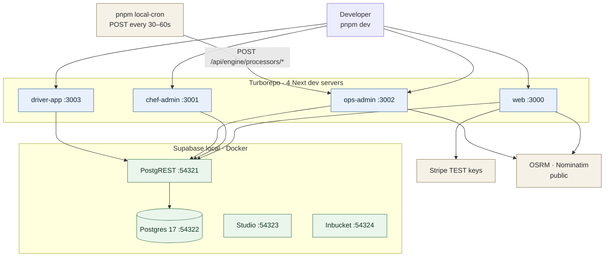
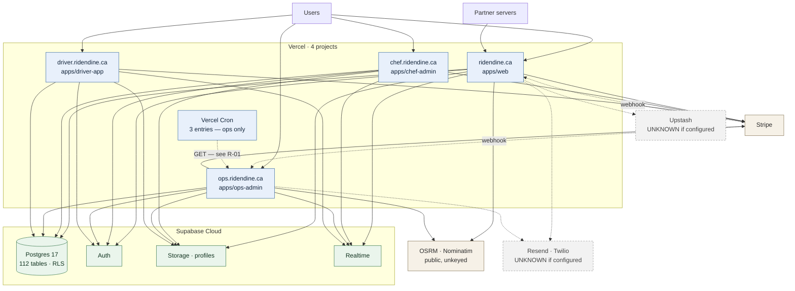

# 16 — Deployment and Runtime Topology

Local and production topologies are kept strictly separate. Anything not provable from the repository is marked UNKNOWN.

Diagram sources: [`diagrams/deployment-local.mmd`](diagrams/deployment-local.mmd) · [`diagrams/deployment-production.mmd`](diagrams/deployment-production.mmd)

---

## 1. Local development topology



**Ports** (`supabase/config.toml`): API 54321, DB 54322, shadow 54320, Studio 54323, Inbucket SMTP 54325 / POP3 54326. Auth `site_url` is `http://localhost:3000` with redirects allowed to 3001–3003, `jwt_expiry` 3600, refresh-token rotation on with a 10 s reuse interval.

**Critical difference from production:** `pnpm local-cron` issues **`POST`** to the processors. Production Vercel Cron issues **`GET`**. **The local environment therefore exercises a code path that production never reaches.** This is the mechanism by which F-01 could pass every local and CI check while being dead in production.

## 2. Production topology



**Dashed grey nodes are UNKNOWN** — the repository cannot tell whether Resend, Twilio or Upstash are configured in production (U-02).

### Deployable units

| Unit | Domain | Vercel project | Cron | Webhooks |
|---|---|---|---|---|
| `apps/web` | `ridendine.ca` | separate | — | `/api/webhooks/stripe` |
| `apps/chef-admin` | `chef.ridendine.ca` | separate | — | — |
| `apps/ops-admin` | `ops.ridendine.ca` | separate | **3** | `/api/stripe/webhook` |
| `apps/driver-app` | `driver.ridendine.ca` | separate | — | — |

Domains are VERIFIED from `scripts/smoke/runtime-contracts.cjs` `defaultBaseUrl` values, overridable by workflow variables `RIDENDINE_{CUSTOMER,CHEF,DRIVER,OPS}_URL`.

### Build and install

Identical in all four `vercel.json`:
```json
{ "framework": "nextjs",
  "installCommand": "cd ../.. && pnpm install --frozen-lockfile",
  "buildCommand": "pnpm build" }
```
Each project builds the whole workspace from the monorepo root. `turbo.json: build.env` declares 16 environment variables as part of the cache key (see C-09 for the ten that are missing).

### Network boundaries

| Boundary | Control |
|---|---|
| Public ingress | Vercel edge, TLS terminated by Vercel |
| App → Supabase | HTTPS PostgREST, service-role or anon key. **No IP allowlist, no VPC peering** — the database is reachable from anywhere with the key. |
| App → Stripe | HTTPS, SDK |
| Stripe → app | HTTPS, HMAC-verified |
| Cron → app | Internal Vercel invocation with a bearer token |
| Egress | Unrestricted — no egress policy exists |

### Autoscaling and replicas

Vercel serverless: implicit, per-request, no configuration in the repository. No `maxDuration`, no `memory`, no `regions` setting in any `vercel.json` — **all four apps run on Vercel defaults.** Database: single instance, no replica configured or referenced.

### Migrations and release sequence

Migrations are **not run by CI or by any deployment step.** `pnpm db:migrate` (`supabase db push`) is a manual operation. `verify-prod-data-hygiene` actively forbids CI from running seed or reset.

Release sequence, reconstructed from `scripts/release/verify-release.ps1`, `docs/RUNBOOK_DEPLOY.md` and the workflows:
1. `pnpm release:verify` (local, PowerShell)
2. Apply migrations manually (`supabase db push`)
3. `pnpm db:generate`, commit the regenerated types
4. Push → CI gate → merge to `master`
5. Vercel builds and deploys all four projects
6. `deployment_status: success` triggers `post-deploy-smoke.yml` → `runtime-contract-smoke.cjs`

**Ordering hazard:** migrations are applied by hand, out of band from the deployment. A schema change deployed before its migration, or vice versa, has no automated guard.

### Rollback

| Layer | Mechanism | Evidence |
|---|---|---|
| Application | Vercel instant rollback to a previous deployment | Platform capability, not configured in the repository |
| Database | **None. Migrations are forward-only by policy.** A bad migration requires a new corrective migration. | `CLAUDE.md`; `supabase/migrations/` |
| Data | UNKNOWN — see U-04 | `docs/BACKUP_AND_ROLLBACK.md` exists but configures nothing |

**This is the sharpest operational edge in the system:** the application can be rolled back in seconds and the database cannot be rolled back at all. A deployment that pairs an app rollback with an already-applied migration leaves old code running against a new schema.

### Backups

`docs/BACKUP_AND_ROLLBACK.md` exists. **Nothing in the repository schedules, configures, verifies or tests a backup or a restore.** Supabase provides managed backups by plan tier, but neither the tier nor the retention nor any restore drill is evidenced here. **UNKNOWN — U-04.** This is the highest-value unknown in the whole map: everything else is recoverable if the data is.

### Scheduled tasks in production

| Task | Schedule | Status |
|---|---|---|
| `/api/engine/processors/sla` | `0 2 * * *` | ⚠️ R-01 |
| `/api/engine/processors/expired-offers` | `0 3 * * *` | ⚠️ R-01 — and **daily** offer expiry would be operationally wrong for a live dispatch system even if it worked |
| `/api/engine/processors/partner-webhooks` | `* * * * *` | ⚠️ R-01 |
| Post-deploy smoke | every 6 h + on deploy | ✅ working |
| CI nightly | `0 9 * * *` | ✅ |
| Load test | `0 8 * * *` | ✅ dry-run |

### Observability destinations

| Destination | Status |
|---|---|
| Vercel function logs | ✅ implicit — stdout/stderr |
| `@vercel/analytics`, `@vercel/speed-insights` | ✅ `apps/web` only |
| Sentry | ❌ **not initialised** (R-03) |
| `system_alerts` table | ✅ written by the SLA processor — **which does not run** |
| `audit_logs` | ✅ written by `AuditLogger` |
| `ops_processor_runs` | ✅ written by `sla` and `expired-offers` only |

## 3. Local vs production differences

| Aspect | Local | Production | Risk |
|---|---|---|---|
| **Cron method** | **POST** via `local-cron` | **GET** via Vercel Cron | ⚠️ **The root of F-01** |
| Cron cadence | 30–60 s | daily / daily / minutely | ⚠️ |
| Database | Docker Postgres | Supabase Cloud | Standard |
| Stripe | test keys | live keys | Standard |
| Auth bypass | `ALLOW_DEV_AUTOLOGIN` available | hard-disabled by `NODE_ENV` | ✅ |
| Fixture reset | available with the flag | hard-disabled | ✅ |
| Command centre | on by default | off unless flagged | ✅ |
| CSP | same as production | web only | ⚠️ V-02 |
| Rate limiting | memory | memory unless Upstash set | ⚠️ V-04 |
| Email/SMS | Inbucket if configured | UNKNOWN | ⚠️ U-02 |

## 4. Deployment findings

| ID | Finding | Severity |
|---|---|---|
| D-01 | **Local cron POSTs, production cron GETs.** The one difference that matters most, and the reason F-01 is invisible locally. | **CRITICAL** |
| D-02 | Migrations are manual and out of band from deployment; no ordering guard. | HIGH |
| D-03 | No database rollback path, while the application rolls back instantly. | HIGH |
| D-04 | Backup/restore entirely unevidenced. | HIGH (U-04) |
| D-05 | `eslint: { ignoreDuringBuilds: true }` — a Vercel deploy from a branch is not lint-gated. | MEDIUM |
| D-06 | CI runs only on `master`/`main`. The current branch, `feat/cooco-partner-webhooks-realtime`, is not gated by push. | MEDIUM |
| D-07 | No `maxDuration`, `memory` or `regions` configured. Long-running processors could hit the default timeout silently. | MEDIUM |
| D-08 | No IP allowlist or network isolation on the database. | MEDIUM |
| D-09 | Whether preview deployments share the production database is UNKNOWN. If they do, a preview build can write production data. | MEDIUM (U-06) |
| D-10 | Four separate Vercel projects each build the entire monorepo — four full builds per change. | LOW (cost) |
