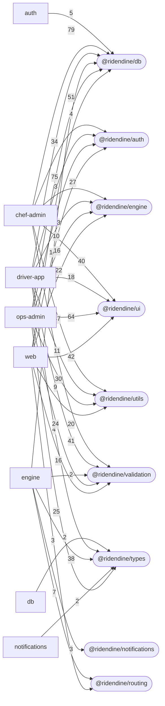

# Program Map 13 — Internal Dependency Graph
<!-- Generated by a read-only static extractor over commit c8b9049d. Facts (exports, imports, tables, guards, methods, env) are machine-extracted; the Purpose column is the file's own header comment, verbatim and trimmed. -->

Workspace-package dependency edges counted by import site. **46 distinct edges.** No app imports another app.

| From | To | Import sites |
|---|---|--:|
| `chef-admin` | `@ridendine/db` | 79 |
| `ops-admin` | `@ridendine/db` | 75 |
| `ops-admin` | `@ridendine/ui` | 64 |
| `web` | `@ridendine/db` | 51 |
| `chef-admin` | `@ridendine/utils` | 47 |
| `web` | `@ridendine/ui` | 42 |
| `chef-admin` | `@ridendine/validation` | 41 |
| `chef-admin` | `@ridendine/ui` | 40 |
| `engine` | `@ridendine/types` | 38 |
| `driver-app` | `@ridendine/db` | 34 |
| `ops-admin` | `@ridendine/utils` | 30 |
| `chef-admin` | `@ridendine/engine` | 27 |
| `ops-admin` | `@ridendine/types` | 25 |
| `ops-admin` | `@ridendine/validation` | 24 |
| `web` | `@ridendine/engine` | 22 |
| `web` | `@ridendine/utils` | 20 |
| `driver-app` | `@ridendine/ui` | 18 |
| `ops-admin` | `@ridendine/engine` | 16 |
| `web` | `@ridendine/validation` | 16 |
| `engine` | `@ridendine/db` | 14 |
| `driver-app` | `@ridendine/utils` | 11 |
| `web` | `@ridendine/auth` | 10 |
| `driver-app` | `@ridendine/validation` | 9 |
| `engine` | `@ridendine/routing` | 7 |
| `auth` | `@ridendine/db` | 5 |
| `chef-admin` | `@ridendine/auth` | 4 |
| `driver-app` | `@ridendine/types` | 4 |
| `driver-app` | `@ridendine/auth` | 3 |
| `driver-app` | `@ridendine/engine` | 3 |
| `engine` | `@ridendine/notifications` | 3 |
| `ops-admin` | `@ridendine/auth` | 3 |
| `web` | `@ridendine/routing` | 3 |
| `db` | `@ridendine/types` | 2 |
| `engine` | `@ridendine/validation` | 2 |
| `notifications` | `@ridendine/types` | 2 |
| `auth` | `@ridendine/types` | 1 |
| `chef-admin` | `@ridendine/config` | 1 |
| `chef-admin` | `@ridendine/types` | 1 |
| `config` | `@ridendine/ui` | 1 |
| `db` | `@ridendine/utils` | 1 |
| `driver-app` | `@ridendine/config` | 1 |
| `engine` | `@ridendine/utils` | 1 |
| `ops-admin` | `@ridendine/config` | 1 |
| `utils` | `@ridendine/types` | 1 |
| `web` | `@ridendine/config` | 1 |
| `web` | `@ridendine/types` | 1 |

## Diagram

## Most-imported files (fan-in by local import path)

| Import specifier | Sites |
|---|--:|
| `@/lib/engine` | 176 |
| `@/components/DashboardLayout` | 37 |
| `../client/types` | 25 |
| `../route` | 22 |
| `@/components/layout/header` | 20 |
| `../utils` | 16 |
| `../core/audit-logger` | 15 |
| `../constants` | 14 |
| `@/lib/kitchen` | 13 |
| `./types` | 12 |
| `../core/event-emitter` | 11 |
| `@/lib/validation` | 10 |
| `../generated/database.types` | 10 |
| `@/lib/auth-helpers` | 9 |
| `./runtime-contracts.cjs` | 9 |
| `@/components/layout/driver-shell` | 7 |
| `./common` | 7 |
| `@/hooks/use-location-tracker` | 6 |
| `@/lib/cart-summary` | 6 |
| `@/lib/customer-ordering` | 6 |
| `./notification-sender` | 6 |
| `./master-order-engine` | 6 |
| `../enums` | 6 |
| `./runtime-contract-smoke.cjs` | 6 |
| `../../../components/auth/auth-layout` | 5 |
| `@/lib/client-api` | 5 |
| `../_components/FinanceSubnav` | 5 |
| `@/contexts/cart-context` | 5 |
| `@/lib/partner/auth` | 5 |
| `@/lib/partner/rate-limit` | 5 |
| `./ledger.service` | 5 |
| `../tokens` | 5 |
| `../../scripts/load-root-env.cjs` | 4 |
| `@/lib/menu-option-guards` | 4 |
| `@/lib/driver-readiness` | 4 |
| `@/lib/driver-operations` | 4 |
| `@/lib/ops-live-feed-types` | 4 |
| `../_components/FinanceAccessDenied` | 4 |
| `../_lib/roles` | 4 |
| `@/hooks/use-ops-live-feed` | 4 |
| `../database.merged` | 4 |
| `./index` | 4 |
| `./event-emitter` | 4 |
| `../core/sla-manager` | 4 |
| `./dispatch-orchestrator` | 4 |
| `./driver-matching.service` | 4 |
| `@/lib/food-cost` | 3 |
| `@/components/layout/kitchen-scope-provider` | 3 |
| `@/lib/offline-outbox` | 3 |
| `./driver-nav` | 3 |
| `@/lib/location-health` | 3 |
| `../../_components/FinanceAccessDenied` | 3 |
| `../../_components/FinanceSubnav` | 3 |
| `../../_lib/roles` | 3 |
| `@/lib/storefront-trust` | 3 |
| `@/lib/checkout/quote` | 3 |
| `@/lib/partner/signing` | 3 |
| `@/lib/checkout/scheduling` | 3 |
| `../services/stripe.service` | 3 |
| `./delivery-engine` | 3 |

## External npm packages actually imported

| Package | Import sites |
|---|--:|
| `next` | 298 |
| `react` | 209 |
| `vitest` | 97 |
| `@testing-library/react` | 57 |
| `@supabase/supabase-js` | 48 |
| `node:path` | 32 |
| `node:fs` | 29 |
| `path` | 29 |
| `lucide-react` | 28 |
| `fs` | 28 |
| `zod` | 18 |
| `node:assert` | 16 |
| `node:test` | 16 |
| `@playwright/test` | 13 |
| `@sentry/nextjs` | 12 |
| `crypto` | 9 |
| `stripe` | 8 |
| `tailwindcss` | 5 |
| `@supabase/ssr` | 4 |
| `node:url` | 4 |
| `leaflet` | 3 |
| `@testing-library/jest-dom` | 2 |
| `@stripe/react-stripe-js` | 2 |
| `node:child_process` | 2 |
| `class-variance-authority` | 2 |
| `pg` | 2 |
| `@vercel/analytics` | 1 |
| `@vercel/speed-insights` | 1 |
| `@stripe/stripe-js` | 1 |
| `glob` | 1 |
| `@eslint/js` | 1 |
| `eslint-plugin-react` | 1 |
| `eslint-plugin-react-hooks` | 1 |
| `typescript-eslint` | 1 |
| `clsx` | 1 |
| `tailwind-merge` | 1 |
| `react-dom` | 1 |
| `node:module` | 1 |
| `node:crypto` | 1 |
